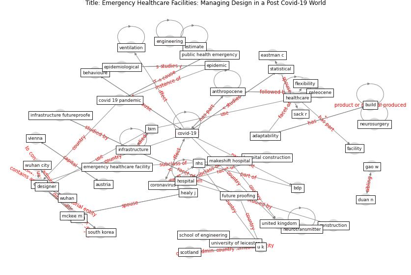

# Article: Emergency Healthcare Facilities: Managing Design in a Post Covid-19 World (marinelli_emergency_2020)

* Source: [10.1109/EMR.2020.3029850](https://doi.org/10.1109/EMR.2020.3029850)
* Year: 2020
* Cluster: [ward-patient](cluster_15)

## Keywords

 * adaptability, [aerosol](keyword_aerosol), air ambulance, air compressor, anthropocene, audio, [austria](keyword_austria), bdp, behavioure, [bim](keyword_bim), bim handbook, [build](keyword_build), build information modeling, carthey j, [china](keyword_china), chow v, [construction](keyword_construction), [coronavirus](keyword_coronavirus), [covid 19 pandemic](keyword_covid_19_pandemic), [covid-19](keyword_covid-19), de neufville, designer, duan n, eastman c, emergency, emergency healthcare facility, [engineering](keyword_engineering), [epidemic](keyword_epidemic), [epidemiological](keyword_epidemiological), estimate, excel, facility, fan, fangcang shelter hospital, future proofing, futureproofing, gao w, global production, [health care](keyword_health_care), [healthcare](keyword_healthcare), healy j, highly contagious, [hospital](keyword_hospital), hospital bed, hospital construction, hospital in a change europe, [hubei](keyword_hubei), infectious, information modelling, [infrastructure](keyword_infrastructure), infrastructure futureproofe, infrastructure futureproofing, [italy](keyword_italy), journal of clinical anesthesia, journal of medical internet research, [lockdown](keyword_lockdown), [london](keyword_london), london nightingale, makeshift hospital, management ofinfrastructural asset, [manufacture](keyword_manufacture), masood t, mckee m, mechanical ventilation, medical waste, medicine, mit press, [negative pressure room](keyword_negative_pressure_room), neurosurgery, neurotransmitter, nhs, [ontology](keyword_ontology), open university, opioid, paleocene, public health emergency, response plan, sack r, safeguard, school of engineering, scotland, [south korea](keyword_south_korea), statistical, [u k](keyword_u_k), [united kingdom](keyword_united_kingdom), university of leicester, usa, value management in construction, [ventilation](keyword_ventilation), video, video surveillance, [vienna](keyword_vienna), viral rna, [virus](keyword_virus), wale, who, work hour, [wuhan](keyword_wuhan), wuhan city, flexibility

## Concepts

 

## Neighbours

### Closest articles

* Management of the COVID-19 pandemic: challenges, practices, and organizational support - [LINK](article_hossny_management_2022)
* Supporting Technologies for COVID-19 Prevention: Systemized Review - [LINK](article_zhao_supporting_2022)
* COVID-19: A new digital dawn? - [LINK](article_robbins_covid-19_2020)
*  - [LINK](article_mehtab_alam_role_2021)
* Response to COVID-19 in Taiwan - [LINK](article_wang_response_2020)
* Using Technology to Maintain the Education of Residents During the COVID-19 Pandemic - [LINK](article_chick_using_2020)
* Significant applications of virtual reality for COVID-19 pandemic - [LINK](article_singh_significant_2020)
* Open-source analytics tools for studying the COVID-19 coronavirus outbreak - [LINK](article_wu_open-source_2020)
* Sustainable work throughout the life course: National policies and strategies, Publications Office of the European Union - [LINK](article_eurofund_sustainable_2016)
* The effect of human mobility and control measures on the COVID-19 epidemic in China - [LINK](article_kraemer_effect_2020)

### Closest BPs

* Blueprint: Resilience in staffing and skills training - [LINK](bp_12)
* Blueprint: Monitoring of wastewater [CID] - [LINK](bp_21)
* Blueprint: Public places as information points - [LINK](bp_8)
