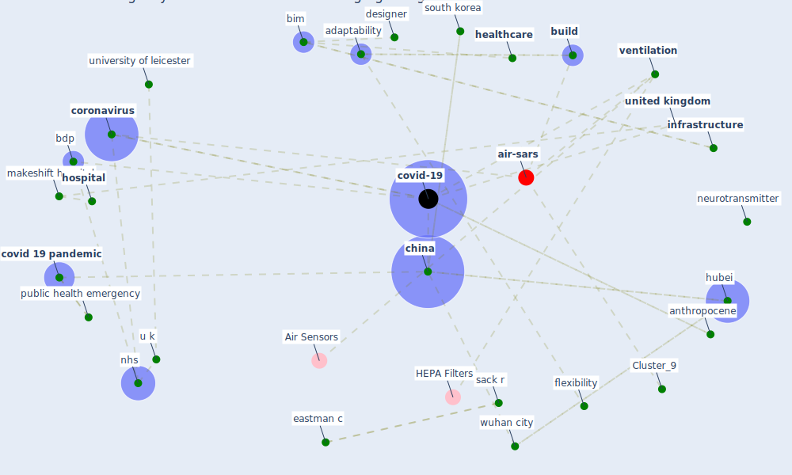

# Article: Emergency Healthcare Facilities: Managing Design in a Post Covid-19 World (marinelli_emergency_2020)

* Source: [10.1109/EMR.2020.3029850](https://doi.org/10.1109/EMR.2020.3029850)
* Year: 2020
* Cluster: [air-sars](cluster_9)

## Keywords

 * adaptability, [aerosol](keyword_aerosol), air ambulance, air compressor, anthropocene, audio, [austria](keyword_austria), bdp, behavioure, [bim](keyword_bim), bim handbook, [build](keyword_build), build information modeling, carthey j, [china](keyword_china), chow v, ciria, clima congress, communication, [construction](keyword_construction), [coronavirus](keyword_coronavirus), [covid 19 pandemic](keyword_covid_19_pandemic), [covid-19](keyword_covid-19), de neufville, designer, director general, [disease](keyword_disease), duan n, eastman c, egregiousdesign, emergency healthcare facility, [engineering](keyword_engineering), [epidemic](keyword_epidemic), [epidemiological](keyword_epidemiological), estimate, excel, fan, fangcang shelter hospital, future proofing, gao w, [healthcare](keyword_healthcare), healy j, highly contagious, [hospital](keyword_hospital), hospital in a change europe, [hubei](keyword_hubei), information modelling, [infrastructure](keyword_infrastructure), infrastructure futureproofe, infrastructure futureproofing, [italy](keyword_italy), [lockdown](keyword_lockdown), [london](keyword_london), london nightingale, makeshift hospital, masood t, mckee m, medicine, mit press, neurosurgery, neurotransmitter, nhs, [ontology](keyword_ontology), open university, opioid, paleocene, [patient](keyword_patient), preparation, public health emergency, publicãâãâclient, reconfigure, respirator, response plan, sack r, safeguard, scholte, school of engineering, scotland, [south korea](keyword_south_korea), statistical, [temperature](keyword_temperature), thomas telford, [transmission](keyword_transmission), [u k](keyword_u_k), [united kingdom](keyword_united_kingdom), university of leicester, unprecedented health and tamadraeconomic crisis, [usa](keyword_usa), value management in construction, [ventilation](keyword_ventilation), [video](keyword_video), video surveillance, [vienna](keyword_vienna), [virus](keyword_virus), wale, who, work hour, [wuhan](keyword_wuhan), wuhan city, flexibility

## Concepts

 

## Neighbours

### Closest articles

* Management of the COVID-19 pandemic: challenges, practices, and organizational support - [LINK](article_hossny_management_2022)
* Supporting Technologies for COVID-19 Prevention: Systemized Review - [LINK](article_zhao_supporting_2022)
* Telehealth overpromises during the Covid-19 pandemic - [LINK](article_ostherr_telehealth_2020)
* Infodemic and the spread of fake news in the COVID-19-era - [LINK](article_orso_infodemic_2020)
* COVID-19: A new digital dawn? - [LINK](article_robbins_covid-19_2020)
* Response to COVID-19 in Taiwan - [LINK](article_wang_response_2020)
* Knowledge, attitudes, and practices of Indonesian residents regarding COVID-19: A national cross-sectional survey - [LINK](article_yodang_knowledge_2021)
* The impacts of knowledge, risk perception, emotion and information on citizens’ protective behaviors during the outbreak of COVID-19: a cross-sectional study in China - [LINK](article_ning_impacts_2020)
* Coronavirus: Can artificial intelligence be smart enough to detect fake news? - [LINK](article_tong_coronavirus_2020)
* Covid-19 and community mitigation strategies in a pandemic - [LINK](article_ebrahim_covid-19_2020)

### Closest BPs

* Blueprint: Resilience in staffing and skills training - [LINK](bp_12)
* Blueprint: Air Cleaning Plants - [LINK](bp_15)
* Blueprint: Public places as information points - [LINK](bp_8)
