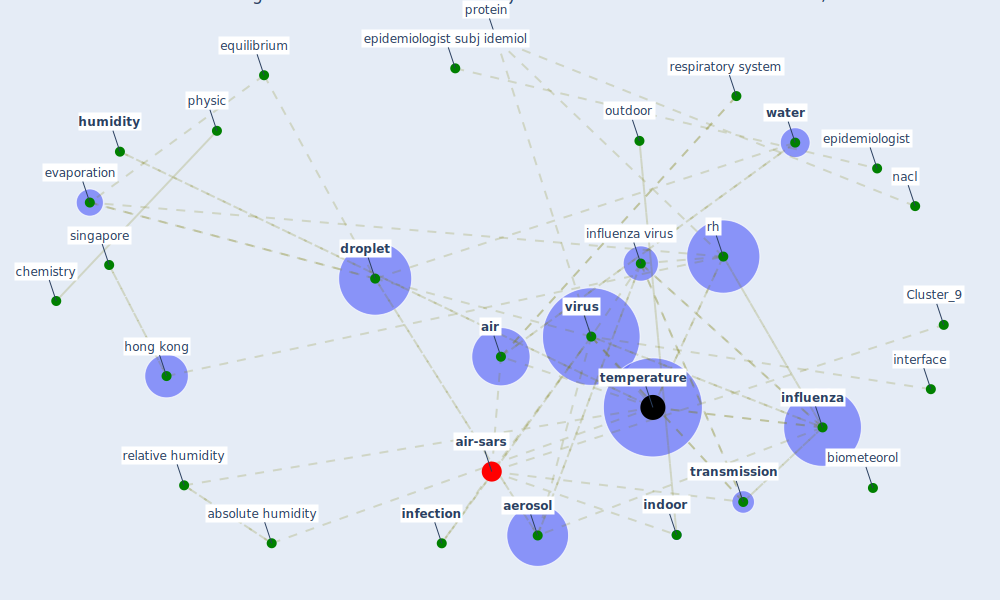

# Article: Mechanistic insights into the effect of humidity on airborne influenza virus survival, transmission and incidence (marr_mechanistic_2019)

* Source: [10.1098/rsif.2018.0298](https://doi.org/10.1098/rsif.2018.0298)
* Year: 2019
* Cluster: [air-uv](cluster_10)

## Keywords

 * 08c, absolute humidity, acad ny, [academy](keyword_academy), [aerosol](keyword_aerosol), [air](keyword_air), [air conditioning](keyword_air_conditioning), alveolar region, atmospheric moisture, biol, biometeorol, chemistry, cold season, compete interest, [datum](keyword_datum), [droplet](keyword_droplet), enfield kb, epidemiologist, epidemiologist subj idemiol, equilibrium, evaporation, exp, expo, ferret model, function, gallagher dl, half life, harper, head airway, hemagglutinin, [hong kong](keyword_hong_kong), humidifier, [humidity](keyword_humidity), inactivation, income, independent variable, [indoor](keyword_indoor), indoor ah, indoor rh, [infection](keyword_infection), [infectious](keyword_infectious), [influenza](keyword_influenza), influenza a, [influenza virus](keyword_influenza_virus), inhale, [interface](keyword_interface), isb, jones rm, lakdawala ss, [li y](keyword_li_y), linear, [model](keyword_model), montgomery dc, multicollinearity, myers rh, nacl, nelson wc, nuclei, nucleic acid, ott wr, outdoor, outdoor ah, outdoor rh, outdoors, pantelic j, pathog, [pathogen](keyword_pathogen), physic, [pressure](keyword_pressure), protein, relative humidity, respiratory fluid, respiratory system, respiratory tract, [rh](keyword_rh), root mean square error, rossi ce, rrna, salt, saturation, season, seasonal, seinfeld, shaman, singapore, solute, surfactant, t ah t, [temperature](keyword_temperature), toulouse m j, [transmission](keyword_transmission), transmission efficiency, turgeon n, viability, [virus](keyword_virus), [water](keyword_water), water vapour, winkler, wolkoff, xie x

## Concepts

 

## Neighbours

### Closest articles

* Effects of temperature and humidity on the spread of COVID-19: A systematic review - [LINK](article_mecenas_effects_2020)
* COVID-19 could be a seasonal illness with higher risk in winter: Reduced humidity linked to increased COVID-19 risk - [LINK](article_university_of_sydney_covid-19_2020)
* Climate and the spread of COVID-19 - [LINK](article_chen_climate_2021)
* Study of COVID-19 pandemic in London (UK) from urban context - [LINK](article_ghosh_study_2020)
* How drones help cities during the Covid-19 pandemic \textbar TheMayor.EU - [LINK](article_dimitrova_how_2021)
* An investigation of transmission control measures during the first 50 days of the COVID-19 epidemic in China - [LINK](article_tian_investigation_2020)
* The effect of human mobility and control measures on the COVID-19 epidemic in China - [LINK](article_kraemer_effect_2020)
* COVID-19 Higher Mortality in Chinese Regions With Chronic Exposure to Lower Air Quality - [LINK](article_pansini_covid-19_2021)
* Drones. Disinfecting robots. Supercomputers. The coronavirus outbreak is a test for China's tech industry \textbar CNN Business - [LINK](article_wang_drones_2020)

### Closest BPs

* Blueprint: Installing UV in ductwork - [LINK](bp_10)
* Blueprint: Resilience in staffing and skills training - [LINK](bp_12)
* Blueprint: Negative pressure rooms - [LINK](bp_13)
