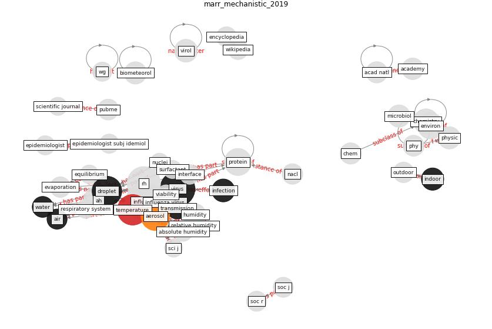

# Article: __Mechanistic insights into the effect of humidity on airborne influenza virus survival, transmission and incidence__ (marr_mechanistic_2019)

* [10.1098/rsif.2018.0298](https://doi.org/10.1098/rsif.2018.0298)
* Cluster: [air-sars](cluster_0)

## Keywords

* [influenza](keyword_influenza), [virus](keyword_virus), [temperature](keyword_temperature), [droplet](keyword_droplet), [influenza virus](keyword_influenza_virus), [rh](keyword_rh), [aerosol](keyword_aerosol), [protein](keyword_protein), [infection](keyword_infection), [indoor](keyword_indoor), [humidity](keyword_humidity), [transmission](keyword_transmission), [relative humidity](keyword_relative_humidity), physic, chemistry

## Keywords at large

* [influenza](keyword_influenza), [virus](keyword_virus), [temperature](keyword_temperature), [droplet](keyword_droplet), [influenza virus](keyword_influenza_virus), [rh](keyword_rh), [aerosol](keyword_aerosol), [protein](keyword_protein), [infection](keyword_infection), [biometeorol](keyword_biometeorol)

## Abstract

Influenza incidence and seasonality, along with virus
survival and transmission, appear to depend at least partly
on humidity, and recent studies have suggested that
absolute humidity (AH) is more important than relative
humidity (RH) in modulating observed patterns. In this
perspective article, we re-evaluate studies of influenza
virus survival in aerosols, transmission in animal models
and influenza incidence to show that the combination of
temperature and RH is equally valid as AH as a predictor.
Collinearity must be considered, as higher levels of AH are
only possible at higher temperatures, where it is well
established that virus decay is more rapid. In studies of
incidence that employ meteorological data, outdoor AH may
be serving as a proxy for indoor RH in temperate regions
during the wintertime heating season. Finally, we present a
mechanistic explanation based on droplet evaporation and
its impact on droplet physics and chemistry for why RH is
more likely than AH to modulate virus survival and
transmission.

## Concepts

 

### Closest articles 

* [Effects of temperature and humidity on the spread of COVID-19: A systematic review](article_mecenas_effects_2020)
* [COVID-19 could be a seasonal illness with higher risk in
winter: Reduced humidity linked to increased COVID-19
risk](article_university_of_sydney_covid-19_2020)
* [COVID-19 and its Modes of Transmission](article_karia_covid-19_2020)
* [Current knowledge of COVID-19: Advances, challenges and future perspectives](article_wu_current_2021)
* [Air, Surface Environmental, and Personal Protective Equipment Contamination by Severe Acute Respiratory Syndrome Coronavirus 2 (SARS-CoV-2) From a Symptomatic Patient](article_ong_air_2020)
* [Aerosol and Surface Distribution of Severe Acute Respiratory Syndrome Coronavirus 2 in Hospital Wards, Wuhan, China, 2020](article_guo_aerosol_2020)
* [SARS-CoV-2 RNA detection of hospital isolation wards hygiene monitoring during the Coronavirus Disease 2019 outbreak in a Chinese hospital](article_wang_sars-cov-2_2020)
* [onway-morris_removal_2021](article_onway-morris_removal_2021)
* [Graphene-based nanomaterials as antimicrobial surface coatings: A parallel approach to restrain the expansion of COVID-19](article_ayub_graphene-based_2021)
* [Real-world data show that filters clean COVID-causing virus from air](article_thompson_real-world_2021)

