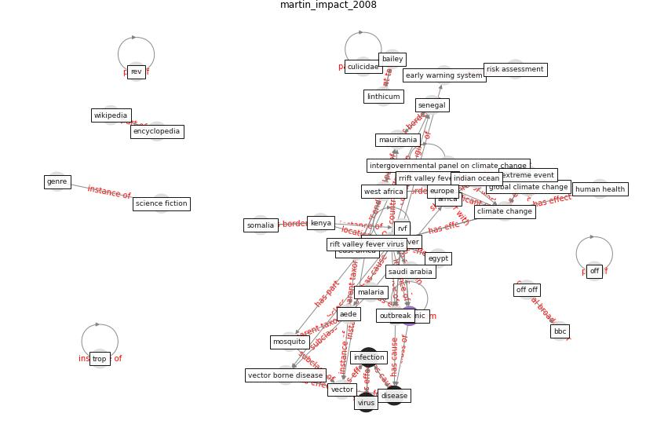

# Article: __The impact of climate change on the epidemiology and control of Rift Valley fever - PubMed__ (martin_impact_2008)

* URL: [https://pubmed.ncbi.nlm.nih.gov/18819669/](https://pubmed.ncbi.nlm.nih.gov/18819669/)
* Year: 2008

## Keywords

* [off](keyword_off), [wikipedia](keyword_wikipedia), [encyclopedia](keyword_encyclopedia), [rift valley fever](keyword_rift_valley_fever), [rev](keyword_rev), [epidemic](keyword_epidemic), [kenya](keyword_kenya), [vector](keyword_vector), [climate change](keyword_climate_change), [east africa](keyword_east_africa), [europe](keyword_europe), [disease](keyword_disease), vector borne disease, rvf, malaria

## Keywords at large

* [biophilic design](keyword_biophilic_design), [architecture](keyword_architecture), [sustainable architecture](keyword_sustainable_architecture), [nature](keyword_nature), [design](keyword_design), [biophilic](keyword_biophilic), [environ](keyword_environ), [biophilia](keyword_biophilia), [wellbeing](keyword_wellbeing), [health](keyword_health)

## Concepts

 

