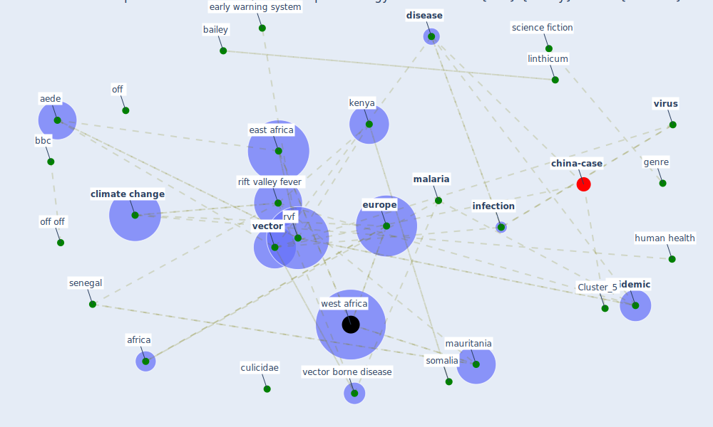

# Article: The impact of climate change on the epidemiology and control of Rift Valley fever - PubMed (martin_impact_2008)

* [https://pubmed.ncbi.nlm.nih.gov/18819669/](https://pubmed.ncbi.nlm.nih.gov/18819669/)
* Year: 2008
* Cluster: [china-case](cluster_5)

## Keywords

 * adaptation, aede, [africa](keyword_africa), anyamba, arabian sea, arbovirus, bailey, bbc, bunyaviridae, cambridge, cambridge university press, [china](keyword_china), [climate](keyword_climate), [climate change](keyword_climate_change), climatique, [control](keyword_control), culex, culicidae, [dengue](keyword_dengue), [disease](keyword_disease), disease outbreak, drier, early warning system, east africa, egypt, emerg, emerg emerg, [engineer](keyword_engineer), [epidemic](keyword_epidemic), epidemic cycle, [europe](keyword_europe), extreme event, extrinsic incubation, fao, flood, florida, fontenille d, [france](keyword_france), french, genre, guillaud, hatch, horn of africa, host, [human health](keyword_human_health), indian ocean, [infection](keyword_infection), kamau, [kenya](keyword_kenya), le guenno b, linthicum, livestock, logan, maladie à transmission vectorielle, [malaria](keyword_malaria), mauritania, mediterranean, [monitor](keyword_monitor), [mosquito](keyword_mosquito), méd, nasa, ndvi, [netherland](keyword_netherland), [new york](keyword_new_york), nord, ocean, [off](keyword_off), off off, [outbreak](keyword_outbreak), ovarian duct, ovary, phlebovirus, precipitation, rain, rainfall, research institute for climate and society, [rift valley fever](keyword_rift_valley_fever), rift valley fever virus, risk assessment, [rome](keyword_rome), rrift valley fever, rvf, [saudi arabia](keyword_saudi_arabia), science fiction, senegal, serological, somalia, [south africa](keyword_south_africa), système d alerte rapide, [tanzania](keyword_tanzania), [temperature](keyword_temperature), terra satellite, thiongane y, [vector](keyword_vector), [vector borne disease](keyword_vector_borne_disease), vectore, vegetation index, [virus](keyword_virus), west africa, wetter

## Concepts

 

## Neighbours

### Closest articles

* Vector-borne disease, climate change and urban design - [LINK](article_ogden_vector-borne_2016)
* Prototype Early Warning Systems for Vector-Borne Diseases in Europe - [LINK](article_semenza_prototype_2015)
* Challenges to Mitigating the Urban Health Burden of Mosquito-Borne Diseases in the Face of Climate Change - [LINK](article_ligsay_challenges_2021)
* Addressing vulnerability, building resilience: community-based adaptation to vector-borne diseases in the context of global change - [LINK](article_bardosh_addressing_2017)
* Global policy challenges for urban vector-borne disease risks - [LINK](article_alabaster_global_2016)
* Decision Making within the Built Environment as a Strategy for Mitigating the Risk of Malaria and Other Vector-Borne Diseases - [LINK](article_obonyo_decision_2018)
* Making green infrastructure healthier infrastructure - [LINK](article_lohmus_making_2015)
* Integrating rapid risk mapping and mobile phone call record data for strategic malaria elimination planning - [LINK](article_tatem_integrating_2014)
* The Emergence of Anti-Privacy and Control at the Nexus between the Concepts of Safe City and Smart City - [LINK](article_allam_emergence_2019)
* Contributions of Smart City Solutions and Technologies to Resilience against the COVID-19 Pandemic: A Literature Review - [LINK](article_sharifi_contributions_2021)

### Closest BPs

* Blueprint: Mental health – Act: Do something - [LINK](bp_18)
* Blueprint: Mental health – Belong: Do something with someone - [LINK](bp_19)
* Blueprint: Mental health – Commit: Do something meaningfull - [LINK](bp_20)
