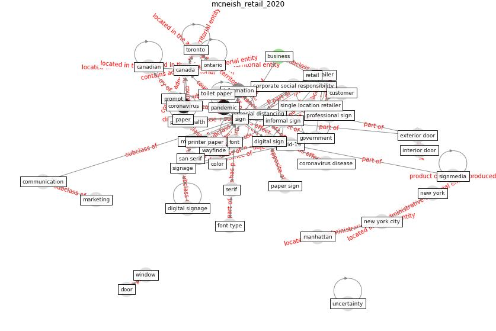

# Article: Retail Signage During the COVID-19 Pandemic (mcneish_retail_2020)

* Source: [10.15763/issn.2470-9670.2020.v4.i2.a64](https://doi.org/10.15763/issn.2470-9670.2020.v4.i2.a64)
* Year: 2020
* Cluster: [sign-retailer](cluster_8)

## Keywords

 * abstraction, adam a, association, black, boeke, bolde, [business](keyword_business), business deem essential, [canada](keyword_canada), canadian, chaparro, cognitive, color, communication, [coronavirus](keyword_coronavirus), coronavirus disease, [covid-19](keyword_covid-19), [customer](keyword_customer), door, duct tape, early stage, emergency order, entrance, exterior door, [font](keyword_font), font type, george orwell, [government](keyword_government), grocery store, gross, huddleston, [information](keyword_information), interior door, juni, kaspar, kettunen, kraków, large counterpart, letter, logo, machleit, [manhattan](keyword_manhattan), [marketing](keyword_marketing), [mask](keyword_mask), message, moghimi, multi location retailer, [new york](keyword_new_york), [new york city](keyword_new_york_city), [news](keyword_news), nineteen eighty four, [ontario](keyword_ontario), order, [pandemic](keyword_pandemic), [paper](keyword_paper), pharmacy, plastic bag, [poland](keyword_poland), post, poster, [printer](keyword_printer), printer paper, [product](keyword_product), prompt, [public health](keyword_public_health), raubal, red, [retail](keyword_retail), retail store, [retailer](keyword_retailer), reusable bag, san serif, serif, sidewalk, [sign](keyword_sign), [signage](keyword_signage), signmedia, single location, single location retailer, [star](keyword_star), starbuck, stay home, stockout, [store](keyword_store), subsection, supermarket, [supply chain](keyword_supply_chain), tangible manifestation, tobacco, toilet paper, [toronto](keyword_toronto), twometer, uncertainty, [unesco](keyword_unesco), unknowe, [wayfinde](keyword_wayfinde), wiktorowicz, [window](keyword_window), [world health organization](keyword_world_health_organization), [world heritage site](keyword_world_heritage_site)

## Concepts

 

## Neighbours

### Closest articles

* Touchless Retail: What the Rest of the World could learn from China’s new ways to shop - [LINK](article_capgemini_touchless_2020)
* How COVID-19 Could Accelerate the Adoption of New Retail Technologies and Enhance the (E-)Servicescape - [LINK](article_willems_how_2021)
* <scp>COVID</scp>             ‐19: Small and medium enterprises challenges and responses with creativity, innovation, and entrepreneurship - [LINK](article_thukral_covid19_2021)
* Startups in times of crisis – A rapid response to the COVID-19 pandemic - [LINK](article_kuckertz_startups_2020)
* KIX to apply antimicrobial coating in its fight against COVID-19 - [LINK](article_kansai_airport_kix_2021)
* COVID-19 and regional solutions for mitigating the risk of SME finance in selected ASEAN member states - [LINK](article_taghizadeh-hesary_covid-19_2022)
* World Bank Development Report - [LINK](article_world_bank_world_2022)
* Building occupancy estimation with people flow modeling in AnyLogic - [LINK](article_li_building_2016)
* Covid-19 and asset management in EU: a preliminary assessment of performance and investment styles - [LINK](article_rizvi_covid-19_2020)

### Closest BPs

* Blueprint: Smart Locker System - [LINK](bp_1)
* Blueprint: Rotational Shift System - [LINK](bp_0)
* Blueprint: One-way mobility circulation - [LINK](bp_4)
