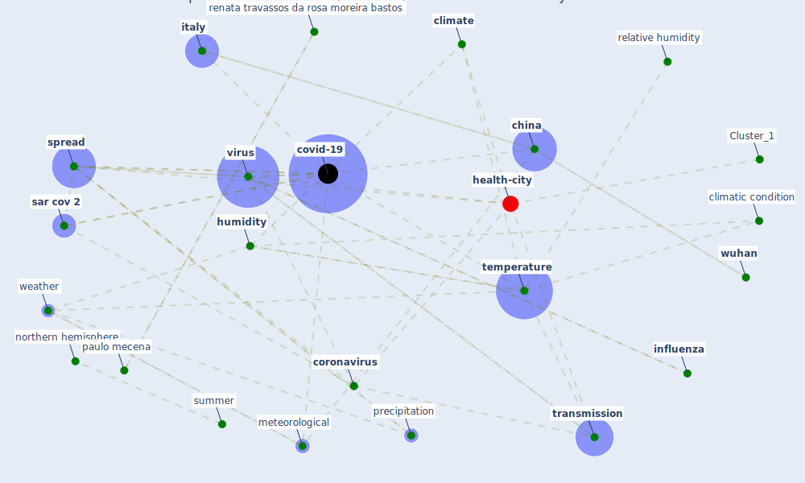

# Article: Effects of temperature and humidity on the spread of COVID-19: A systematic review (mecenas_effects_2020)

* Source: [10.1371/journal.pone.0238339](https://doi.org/10.1371/journal.pone.0238339)
* Year: 2020
* Cluster: [health-city](cluster_1)

## Keywords

 * absolute humidity, antonio carlos rosa rio vallinoto, bannistertyrrell, [beijing](keyword_beijing), betacoronavirus, bias, cai, [cdc](keyword_cdc), chen et, [china](keyword_china), [climate](keyword_climate), climatic condition, cochrane library, cold, confound factor, confound variable, [coronavirus](keyword_coronavirus), coronavirus disease, [covid-19](keyword_covid-19), database, david normando, descriptive statistic, [disease](keyword_disease), disease control, dry, electronic database, [engineering](keyword_engineering), [europe](keyword_europe), [exposure](keyword_exposure), [factor](keyword_factor), [france](keyword_france), google scholar, health policy, [hubei](keyword_hubei), humid, [humidity](keyword_humidity), [immunity](keyword_immunity), incidence, [infection](keyword_infection), [influenza](keyword_influenza), intervention, [italy](keyword_italy), khattabi, lilacs, [low](keyword_low), low risk of bias, luo, medrxiv org, [meta analysis](keyword_meta_analysis), meteorological, northern hemisphere, objective, observational, [outbreak](keyword_outbreak), [pandemic](keyword_pandemic), paulo mecena, population density, precipitation, [pressure](keyword_pressure), [public health](keyword_public_health), public intervention, radio format, reanalysis, relative humidity, renata travassos da rosa moreira bastos, retrospective, [risk](keyword_risk), risk of bias, sar cov, [sar cov 2](keyword_sar_cov_2), song, [south korea](keyword_south_korea), specific humidity, [spread](keyword_spread), spread of the virus, srrn, statistic, [study](keyword_study), summer, [surveillance](keyword_surveillance), [system](keyword_system), system science, systematic review, [temperature](keyword_temperature), [toronto](keyword_toronto), [transmission](keyword_transmission), travel limitation, [vaccine](keyword_vaccine), [virus](keyword_virus), visibility, warm, weather, weather factor, weather variable, web of science, wet, wind speed, [winter](keyword_winter), [wuhan](keyword_wuhan), zhou p

## Concepts

 

## Neighbours

### Closest articles

* COVID-19 could be a seasonal illness with higher risk in winter: Reduced humidity linked to increased COVID-19 risk - [LINK](article_university_of_sydney_covid-19_2020)
* Climate and the spread of COVID-19 - [LINK](article_chen_climate_2021)
* Mechanistic insights into the effect of humidity on airborne influenza virus survival, transmission and incidence - [LINK](article_marr_mechanistic_2019)
* Study of COVID-19 pandemic in London (UK) from urban context - [LINK](article_ghosh_study_2020)
* An investigation of transmission control measures during the first 50 days of the COVID-19 epidemic in China - [LINK](article_tian_investigation_2020)
* The effect of human mobility and control measures on the COVID-19 epidemic in China - [LINK](article_kraemer_effect_2020)
* COVID-19 Higher Mortality in Chinese Regions With Chronic Exposure to Lower Air Quality - [LINK](article_pansini_covid-19_2021)
* Air pollution linked with higher COVID-19 death rates - [LINK](article_harvard_th_chan_schoold_of_public_health_air_2020)
* How drones help cities during the Covid-19 pandemic \textbar TheMayor.EU - [LINK](article_dimitrova_how_2021)
* Open-source analytics tools for studying the COVID-19 coronavirus outbreak - [LINK](article_wu_open-source_2020)

### Closest BPs

* Blueprint: Resilience in staffing and skills training - [LINK](bp_12)
* Blueprint: Installing UV in ductwork - [LINK](bp_10)
* Blueprint: Negative pressure rooms - [LINK](bp_13)
