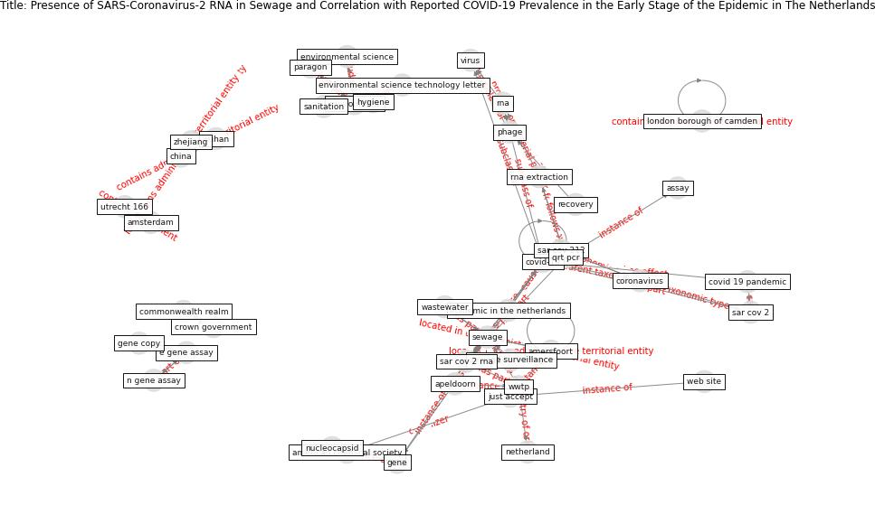

# Article: __Presence of SARS-Coronavirus-2 RNA in Sewage and Correlation with Reported COVID-19 Prevalence in the Early Stage of the Epidemic in The Netherlands__ (medema_presence_2020)

* [10.1021/acs.estlett.0c00357](https://doi.org/10.1021/acs.estlett.0c00357)
* Cluster: [wastewater-sars](cluster_12)

## Keywords

* [sar cov 2](keyword_sar_cov_2), [covid-19](keyword_covid-19), [wwtp](keyword_wwtp), [sewage](keyword_sewage), [gene](keyword_gene), [china](keyword_china), [netherland](keyword_netherland), [rna extraction](keyword_rna_extraction), [sar cov 2 rna](keyword_sar_cov_2_rna), [rna](keyword_rna), [environment](keyword_environment), [wuhan](keyword_wuhan), [virus](keyword_virus), [coronavirus](keyword_coronavirus), just accept

## Keywords at large

* [biophilic design](keyword_biophilic_design), [architecture](keyword_architecture), [sustainable architecture](keyword_sustainable_architecture), [nature](keyword_nature), [design](keyword_design), [biophilic](keyword_biophilic), [environ](keyword_environ), [biophilia](keyword_biophilia), [wellbeing](keyword_wellbeing), [health](keyword_health)

## Concepts

 

### References 

* [SARS-CoV-2 in wastewater: potential health risk, but
also data source](article_lodder_sars-cov-2_2020)
* [First confirmed detection of SARS-CoV-2 in untreated
wastewater in Australia: A proof of concept for the
wastewater surveillance of COVID-19 in the community](article_ahmed_first_2020)

### Cited by 

* [Wastewater-Based Epidemiology to monitor COVID-19
outbreak: Present and future diagnostic methods to be in
your radar](article_barcelo_wastewater-based_2020)
* [When the fourth water and digital revolution encountered
COVID-19](article_poch_when_2020)
* [Detection of SARS-CoV-2 in raw and treated wastewater
in Germany – Suitability for COVID-19 surveillance
and potential transmission risks](article_westhaus_detection_2021)
