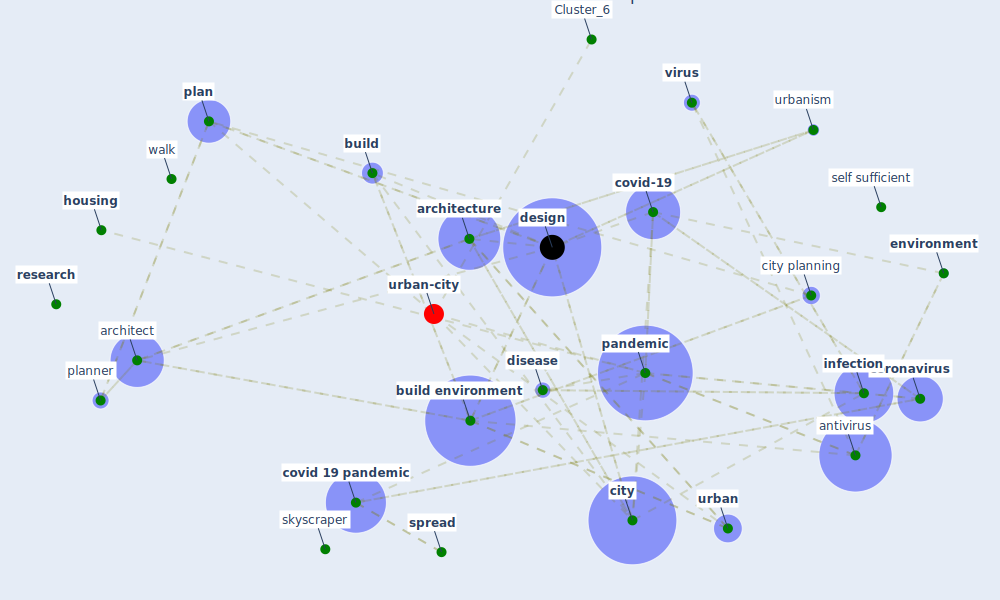

# Article: Antivirus-built environment: Lessons learned from Covid-19 pandemic (megahed_antivirus-built_2020)

* Source: [10.1016/j.scs.2020.102350](https://doi.org/10.1016/j.scs.2020.102350)
* Year: 2020
* Cluster: [urban-city](cluster_6)

## Keywords

 * abd elhafeez, alsafi, antivirus, antivirus strategy, [architect](keyword_architect), [architecture](keyword_architecture), architecture after coronavirus, avineri, [build](keyword_build), [build environment](keyword_build_environment), [building](keyword_building), [city](keyword_city), city planning, clifton, [construction](keyword_construction), construction strategy, [coronavirus](keyword_coronavirus), covid 19 outbreak, [covid 19 pandemic](keyword_covid_19_pandemic), [covid-19](keyword_covid-19), current pandemic, cybersecurity, [cycling](keyword_cycling), decentralization, [design](keyword_design), [disease](keyword_disease), dream, elevator, elmokadem, [environment](keyword_environment), [epidemic](keyword_epidemic), ermacora, [europe](keyword_europe), [european union](keyword_european_union), farm, fear of infection, [green roof](keyword_green_roof), [health](keyword_health), [home](keyword_home), horizontally, [hospital](keyword_hospital), [housing](keyword_housing), [infection](keyword_infection), [infectious disease](keyword_infectious_disease), kashdan, kerwan, league, [london](keyword_london), madani, megahe, [microorganism](keyword_microorganism), modular, muggah, [nature](keyword_nature), [new york](keyword_new_york), [office](keyword_office), [pandemic](keyword_pandemic), [plan](keyword_plan), planner, planning theory, [population](keyword_population), post pandemic style, post-pandemic, pourdeihimi, prefabricate, [prevention](keyword_prevention), [professional](keyword_professional), [public space](keyword_public_space), ranson, reality, related question, [research](keyword_research), routledge, saadat, science, self sufficient, skyscraper, [society](keyword_society), [spread](keyword_spread), susilo, [sustainability](keyword_sustainability), sustainable, [sustainable architecture](keyword_sustainable_architecture), sustainable city, [sustainable development](keyword_sustainable_development), [technology](keyword_technology), term, terrace, [urban](keyword_urban), urban farming, [urban planning](keyword_urban_planning), urban story, [urbanism](keyword_urbanism), vaishya, [virus](keyword_virus), walk, work from home, workspace, world, [world heritage site](keyword_world_heritage_site)

## Concepts

 

## Neighbours

### Closest articles

* Impact of Covid-19 on the built environment - [LINK](article_mahima_impact_2022)
* The Role of Architecture and Urbanism in Preventing Pandemics - [LINK](article_kumar_role_2021)
* Houses amid COVID-19: Environmental challenges and design adaptation - [LINK](article_hizra_houses_2021)
* COVID-19 Could Leverage a Sustainable Built Environment - [LINK](article_pinheiro_covid-19_2020)
* The Impact of COVID-19 on Public Space: A Review of the Emerging Questions - [LINK](article_honey-roses_impact_2020)
* How the Coronavirus Will Reshape Architecture - [LINK](article_chayka_how_2020)
* Coronavirus questions that will not go away: interrogating urban and socio-spatial implications of COVID-19 measures - [LINK](article_salama_coronavirus_2020)
* Designing for COVID-2x: Reflecting on Future-Proofing Human Habitation for the Inevitable Next Pandemic - [LINK](article_spennemann_designing_2022)
* RESIDENTIAL ARCHITECTURE IN A POST-PANDEMIC WORLD: IMPLICATIONS OF COVID-19 FOR NEW CONSTRUCTION AND FOR ADAPTING HERITAGE BUILDINGS - [LINK](article_spennemann_residential_2021)

### Closest BPs

* Blueprint: Tracking and enforcing use of Personal Protective Equipment - [LINK](bp_23)
* Blueprint: Building Adaptation during a pandemic - [LINK](bp_14)
* Blueprint: Architecture design - [LINK](bp_2)
