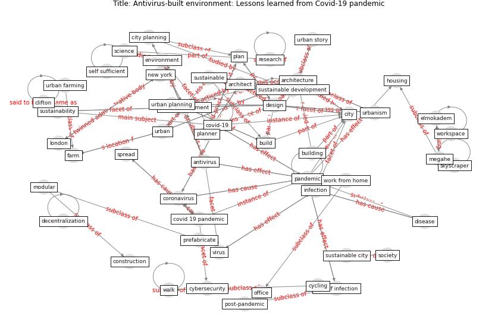

# Article: __Antivirus-built environment: Lessons learned from Covid-19 pandemic__ (megahed_antivirus-built_2020)

* [10.1016/j.scs.2020.102350](https://doi.org/10.1016/j.scs.2020.102350)
* Cluster: [health-building](cluster_9)

## Keywords

* [pandemic](keyword_pandemic), [covid-19](keyword_covid-19), [architecture](keyword_architecture), [build environment](keyword_build_environment), [city](keyword_city), [design](keyword_design), [antivirus](keyword_antivirus), [covid 19 pandemic](keyword_covid_19_pandemic), [urbanism](keyword_urbanism), [infection](keyword_infection), [coronavirus](keyword_coronavirus), [environment](keyword_environment), [architect](keyword_architect), [build](keyword_build), work from home

## Keywords at large

* [pandemic](keyword_pandemic), [covid-19](keyword_covid-19), [architecture](keyword_architecture), [design](keyword_design), [build environment](keyword_build_environment), [city](keyword_city), [antivirus](keyword_antivirus), [covid 19 pandemic](keyword_covid_19_pandemic), [urbanism](keyword_urbanism), [infection](keyword_infection)

## Concepts

 

### Closest articles 

* [COVID-19 Could Leverage a Sustainable Built Environment](article_pinheiro_covid-19_2020)
* [Coronavirus questions that will not go away: interrogating urban and socio-spatial implications of COVID-19 measures](article_salama_coronavirus_2020)
* [Epidemics, Planning and the City: A Special Issue of Planning Perspectives](article_davis_epidemics_2022)
* [COVID-19 Pandemic: Rethinking Strategies for
Resilient Urban Design, Perceptions, and
Planning](article_afrin_covid-19_2021)
* [Learning from pandemics: Applying resilience thinking to identify priorities for planning urban settlements](article_syal_learning_2021)
* [Respiratory pandemics, urban planning and design: A multidisciplinary rapid review of the literature](article_harris_respiratory_2022)
* [The Impact of COVID-19 on Public Space: A Review of the Emerging Questions](article_honey-roses_impact_2020)
* [COVID-19 Lessons for a Resilient Built
Environment: A Roadmap](article_hull_covid-19_2020)
* [COVID-19: Lessons for an Urban(izing) World](article_acuto_covid-19_2020)
* [Biophilic design in architecture and its contributions to health, well-being, and sustainability: A critical review](article_zhong_biophilic_2022)

### References 

* [COVID-19: Lessons for an Urban(izing) World](article_acuto_covid-19_2020)
* [Pandemic stricken cities on lockdown. Where are our
planning and design professionals [now, then and into the
future]?](article_allam_pandemic_2020)
* [Using Technology to Maintain the Education of
Residents During the COVID-19 Pandemic](article_chick_using_2020)
* [COVID-19 Pandemic: Prevention and Protection
Measures to Be Adopted at the Workplace](article_cirrincione_covid-19_2020)
* [2019 Novel Coronavirus (COVID-19) Pandemic:
Built Environment Considerations To Reduce
Transmission](article_dietz_2019_2020)
* [How COVID-19 Redefines the Concept of
Sustainability](article_hakovirta_how_2020)
* [The socio-economic implications of the coronavirus
pandemic (COVID-19): A review](article_nicola_socio-economic_2020)
* [Nurture to nature via COVID-19, a self-regenerating
environmental strategy of environment in global context](article_paital_nurture_2020)
* [Mental Health and the Covid-19 Pandemic](article_pfefferbaum_mental_2020)
* [COVID-19: A new digital dawn?](article_robbins_covid-19_2020)

### Cited by 

* [A Review on Building Design as a Biomedical
System for Preventing COVID-19 Pandemic](article_amran_review_2022)
* [Housing Experience in Gated Communities in the
Time of Pandemics: Lessons Learned from
COVID-19](article_asfour_housing_2022)
* [A Mixed Approach on Resilience of Spanish
Dwellings and Households during COVID-19 Lockdown](article_cuerdo-vilches_mixed_2020)
* [Treating two pandemics for the price of one: Chronic and
infectious disease impacts of the built and natural
environment](article_frank_treating_2021)
* [Addressing the impact of COVID-19 lockdown on energy use
in municipal buildings: A case study in Florianópolis,
Brazil](article_geraldi_addressing_2021)
* [Strategies to Mitigate COVID-19 Pandemic Impacts
on Health and Safety of Workers in Construction
Projects](article_kaushal_strategies_2021)
* [Indoor Air Quality: Rethinking rules of building
design strategies in post-pandemic architecture](article_megahed_indoor_2021)
* [Designing Post COVID-19 Buildings: Approaches for
Achieving Healthy Buildings](article_navaratnam_designing_2022)
* [COVID-19 Experience Transforming the Protective
Environment of Office Buildings and Spaces](article_phapant_covid-19_2021)
* [RESIDENTIAL ARCHITECTURE IN A POST-PANDEMIC
WORLD: IMPLICATIONS OF COVID-19 FOR NEW
CONSTRUCTION AND FOR ADAPTING HERITAGE
BUILDINGS](article_spennemann_residential_2021)
* [Readiness Assessment of Green Building
Certification Systems for Residential Buildings
during Pandemics](article_tleuken_readiness_2021)
* [Assessment method for new sustainability indicators
providing pandemic resilience for residential buildings](article_tokazhanov_assessment_2021)
* [How is COVID-19 Experience Transforming
Sustainability Requirements of Residential
Buildings? A Review](article_tokazhanov_how_2020)
* [Impact of COVID-19 on IoT Adoption in Healthcare,
Smart Homes, Smart Buildings, Smart Cities,
Transportation and Industrial IoT](article_umair_impact_2021)
