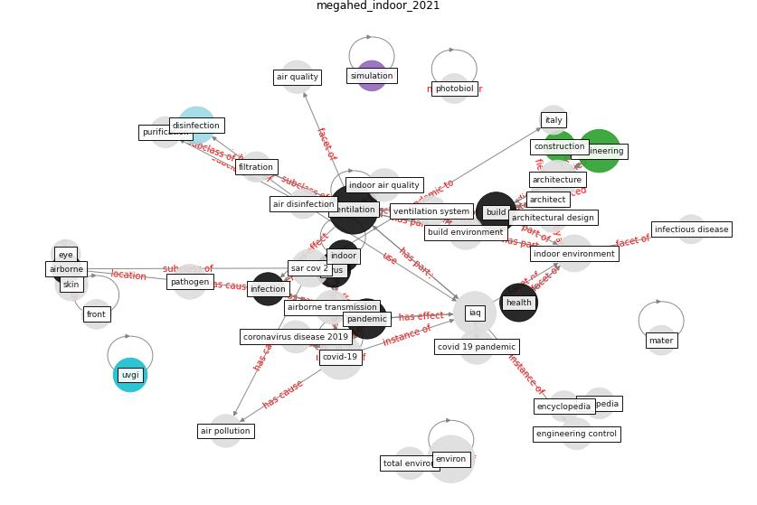

# Article: __Indoor Air Quality: Rethinking rules of building design strategies in post-pandemic architecture__ (megahed_indoor_2021)

* [10.1016/j.envres.2020.110471](https://doi.org/10.1016/j.envres.2020.110471)
* Cluster: [air-ventilation](cluster_8)

## Keywords

[ventilation](keyword_ventilation), [engineering](keyword_engineering), [build](keyword_build), [pandemic](keyword_pandemic), [health](keyword_health)

## Concepts

 

### References 

* [Methods for air cleaning and protection of building
occupants from airborne pathogens](article_bolashikov_methods_2009)
* [Antivirus-built environment: Lessons learned from
Covid-19 pandemic](article_megahed_antivirus-built_2020)
* [Applications of ultraviolet germicidal irradiation
disinfection in health care facilities: Effective
adjunct, but not stand-alone technology](article_memarzadeh_applications_2010)
* [How can airborne transmission of COVID-19 indoors be
minimised?](article_morawska_how_2020-1)
* [Characterization and performance evaluation of a
full-scale activated carbon-based dynamic botanical air
filtration system for improving indoor air quality](article_wang_characterization_2011)
* [Combating COVID-19—The role of robotics in managing
public health and infectious diseases](article_yang_combating_2020)

### Cited by 

* [A Review on Building Design as a Biomedical
System for Preventing COVID-19 Pandemic](article_amran_review_2022)* [A critical review of heating, ventilation, and air
conditioning (HVAC) systems within the context of a
global SARS-CoV-2 epidemic](article_elsaid_critical_2021)* [Designing Post COVID-19 Buildings: Approaches for
Achieving Healthy Buildings](article_navaratnam_designing_2022)
