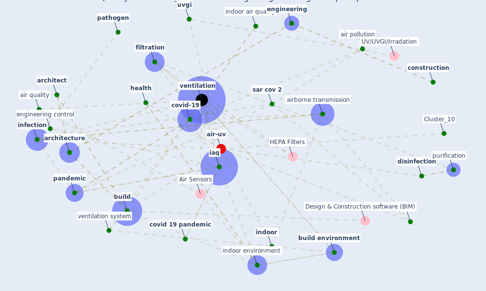

# Article: Indoor Air Quality: Rethinking rules of building design strategies in post-pandemic architecture (megahed_indoor_2021)

* Source: [10.1016/j.envres.2020.110471](https://doi.org/10.1016/j.envres.2020.110471)
* Year: 2021
* Cluster: [air-uv](cluster_10)

## Keywords

 * [air](keyword_air), air disinfection, air filtration, [air pollutant](keyword_air_pollutant), [air pollution](keyword_air_pollution), air purification, air purifier, air quality, air quality monitoring, [airborne](keyword_airborne), airborne transmission, [architect](keyword_architect), [architectural](keyword_architectural), [architecture](keyword_architecture), back, biofiltration, biosystem, biotechnol, [build](keyword_build), build environ, [build environment](keyword_build_environment), [building](keyword_building), chemistry, [city](keyword_city), co2, [coating](keyword_coating), comfort, [construction](keyword_construction), construction control, [control](keyword_control), cornea, [coronavirus](keyword_coronavirus), coronavirus disease, [covid 19 pandemic](keyword_covid_19_pandemic), [covid-19](keyword_covid-19), cross infection, current pandemic, dilution, [disease](keyword_disease), [disinfection](keyword_disinfection), dixon, energy build, [engineer](keyword_engineer), [engineering](keyword_engineering), engineering control, expo, [exposure](keyword_exposure), eye, [filtration](keyword_filtration), flowchart, front, genre, green wall, [health](keyword_health), hierarchy of hazard control, [hvac](keyword_hvac), [iaq](keyword_iaq), [indoor](keyword_indoor), [indoor air quality](keyword_indoor_air_quality), [indoor environment](keyword_indoor_environment), [infection](keyword_infection), [infectious disease](keyword_infectious_disease), [infrastructure](keyword_infrastructure), interdisciplinary, [italy](keyword_italy), maintenance, [mater](keyword_mater), microalgae, [mitigation](keyword_mitigation), [monitor](keyword_monitor), [occupant health](keyword_occupant_health), outdoor air, [pandemic](keyword_pandemic), passive design, [pathogen](keyword_pathogen), photochem, [pollution](keyword_pollution), post pandemic control, [prevention](keyword_prevention), protection, [public health](keyword_public_health), purification, [research](keyword_research), [sar cov 2](keyword_sar_cov_2), science, science fiction, [sensor](keyword_sensor), sick building syndrome, [simulation](keyword_simulation), skin, [spread](keyword_spread), [standard](keyword_standard), [system](keyword_system), today, [transmission](keyword_transmission), [uv](keyword_uv), [uvgi](keyword_uvgi), [ventilation](keyword_ventilation), ventilation system, [virus](keyword_virus)

## Concepts

 

## Neighbours

### Closest articles

* Designing Post COVID-19 Buildings: Approaches for Achieving Healthy Buildings - [LINK](article_navaratnam_designing_2022)
* Smart buildings: how a virus might lead to healthier buildings - Arup - [LINK](article_lam_smart_2021)
* Ten questions concerning occupant health in buildings during normal operations and extreme events including the COVID-19 pandemic - [LINK](article_awada_ten_2021)
* The effect of a redesigned floor plan, occupant density and the quality of indoor climate on the cost of space, productivity and sick leave in an office building–A case study - [LINK](article_saari_effect_2006)
* Occupant health in buildings: Impact of the COVID-19 pandemic on the opinions of building professionals and implications on research - [LINK](article_awada_occupant_2022)
*  - [LINK](article_yakubu_aminu_dodo_green_2020)
* The contribution of green buildings in the fight against COVID-19 - [LINK](article_world_green_building_council_contribution_2020)
* Health, Wellbeing \& Productivity in Offices - [LINK](article_world_green_building_council_health_2014)
* Characterization and performance evaluation of a full-scale activated carbon-based dynamic botanical air filtration system for improving indoor air quality - [LINK](article_wang_characterization_2011)
* The Effect of Opening Windows on Air Change Rates in Two Homes - [LINK](article_howard-reed_effect_2002)

### Closest BPs

* Blueprint: Indoor Environmental Quality (IEQ) monitoring system - [LINK](bp_3)
* Blueprint: Air Cleaning Plants - [LINK](bp_15)
* Blueprint: Installing high-efficiency air filters - [LINK](bp_11)
