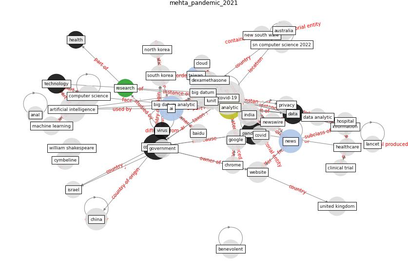

# Article: __Pandemic Analytics: How Countries are Leveraging Big Data Analytics and Artificial Intelligence to Fight COVID-19?__ (mehta_pandemic_2021)

* [10.1007/s42979-021-00923-y](https://doi.org/10.1007/s42979-021-00923-y)
* Cluster: [datum-health](cluster_1)

## Keywords

[coronavirus](keyword_coronavirus), [ai](keyword_ai), [analytic](keyword_analytic), [news](keyword_news), [pandemic](keyword_pandemic), [data](keyword_data)

## Abstract

Emergence of coronavirus in December 2019 and its spread
across the world in the following months has made it a
global health concern. The uncertainty about its evolution,
transmission and effect of SARS-CoV-2, has left the
countries and their governments in a worrisome state.
Ambiguity about the strategies that would work towards
mitigating the impact of virus has prompted them to use
data-driven methods. Several countries started applying big
data and advanced analytics technology for management of
the crisis. This study aims to understand how different
nations have employed analytics to deal with COVID-19. This
paper reviews various strategies employed by different
governments and organizations across nations that use
advanced analytics to tackle pandemic. In the current
emergency of corona virus, there have been several measures
that organizations have taken to mitigate its impact,
thanks to the evolution of computing technology. Big data
and analytical tools provide various solutions like
detection of existing COVID-19 cases, prediction of future
outbreak, anticipation of potential preventive and
therapeutic agents, and assistance in informed
decision-making. This review discusses the big data
analytics and artificial intelligence approaches that
policy makers, researchers, epidemiologists and private
organizations have adopted. By examining the different ways
and areas where data analytics has been utilized, this
study provides the other nations with the progressive
scheme to address the pandemic.

## Concepts

 

### References 

* [Response to COVID-19 in Taiwan: Big Data
Analytics, New Technology, and Proactive
Testing](article_wang_response_2020)

### Cited by 

