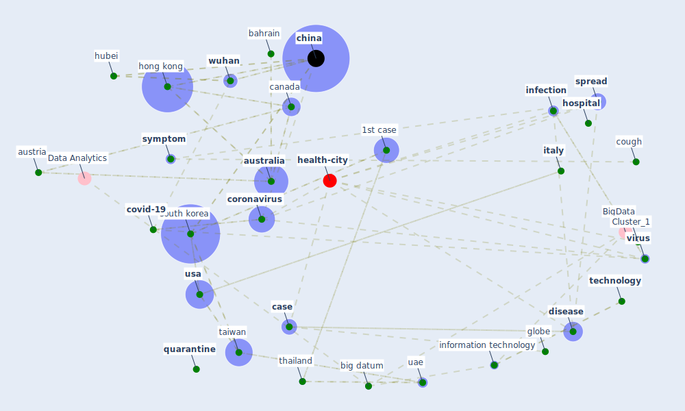

# Article:  (mehtab_alam_role_2021)

* Source: [10.6084/M9.FIGSHARE.14369627](https://doi.org/10.6084/M9.FIGSHARE.14369627)
* Year: 2021
* Cluster: [health-city](cluster_1)

## Keywords

 * 1st case, 1st death, age, ai ai, [australia](keyword_australia), [austria](keyword_austria), azerbaijan, bahrain, bangkok, [beijing](keyword_beijing), [big datum](keyword_big_datum), [brazil](keyword_brazil), [business](keyword_business), [canada](keyword_canada), [case](keyword_case), ccdc, [cctv](keyword_cctv), [cdc](keyword_cdc), cell, [china](keyword_china), china 2835 iran 43 italy 29 south korea 17 usa1, [city](keyword_city), [coronavirus](keyword_coronavirus), cough, country affect by novel coronavirus, [covid-19](keyword_covid-19), current pandemic, [denmark](keyword_denmark), department, difficulty in breathing, [disease](keyword_disease), [disinfectant](keyword_disinfectant), [drone](keyword_drone), ecuador, [fever](keyword_fever), [finland](keyword_finland), [france](keyword_france), [germany](keyword_germany), globe, guangdong, hand sanitizer, healthcare professional, [hong kong](keyword_hong_kong), [hospital](keyword_hospital), huanan, [hubei](keyword_hubei), hubei province, [human](keyword_human), [india](keyword_india), [indonesia](keyword_indonesia), [infection](keyword_infection), [influenza](keyword_influenza), information technology, [internet](keyword_internet), [iot](keyword_iot), isolation, [italy](keyword_italy), [japan](keyword_japan), [kuwait](keyword_kuwait), lebanon, location, lung, management study, medication, [network](keyword_network), [north america](keyword_north_america), novel, [organization](keyword_organization), [pandemic](keyword_pandemic), papanikolaou, philippine, pneumonia, [prevention](keyword_prevention), processing power, protein, [province](keyword_province), qatar, [quarantine](keyword_quarantine), respiratory droplet, [robot](keyword_robot), seafood market, [shanghai](keyword_shanghai), [south korea](keyword_south_korea), [spread](keyword_spread), [stainless steel](keyword_stainless_steel), statpearl, [symptom](keyword_symptom), [taiwan](keyword_taiwan), [technology](keyword_technology), [test](keyword_test), thailand, uae, [united states](keyword_united_states), unwanted transmission, [usa](keyword_usa), [vaccine](keyword_vaccine), vietnam, [virus](keyword_virus), [wuhan](keyword_wuhan), zhejiang

## Concepts

 

## Neighbours

### Closest articles

* Open-source analytics tools for studying the COVID-19 coronavirus outbreak - [LINK](article_wu_open-source_2020)
* The effect of human mobility and control measures on the COVID-19 epidemic in China - [LINK](article_kraemer_effect_2020)
* An investigation of transmission control measures during the first 50 days of the COVID-19 epidemic in China - [LINK](article_tian_investigation_2020)
* Response to COVID-19 in Taiwan - [LINK](article_wang_response_2020)
* Coronavirus: Can artificial intelligence be smart enough to detect fake news? - [LINK](article_tong_coronavirus_2020)
* Covid-19 and community mitigation strategies in a pandemic - [LINK](article_ebrahim_covid-19_2020)
* Coronavirus disease 2019: The harms of exaggerated information and non‐evidence‐based measures - [LINK](article_ioannidis_coronavirus_2020)
* Telehealth overpromises during the Covid-19 pandemic - [LINK](article_ostherr_telehealth_2020)
* Infodemic and the spread of fake news in the COVID-19-era - [LINK](article_orso_infodemic_2020)
* Overview of the mitigation strategies for COVID-19 pandemic - [LINK](article_ads_overview_2020)

### Closest BPs

* Blueprint: Resilience in staffing and skills training - [LINK](bp_12)
* Blueprint: Installing UV in ductwork - [LINK](bp_10)
* Blueprint: Negative pressure rooms - [LINK](bp_13)
