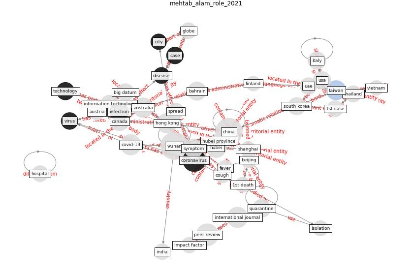

# Article: ____ (mehtab_alam_role_2021)

* [10.6084/M9.FIGSHARE.14369627](https://doi.org/10.6084/M9.FIGSHARE.14369627)
* Cluster: [health-ai](cluster_1)

## Keywords

* [wuhan](keyword_wuhan), [china](keyword_china), [coronavirus](keyword_coronavirus), [hubei](keyword_hubei), [australia](keyword_australia), [hong kong](keyword_hong_kong), [covid-19](keyword_covid-19), [taiwan](keyword_taiwan), [canada](keyword_canada), [infection](keyword_infection), bahrain, [symptom](keyword_symptom), usa, [technology](keyword_technology), [south korea](keyword_south_korea)

## Keywords at large

* [biophilic design](keyword_biophilic_design), [architecture](keyword_architecture), [sustainable architecture](keyword_sustainable_architecture), [nature](keyword_nature), [design](keyword_design), [biophilic](keyword_biophilic), [environ](keyword_environ), [biophilia](keyword_biophilia), [wellbeing](keyword_wellbeing), [health](keyword_health)

## Abstract

With the sudden outbreak of the novel coronavirus in china
the whole world has come to a stand-still. The outbreak was
first identified in Wuhan, Hubei, China, in December 2019.
It didn’t take much time for the novel coronavirus to
leave china mainland and spread to other countries of the
world. With a few months more than 150 countries started to
report cases for the disease. Panic was created in all the
whole world. In the next few weeks, the confirmed cases
were recorded as 89206 and the death toll was more than 812
world-wide (29 th February 2020).

## Concepts

 

