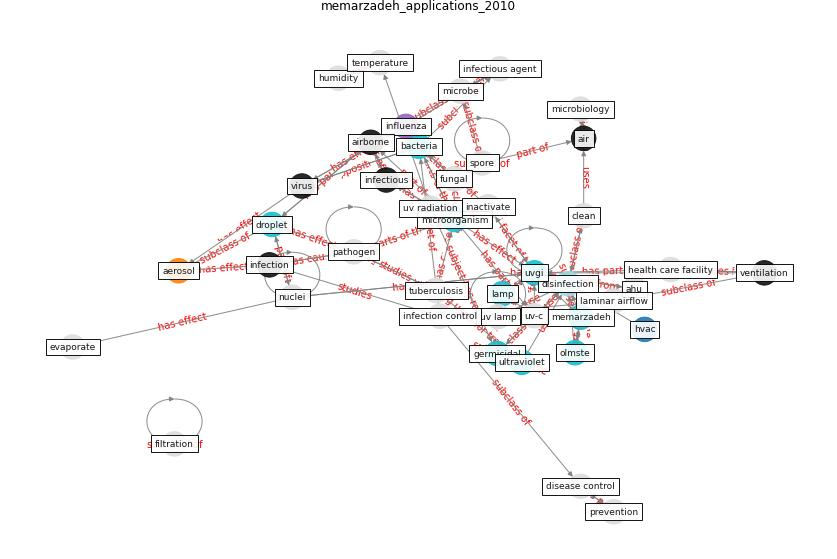

# Article: __Applications of ultraviolet germicidal irradiation disinfection in health care facilities: Effective adjunct, but not stand-alone technology__ (memarzadeh_applications_2010)

* [10.1016/j.ajic.2010.04.208](https://doi.org/10.1016/j.ajic.2010.04.208)
* Cluster: [uvgi-uv](cluster_11)

## Keywords

[uvgi](keyword_uvgi), [disinfection](keyword_disinfection), [ventilation](keyword_ventilation), [germicidal](keyword_germicidal), [ultraviolet](keyword_ultraviolet), [bacteria](keyword_bacteria), [microorganism](keyword_microorganism), [virus](keyword_virus), [lamp](keyword_lamp)

## Concepts

 

### References 

* [Role of ventilation in airborne transmission of infectious
agents in the built environment ? a multidisciplinary
systematic review](article_li_role_2007)
* [Upper-Room Ultraviolet Light and Negative Air
Ionization to Prevent Tuberculosis Transmission](article_escombe_upper-room_2009)

### Cited by 

* [A Review on Building Design as a Biomedical
System for Preventing COVID-19 Pandemic](article_amran_review_2022)
* [2019 Novel Coronavirus (COVID-19) Pandemic:
Built Environment Considerations To Reduce
Transmission](article_dietz_2019_2020)
* [Prophylactic Architecture: Formulating the Concept
of Pandemic-Resilient Homes](article_elrayies_prophylactic_2022)
* [Indoor Air Quality: Rethinking rules of building
design strategies in post-pandemic architecture](article_megahed_indoor_2021)
* [A review of facilities management interventions to
mitigate respiratory infections in existing buildings](article_zhang_review_2022)
