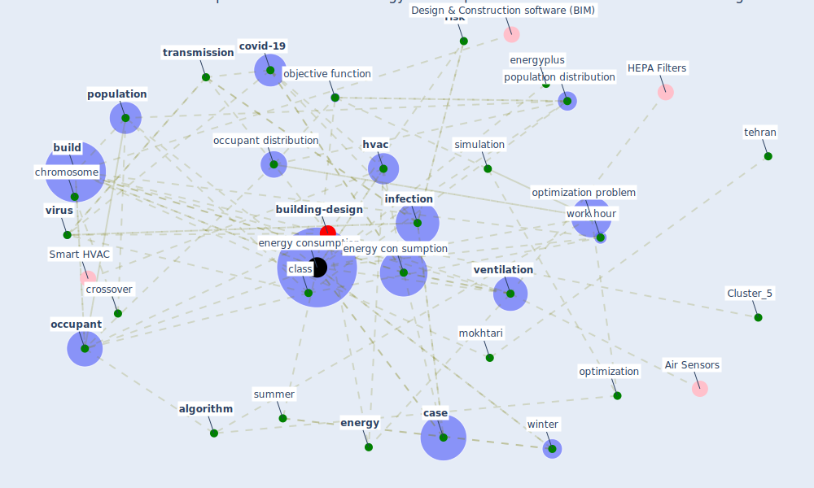

# Article: The effect of occupant distribution on energy consumption and COVID-19 infection in buildings: A case study of university building (mokhtari_effect_2021)

* Source: [10.1016/j.buildenv.2020.107561](https://doi.org/10.1016/j.buildenv.2020.107561)
* Year: 2021
* Cluster: [building-energy](cluster_2)

## Keywords

 * air exchange rate, [algorithm](keyword_algorithm), ambient, [ashrae](keyword_ashrae), asymptomatic, [build](keyword_build), build energy simulation, build temperature, [building](keyword_building), [case](keyword_case), [china](keyword_china), [chromosome](keyword_chromosome), class, class duration, classroom, climatic condition, cold season, component, [computer](keyword_computer), cool, [coronavirus](keyword_coronavirus), cost function, covid 19 infection, [covid 19 pandemic](keyword_covid_19_pandemic), [covid-19](keyword_covid-19), crossover, day, decision variable, eh t x t, [energy](keyword_energy), energy con sumption, [energy consumption](keyword_energy_consumption), energy simulation, energyplus, exhalation, exposure time, generate heat, hcl, heat load, heating, [hvac](keyword_hvac), [hvac system](keyword_hvac_system), [inactivate](keyword_inactivate), infect, [infection](keyword_infection), [influenza](keyword_influenza), jahangir, jahangir building and environment, london borough of camden, m h, machine learning, matlab, metabolic rate, metaheuristic, [model](keyword_model), mokhtari, mutation, north south orient, nsga ii, number of infected people, objective function, [occupant](keyword_occupant), occupant density, occupant distribution, optimization, optimization algorithm, [optimization problem](keyword_optimization_problem), [pandemic](keyword_pandemic), parameter, pareto front, [particle](keyword_particle), peke university, pmv, [population](keyword_population), population density, population distribution, quanta, quanta concentration, respiratory virus, [risk](keyword_risk), sari, sensible heat, [simulation](keyword_simulation), summer, tehran, [temperature](keyword_temperature), time, [transmission](keyword_transmission), [tuberculosis](keyword_tuberculosis), [ventilation](keyword_ventilation), ventilation rate, [virus](keyword_virus), virus quanta concentration, virus transmission, wh m2, wind speed, [window](keyword_window), [winter](keyword_winter), work hour, zhai

## Concepts

 

## Neighbours

### Closest articles

* Assessment of Building Automation and Control Systems in Danish Healthcare Facilities in the COVID-19 Era - [LINK](article_pedersen_assessment_2022)
* Reflecting on Impacts of COVID19 on Sustainable Buildings and Cities - [LINK](article_gonzalez_reflecting_2021)
* Occupants’ behavior and activity patterns influencing the energy consumption in the Kuwaiti residences - [LINK](article_al-mumin_occupants_2003)
* Addressing the impact of COVID-19 lockdown on energy use in municipal buildings: A case study in Florianópolis, Brazil - [LINK](article_geraldi_addressing_2021)
* Impacts of COVID-19 on residential building energy use and performance - [LINK](article_kawka_impacts_2021)
* Validity of energy social research during and after COVID-19: challenges, considerations, and responses - [LINK](article_fell_validity_2020)
* Contextualizing the Covid-19 pandemic for a carbon-constrained world: Insights for sustainability transitions, energy justice, and research methodology - [LINK](article_sovacool_contextualizing_2020)
* Covid-19 and the politics of sustainable energy transitions - [LINK](article_kuzemko_covid-19_2020)
* Ten questions concerning occupant health in buildings during normal operations and extreme events including the COVID-19 pandemic - [LINK](article_awada_ten_2021)
* Designing Post COVID-19 Buildings: Approaches for Achieving Healthy Buildings - [LINK](article_navaratnam_designing_2022)

### Closest BPs

* Blueprint: nan - [LINK](bp_34)
* Blueprint: Tender support at building stage - [LINK](bp_9)
* Blueprint: Building Adaptation during a pandemic - [LINK](bp_14)
