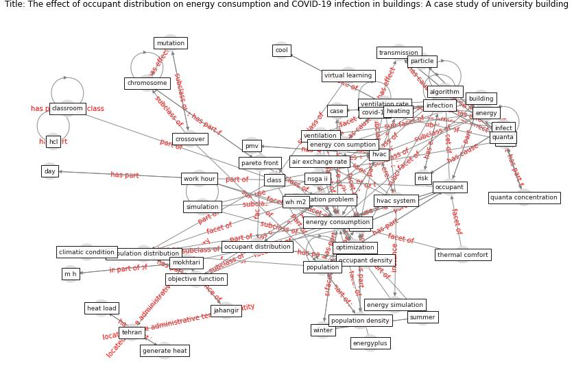

# Article: The effect of occupant distribution on energy consumption and COVID-19 infection in buildings: A case study of university building (mokhtari_effect_2021)

* Source: [10.1016/j.buildenv.2020.107561](https://doi.org/10.1016/j.buildenv.2020.107561)
* Year: 2021
* Cluster: [air-ventilation](cluster_13)

## Keywords

 * air exchange rate, [algorithm](keyword_algorithm), ambient, [ashrae](keyword_ashrae), asymptomatic, [build](keyword_build), build energy simulation, build temperature, [building](keyword_building), [case](keyword_case), [china](keyword_china), chromosome, class, class duration, classroom, climatic condition, cold season, computer, cool, [coronavirus](keyword_coronavirus), cost function, covid 19 infection, [covid 19 pandemic](keyword_covid_19_pandemic), [covid-19](keyword_covid-19), crossover, crowd distance, day, eh t x t, emi, [energy](keyword_energy), energy con sumption, [energy consumption](keyword_energy_consumption), energy simulation, energyplus, exhalation, exposure time, generate heat, hcl, heat load, heating, [hvac](keyword_hvac), hvac system, [inactivate](keyword_inactivate), infect, [infection](keyword_infection), [influenza](keyword_influenza), iterative process, jahangir, [japan](keyword_japan), [lighting](keyword_lighting), m h, [machine learning](keyword_machine_learning), matlab, metabolic rate, [model](keyword_model), mokhtari, mutation, north south orient, nsga ii, number of infected people, objective function, [occupant](keyword_occupant), occupant density, occupant distribution, optimization, optimization algorithm, optimization problem, [pandemic](keyword_pandemic), pareto front, [particle](keyword_particle), peke university, pmv, [population](keyword_population), population density, population distribution, quanta, quanta concentration, [risk](keyword_risk), sensible heat, [simulation](keyword_simulation), stop condition, summer, summer day, ta, tehran, [thermal comfort](keyword_thermal_comfort), [thermostat](keyword_thermostat), [time](keyword_time), [transmission](keyword_transmission), [tuberculosis](keyword_tuberculosis), university of washington, [ventilation](keyword_ventilation), ventilation rate, virtual learning, [virus](keyword_virus), virus quanta concentration, virus transmission, wh m2, [winter](keyword_winter), work hour

## Concepts

 

## Neighbours

### Closest articles

* Occupants’ behavior and activity patterns influencing the energy consumption in the Kuwaiti residences - [LINK](article_al-mumin_occupants_2003)
* Assessment of Building Automation and Control Systems in Danish Healthcare Facilities in the COVID-19 Era - [LINK](article_pedersen_assessment_2022)
* Addressing the impact of COVID-19 lockdown on energy use in municipal buildings: A case study in Florianópolis, Brazil - [LINK](article_geraldi_addressing_2021)
* Impacts of COVID-19 on residential building energy use and performance - [LINK](article_kawka_impacts_2021)
* Reflecting on Impacts of COVID19 on Sustainable Buildings and Cities - [LINK](article_gonzalez_reflecting_2021)
* Validity of energy social research during and after COVID-19: challenges, considerations, and responses - [LINK](article_fell_validity_2020)
* The Effect of Opening Windows on Air Change Rates in Two Homes - [LINK](article_howard-reed_effect_2002)
* Contextualizing the Covid-19 pandemic for a carbon-constrained world: Insights for sustainability transitions, energy justice, and research methodology - [LINK](article_sovacool_contextualizing_2020)
* Characterization and performance evaluation of a full-scale activated carbon-based dynamic botanical air filtration system for improving indoor air quality - [LINK](article_wang_characterization_2011)
* Covid-19 and the politics of sustainable energy transitions - [LINK](article_kuzemko_covid-19_2020)

### Closest BPs

* Blueprint: Air Cleaning Plants - [LINK](bp_15)
* Blueprint: Tender support at building stage - [LINK](bp_9)
* Blueprint: Public places as information points - [LINK](bp_8)
