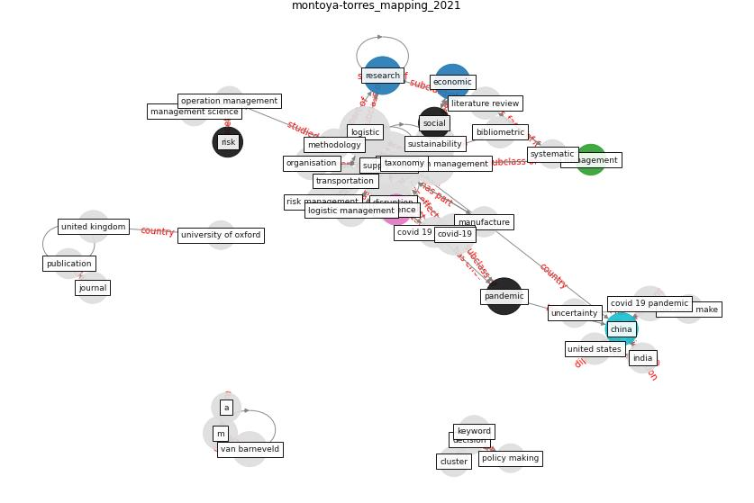

# Article: Mapping research in logistics and supply chain management during COVID-19 pandemic (montoya-torres_mapping_2021)

* Source: [10.1080/13675567.2021.1958768](https://doi.org/10.1080/13675567.2021.1958768)
* Year: 2021
* Cluster: [construction-resilience](cluster_5)

## Keywords

 * academic literature, bibliometric, bibliometric analysis, [business](keyword_business), chart, [china](keyword_china), circle, cluster, [coronavirus](keyword_coronavirus), cost, covid 19 outbreak, [covid 19 pandemic](keyword_covid_19_pandemic), [covid-19](keyword_covid-19), craighead, decision, decision make, decision science, demand, disruption, different, dolgui, dyadic, e commerce, [economic](keyword_economic), environmental, equipment, efficient, factor, flynn, food, food supply chain, [health](keyword_health), [india](keyword_india), [infrastructure](keyword_infrastructure), insurance, international standard organization, [italy](keyword_italy), keyword, [knowledge](keyword_knowledge), knowledge creation, link, literature review, [logistic](keyword_logistic), logistic management, management, management science, [manufacture](keyword_manufacture), methodology, montoya torre, moreno camacho, operation management, [organisation](keyword_organisation), [pandemic](keyword_pandemic), pandemic disruption, paper, performance, physical distribution, policy making, process, publication, [qualitative](keyword_qualitative), [research](keyword_research), research and application, research methodology, [resilience](keyword_resilience), retail, retailer, [risk](keyword_risk), risk management, scm, scopus, service, [simulation](keyword_simulation), [social](keyword_social), strategy, supply, [supply chain](keyword_supply_chain), supply chain disruption, [supply chain management](keyword_supply_chain_management), supply chain resilience, supply chain risk, supply chain structure, supply network, [sustainability](keyword_sustainability), systematic, systematic literature review, tactical, taxonomy, transportation, transportation research part e, uncertainty, [united kingdom](keyword_united_kingdom), [united states](keyword_united_states), universidad de la sabana, university of oxford, van barneveld, vosviewer, [vulnerability](keyword_vulnerability), warse, worldwide

## Concepts

 

## Neighbours

### Closest articles

* Global value chains: Efficiency and risks in the context of COVID-19 - [LINK](article_oecd_global_2021)
* Covid-19 and asset management in EU: a preliminary assessment of performance and investment styles - [LINK](article_rizvi_covid-19_2020)
* The socio-economic implications of the coronavirus pandemic (COVID-19): A review - [LINK](article_nicola_socio-economic_2020)
* World Bank Development Report - [LINK](article_world_bank_world_2022)
* Building sustainable finance for resilient protected and conserved areas: lessons from COVID-19 - [LINK](article_cumming_building_2021)
* Sustainable work throughout the life course: National policies and strategies, Publications Office of the European Union - [LINK](article_eurofund_sustainable_2016)
* COVID-19 and regional solutions for mitigating the risk of SME finance in selected ASEAN member states - [LINK](article_taghizadeh-hesary_covid-19_2022)
* Startups in times of crisis – A rapid response to the COVID-19 pandemic - [LINK](article_kuckertz_startups_2020)
* <scp>COVID</scp>             ‐19: Small and medium enterprises challenges and responses with creativity, innovation, and entrepreneurship - [LINK](article_thukral_covid19_2021)

### Closest BPs

* Blueprint: Smart Locker System - [LINK](bp_1)
* Blueprint: Rotational Shift System - [LINK](bp_0)
* Blueprint: One-way mobility circulation - [LINK](bp_4)
