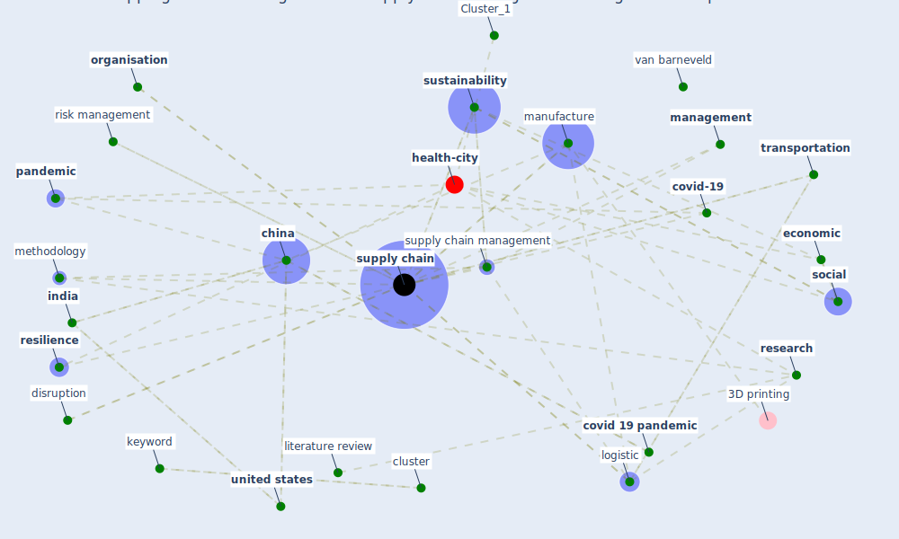

# Article: Mapping research in logistics and supply chain management during COVID-19 pandemic (montoya-torres_mapping_2021)

* Source: [10.1080/13675567.2021.1958768](https://doi.org/10.1080/13675567.2021.1958768)
* Year: 2021
* Cluster: [health-city](cluster_1)

## Keywords

 * academic literature, bibliometric, bibliometric analysis, [brand](keyword_brand), [business](keyword_business), chart, [china](keyword_china), [circle](keyword_circle), cluster, [coronavirus](keyword_coronavirus), [cost](keyword_cost), covid 19 outbreak, [covid 19 pandemic](keyword_covid_19_pandemic), [covid-19](keyword_covid-19), decision, decision make, decision science, demand, disruption, different, document, dyadic, e commerce, [economic](keyword_economic), [environmental](keyword_environmental), equipment, efficient, flynn, food, food supply chain, [health](keyword_health), [india](keyword_india), [infrastructure](keyword_infrastructure), insurance, [italy](keyword_italy), keyword, [knowledge](keyword_knowledge), knowledge creation, kotzab, link, literature review, [logistic](keyword_logistic), logistic management, logistic system, [management](keyword_management), management science, [manufacture](keyword_manufacture), methodology, metric, montoya torre, moreno camacho, operation management, [organisation](keyword_organisation), [pandemic](keyword_pandemic), pandemic disruption, paper, performance, policy making, process, publication, [qualitative](keyword_qualitative), quantitative, [research](keyword_research), research and application, research methodology, [resilience](keyword_resilience), retail, [retailer](keyword_retailer), [risk](keyword_risk), risk management, scm, scopus, [service](keyword_service), [simulation](keyword_simulation), [social](keyword_social), [strategy](keyword_strategy), [supply](keyword_supply), [supply chain](keyword_supply_chain), supply chain disruption, [supply chain management](keyword_supply_chain_management), supply chain resilience, supply chain risk, supply chain structure, supply network, [sustainability](keyword_sustainability), systematic, systematic literature review, tactical, taxonomy, [transportation](keyword_transportation), transportation research part e, uncertainty, [united kingdom](keyword_united_kingdom), [united states](keyword_united_states), university of oxford, van barneveld, vosviewer, [vulnerability](keyword_vulnerability), warse, worldwide

## Concepts

 

## Neighbours

### Closest articles

* Global value chains: Efficiency and risks in the context of COVID-19 - [LINK](article_oecd_global_2021)
* Covid-19 and asset management in EU: a preliminary assessment of performance and investment styles - [LINK](article_rizvi_covid-19_2020)
* Building sustainable finance for resilient protected and conserved areas: lessons from COVID-19 - [LINK](article_cumming_building_2021)
* Startups in times of crisis – A rapid response to the COVID-19 pandemic - [LINK](article_kuckertz_startups_2020)
* COVID-19 and regional solutions for mitigating the risk of SME finance in selected ASEAN member states - [LINK](article_taghizadeh-hesary_covid-19_2022)
* Challenges of data sharing in European Covid-19 projects: A learning opportunity for advancing pandemic preparedness and response - [LINK](article_tacconelli_challenges_2022)
* <scp>COVID</scp>             ‐19: Small and medium enterprises challenges and responses with creativity, innovation, and entrepreneurship - [LINK](article_thukral_covid19_2021)
* 2020 Data Protection Report - [LINK](article_council_of_europe_2020_2020)
* World Bank Development Report - [LINK](article_world_bank_world_2022)

### Closest BPs

* Blueprint: Resilience in staffing and skills training - [LINK](bp_12)
* Blueprint: Installing high-efficiency air filters - [LINK](bp_11)
* Blueprint: Smart Locker System - [LINK](bp_1)
