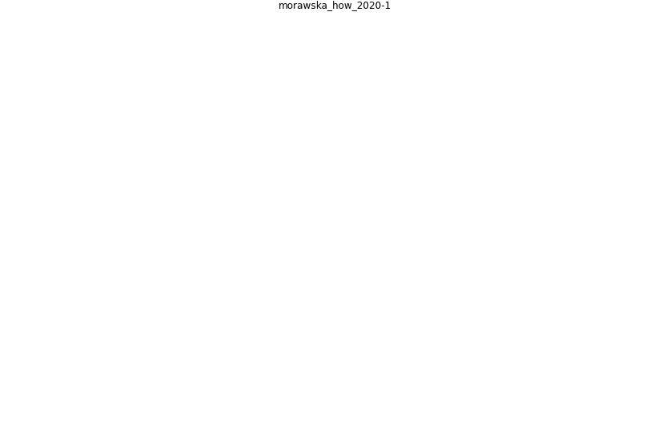

# Article: __How can airborne transmission of COVID-19 indoors be minimised?__ (morawska_how_2020-1)

* [10.1016/j.envint.2020.105832](https://doi.org/10.1016/j.envint.2020.105832)
* Cluster: [air-ventilation](cluster_8)

## Keywords

## Concepts

 

