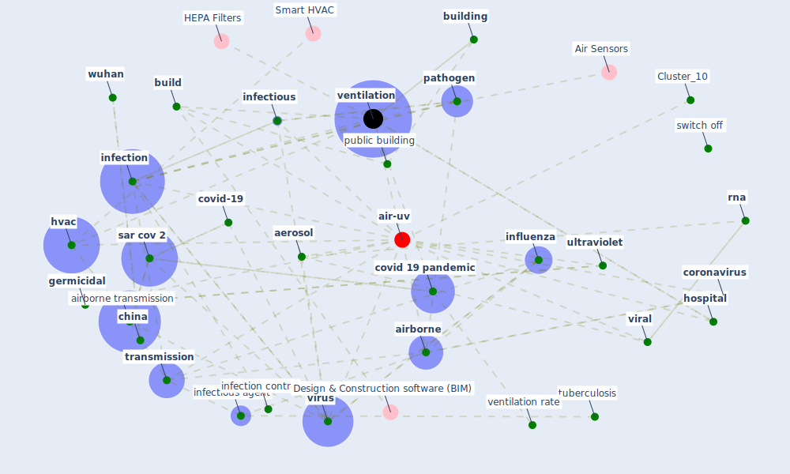

# Article: How can airborne transmission of COVID-19 indoors be minimised? (morawska_how_2020)

* Source: [10.1016/j.envint.2020.105832](https://doi.org/10.1016/j.envint.2020.105832)
* Year: 2020
* Cluster: [air-sars](cluster_9)

## Keywords

 * [aerosol](keyword_aerosol), [air](keyword_air), [air conditioning](keyword_air_conditioning), [airborne](keyword_airborne), [airborne infection](keyword_airborne_infection), airborne transmission, [ashrae](keyword_ashrae), [australia](keyword_australia), [bacteria](keyword_bacteria), [build](keyword_build), [building](keyword_building), chemistry, chickenpox, [china](keyword_china), clean air, [control](keyword_control), [coronavirus](keyword_coronavirus), covid 19 outbreak, [covid 19 pandemic](keyword_covid_19_pandemic), [covid-19](keyword_covid-19), department of health, disease control, [disinfection](keyword_disinfection), [energy](keyword_energy), [engineering](keyword_engineering), [epidemic](keyword_epidemic), epidemiologist, epidemiologist subj idemiol, escombe, esmét, exhale, [exposure](keyword_exposure), extensive viable middle east respiratory syndrome, [filter](keyword_filter), fungal, geneva, [genome](keyword_genome), [germicidal](keyword_germicidal), guidance, [health](keyword_health), [health care](keyword_health_care), healthcare facility, heating, heating ventilating and air conditioning, hepa filtration, [hospital](keyword_hospital), [hvac](keyword_hvac), [hvac system](keyword_hvac_system), [infection](keyword_infection), [infection control](keyword_infection_control), infectious, infectious agent, [infectious disease](keyword_infectious_disease), infiltration, [influenza](keyword_influenza), inhale, ireland, isolation, lakdawala, microdroplet, [microorganism](keyword_microorganism), mycobacterium, nebraska, [new south wale](keyword_new_south_wale), particle filtration, [pathogen](keyword_pathogen), photochem, [prevention](keyword_prevention), public building, quarantine, rna, [sar cov 1](keyword_sar_cov_1), [sar cov 2](keyword_sar_cov_2), sarscov 1, [school](keyword_school), science, scotland, severe acute respiratory syndrome coronavirus 2, severe acute respiratory syndrome sar cov, singapore, [student](keyword_student), supply air, switch off, [system](keyword_system), technol sci, [transmission](keyword_transmission), transmission mode, transmission route, [tuberculosis](keyword_tuberculosis), uk government, [ultraviolet](keyword_ultraviolet), [united kingdom](keyword_united_kingdom), [usa](keyword_usa), [uv-c](keyword_uv-c), [ventilation](keyword_ventilation), ventilation air, ventilation rate, [viral](keyword_viral), [virus](keyword_virus), [wuhan](keyword_wuhan)

## Concepts

 

## Neighbours

### Closest articles

* Methods for air cleaning and protection of building occupants from airborne pathogens - [LINK](article_bolashikov_methods_2009)
* Heating, ventilation and air-conditioning systems in the context of COVID-19 - [LINK](article_ecdc_heating_2020)
* The ventilation of buildings and other mitigating measures for COVID-19: a focus on wintertime - [LINK](article_burridge_ventilation_2021)
* ASHRAE Position Document on Infectious Aerosols - [LINK](article_ashrae_ashrae_2022)
* A review of facilities management interventions to mitigate respiratory infections in existing buildings - [LINK](article_zhang_review_2022)
* Ventilation use in nonmedical settings during COVID-19: Cleaning protocol, maintenance, and recommendations - [LINK](article_nembhard_ventilation_2020)
* The efficacy of social distance and ventilation effectiveness in preventing COVID-19 transmission - [LINK](article_sun_efficacy_2020)
* A critical review of heating, ventilation, and air conditioning (HVAC) systems within the context of a global SARS-CoV-2 epidemic - [LINK](article_elsaid_critical_2021)
* Environmental factors involved in SARS-CoV-2 transmission: effect and role of indoor environmental quality in the strategy for COVID-19 infection control - [LINK](article_azuma_environmental_2020)

### Closest BPs

* Blueprint: Installing UV in ductwork - [LINK](bp_10)
* Blueprint: Installing high-efficiency air filters - [LINK](bp_11)
* Blueprint: Negative pressure rooms - [LINK](bp_13)
