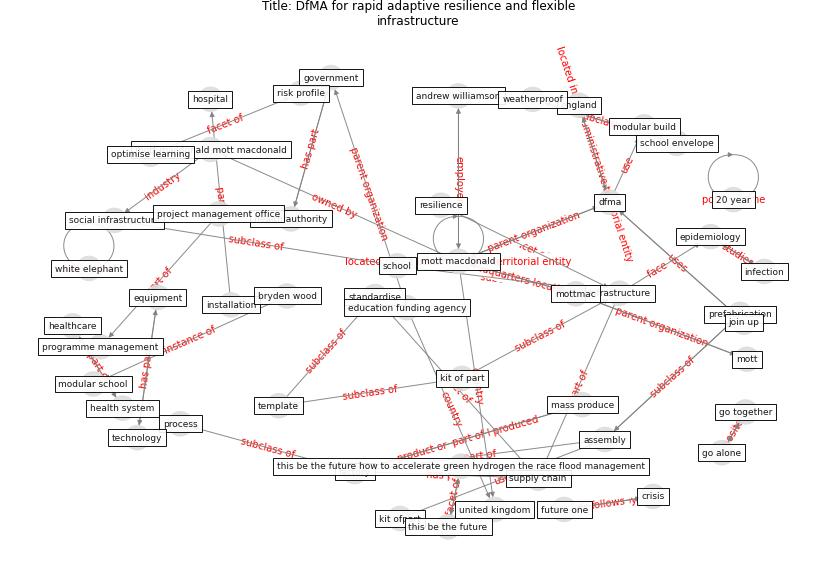

# Article: DfMA for rapid adaptive resilience and flexibleinfrastructure (mott_macdonald_dfma_2020)

* [https://www.mottmac.com/views/dfma-for-rapid-adaptive-resilience-and-flexible-infrastructure](https://www.mottmac.com/views/dfma-for-rapid-adaptive-resilience-and-flexible-infrastructure)
* Year: 2020
* Cluster: [construction-resilience](cluster_5)

## Keywords

 * 20 year, adaptive resilience, andrew williamson, assemble, assembly, [biodiversity](keyword_biodiversity), bryden wood, [build](keyword_build), build unit, carbon offset, carbon reduction, [climate](keyword_climate), [climate change](keyword_climate_change), climate resilience, [construction](keyword_construction), [construction industry](keyword_construction_industry), [covid 19 crisis](keyword_covid_19_crisis), [covid 19 pandemic](keyword_covid_19_pandemic), [crisis](keyword_crisis), current, current crisis, decommissioning, densely populate, [dfma](keyword_dfma), economy of scale, education funding agency, england, [epidemiology](keyword_epidemiology), equipment, [factory](keyword_factory), future one, future proof, go alone, go together, [government](keyword_government), green hydrogen, habitat loss, health authority, [health system](keyword_health_system), [healthcare](keyword_healthcare), [hospital](keyword_hospital), inclusion offset, [infection](keyword_infection), [infrastructure](keyword_infrastructure), installation, join up, kit of part, kit ofpart, kraków, [manufacture](keyword_manufacture), manufacture and assembly, mass produce, modular build, modular building unit, modular infrastructure, modular school, moth ball, mott, [mott macdonald](keyword_mott_macdonald), mott macdonald 2, mott macdonald mott macdonald, [mottmac](keyword_mottmac), mottmac com, multiply, net zero emission, nhs, off the shelf, offsite, optimise learning, [pandemic](keyword_pandemic), [poland](keyword_poland), portakabin, prefabrication, process, programme management, project management office, psbp, repurpose, [resilience](keyword_resilience), reuse, risk profile, [school](keyword_school), school envelope, school size, secondary school, standardise, [supply chain](keyword_supply_chain), [technology](keyword_technology), template, the efa, themix, this be the future, this be the future how to accelerate green hydrogen the race flood management, uk government, [united kingdom](keyword_united_kingdom), urban centre, weatherproof, white elephant, yorkon, zero of procurement

## Concepts

 

## Neighbours

### Closest articles

* Preparing critical infrastructure for the future: Lessons learnt from the Covid-19 pandemic - [LINK](article_tomalska_preparing_2022)
* COVID-19 as a Harbinger of Transforming Infrastructure Resilience - [LINK](article_carvalhaes_covid-19_2020)
* COVID-19 and a new resilient infrastructure landscape - [LINK](article_oecd_covid-19_2021)
* Guidelines for resilience systems analysis - [LINK](article_oecd_guidelines_2014)
* A review of definitions and measures of system resilience - [LINK](article_hosseini_review_2016)
* Strengthening resilience: a priority shared by Health 2020 and - [LINK](article_who_strengthening_2017)
* China adapts survey drones to enforce world’s largest quarantine - [LINK](article_liu_china_2020)
* Building up an ecologically sustainable and socially desirable post-COVID-19 future - [LINK](article_duflot_building_2021)
* COVID-19: IMPACT OF THE PANDEMIC ON THE SUSTAINABLE DEVELOPMENT GOALS - [LINK](article_samout_covid-19_2020)

### Closest BPs

* Blueprint: Resilience in staffing and skills training - [LINK](bp_12)
* Blueprint: Smart Locker System - [LINK](bp_1)
* Blueprint: Rotational Shift System - [LINK](bp_0)
