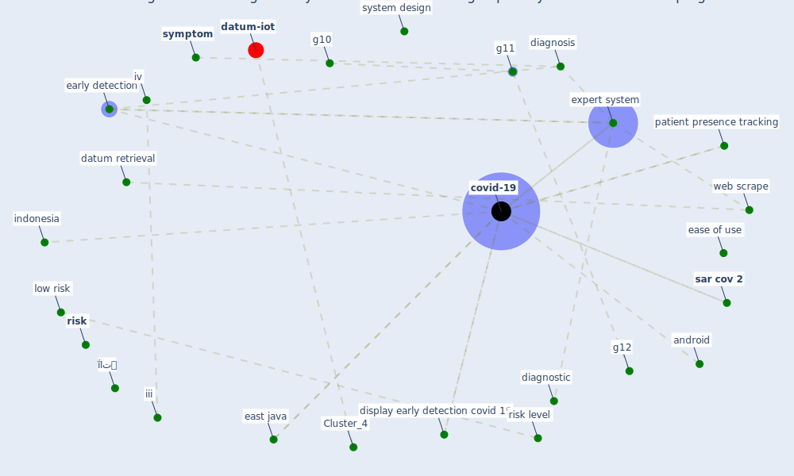

# Article: Risk Diagnosis and Mitigation System of COVID-19 Using Expert System and Web Scraping (mufid_risk_2020)

* Source: [10.1109/IES50839.2020.9231619](https://doi.org/10.1109/IES50839.2020.9231619)
* Year: 2020
* Cluster: [datum-iot](cluster_4)

## Keywords

 * a triayudi, [analysis](keyword_analysis), android, [application](keyword_application), available button, b b, boeing, class structure, color, community acquire tamadrapneumonia, condition, [coronavirus](keyword_coronavirus), country in the world, covid 19 case in indonesia, covid 19 prevention, covid 19 risk, [covid-19](keyword_covid-19), database, datum retrieval, datum structure, [detection](keyword_detection), diagnosis, diagnostic, display early detection covid 19, display main menu, district, early detection, ease of learn, ease of use, east java, expert fixmesystem, [expert system](keyword_expert_system), expert system rule base method, extract, extraction, fixmewebsite, g10, g11, g12, g14, g15, g16, g8, g9, high risk, if condition then action a rule, iii, [indonesia](keyword_indonesia), ipv7, ipv8, iv, jsoup, knowledge base, knowledge representation, knowledgebase, learn, library, low risk, macos, [mitigation](keyword_mitigation), neurotransmitter, no 4, or, organ failure, patient presence tracking, performance, performance evaluation, picasso, pneumonia, [policy](keyword_policy), pp, [province](keyword_province), python, region, [risk](keyword_risk), risk level, rule engine, [sar cov 2](keyword_sar_cov_2), satisfaction, scenario test, scrape, [symptom](keyword_symptom), [system analysis](keyword_system_analysis), system design, task description, task for responden, task for responden subj 能, test, testing, [transmission](keyword_transmission), [united states](keyword_united_states), usage, use questionnaire, usefulness, validation, vol 1, vol 2, [web scrape](keyword_web_scrape), web scrapping, ḯاتہ

## Concepts

 

## Neighbours

### Closest articles

* COVID19-Routes: A Safe Pedestrian Navigation Service - [LINK](article_cantarero_covid19-routes_2021)
* Social distancing enhanced automated optimal design of physical spaces in the wake of the COVID-19 pandemic - [LINK](article_ugail_social_2021)
* Digital Twin of COVID-19 Mass Vaccination Centers - [LINK](article_pilati_digital_2021)
* Exploring the Non-Medical impacts of Covid-19 using Natural Language Processing - [LINK](article_agade_exploring_2020)
* DeepSOCIAL: Social Distancing Monitoring and Infection Risk Assessment in COVID-19 Pandemic - [LINK](article_rezaei_deepsocial_2020)
* Towards the sustainable development of smart cities through mass video surveillance: A response to the COVID-19 pandemic - [LINK](article_shorfuzzaman_towards_2021)
* Building occupancy estimation with people flow modeling in AnyLogic - [LINK](article_li_building_2016)
* EXPOSED: An occupant exposure model for confined spaces to retrofit crowd models during a pandemic - [LINK](article_ronchi_exposed_2020)
* COVID-ABS: An agent-based model of COVID-19 epidemic to simulate health and economic effects of social distancing interventions - [LINK](article_silva_covid-abs_2020)
* An Automated System to Limit COVID-19 Using Facial Mask Detection in Smart City Network - [LINK](article_rahman_automated_2020)

### Closest BPs

* Blueprint: Resilience in staffing and skills training - [LINK](bp_12)
* Blueprint: Tracking and enforcing use of Personal Protective Equipment - [LINK](bp_23)
* Blueprint: Public places as information points - [LINK](bp_8)
