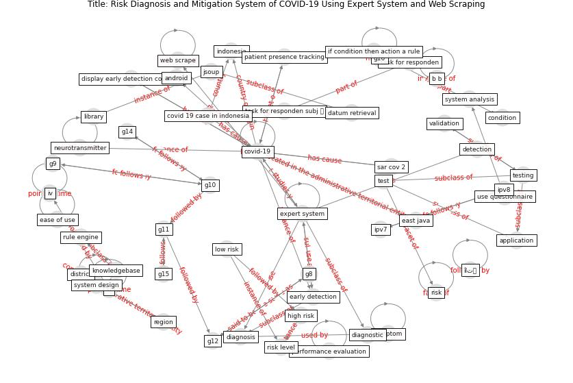

# Article: Risk Diagnosis and Mitigation System of COVID-19 Using Expert System and Web Scraping (mufid_risk_2020)

* Source: [10.1109/IES50839.2020.9231619](https://doi.org/10.1109/IES50839.2020.9231619)
* Year: 2020
* Cluster: [building-space](cluster_9)

## Keywords

 * a triayudi, android, [application](keyword_application), [artificial intelligence](keyword_artificial_intelligence), available button, b b, boeing, class structure, color, community acquire tamadrapneumonia, condition, [coronavirus](keyword_coronavirus), country in the world, covid 19 case in indonesia, covid 19 risk, [covid-19](keyword_covid-19), database, datum retrieval, [detection](keyword_detection), diagnosis, diagnostic, display early detection covid 19, district, early detection, ease of learn, ease of use, east java, expert fixmesystem, [expert system](keyword_expert_system), expert system for tamadracovid 19 diagnosis, expert system rule base method, extract, extraction, fixmewebsite, g10, g11, g12, g14, g15, g16, g8, g9, high risk, [human](keyword_human), if condition then action a rule, iii, [indonesia](keyword_indonesia), ipv7, iv, jsoup, [knowledge](keyword_knowledge), knowledge base, knowledge representation, knowledgebase, learn, library, low risk, macos, mitigation, neurotransmitter, no 4, organ failure, patient presence tracking, performance evaluation, picasso, planning education, pneumonia, [policy](keyword_policy), pp, [province](keyword_province), region, [risk](keyword_risk), risk level, rule engine, [sar cov 2](keyword_sar_cov_2), satisfaction, scenario test, scrape, severitie, solve problem face by human, sqlite, [symptom](keyword_symptom), [system analysis](keyword_system_analysis), system design, tabel 2, task for responden, task for responden subj 能, technological development, test, [testing](keyword_testing), [transmission](keyword_transmission), usage, use questionnaire, usefulness, validation, vol 1, vol 2, [web scrape](keyword_web_scrape), web scrapping, ḯاتہ

## Concepts

 

## Neighbours

### Closest articles

* Exploring the Non-Medical impacts of Covid-19 using Natural Language Processing - [LINK](article_agade_exploring_2020)
* Construction of a Linked Data Set of COVID-19 Knowledge Graphs: Development and Applications - [LINK](article_wang_construction_2022)
* COVID19-Routes: A Safe Pedestrian Navigation Service - [LINK](article_cantarero_covid19-routes_2021)
* Digital Twin of COVID-19 Mass Vaccination Centers - [LINK](article_pilati_digital_2021)
* Social distancing enhanced automated optimal design of physical spaces in the wake of the COVID-19 pandemic - [LINK](article_ugail_social_2021)
* Reframe how to serve your community in the midst of a pandemic - [LINK](article_sutton_reframe_2020)
* COVID-19 Bulletin 1: Alterations to BREEAM assessment requirements as a result of the Coronavirus pandemic – Knowledge Base - [LINK](article_breeam_covid-19_2020)
* A Platform for Citizen Cooperation during the COVID-19 Pandemic in RN, Brazil - [LINK](article_de_araujo_platform_2020)
* COVID-ABS: An agent-based model of COVID-19 epidemic to simulate health and economic effects of social distancing interventions - [LINK](article_silva_covid-abs_2020)
* Case Study on Finnish TVETA Resilient Model of Training During COVID-19 - [LINK](article_unesco_case_2021)

### Closest BPs

* Blueprint: Resilience in staffing and skills training - [LINK](bp_12)
* Blueprint: Public places as information points - [LINK](bp_8)
* Blueprint: Smart Locker System - [LINK](bp_1)
