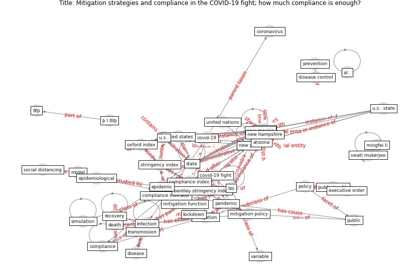

# Article: Mitigation strategies and compliance in the COVID-19 fight; how much compliance is enough? (mukerjee_mitigation_2021)

* Source: [10.1371/journal.pone.0239352](https://doi.org/10.1371/journal.pone.0239352)
* Year: 2021
* Cluster: [city-health](cluster_14)

## Keywords

 * [algorithm](keyword_algorithm), api, arizona, atlanta, average, az, bentley stringency index, bentley university, [bsi](keyword_bsi), bsi number, [california](keyword_california), [cdc](keyword_cdc), center for disease control and prevention, [china](keyword_china), colorado, [compliance](keyword_compliance), compliance index, [compliance indicator](keyword_compliance_indicator), compliance rate, [control](keyword_control), [coronavirus](keyword_coronavirus), covid 19 epidemic, covid 19 fight, [covid 19 pandemic](keyword_covid_19_pandemic), [covid-19](keyword_covid-19), [datum](keyword_datum), day 180, death, desirable, [disease](keyword_disease), [epidemic](keyword_epidemic), [epidemiological](keyword_epidemiological), [epidemiology](keyword_epidemiology), executive order, [face mask](keyword_face_mask), gao, github, google scholar, governor, [infection](keyword_infection), johns hopkins university, legend, [lockdown](keyword_lockdown), mingfei li, [mitigation](keyword_mitigation), mitigation function, mitigation measure, mitigation policy, mitigation strategy, [model](keyword_model), model estimation, national academy of sciences, new hampshire, new mexico, [new york](keyword_new_york), [new york city](keyword_new_york_city), new york times repository, [nm](keyword_nm), ortiz ospina e, oxford index, [pandemic](keyword_pandemic), peke university, physical distancing, pmid, [policy](keyword_policy), policy maker, [population](keyword_population), prevention, [public](keyword_public), [public health](keyword_public_health), r0, [recovery](keyword_recovery), reproduction number, s t, [sar cov 2](keyword_sar_cov_2), seird, sensitivity analysis, si t, [simulation](keyword_simulation), [social distancing](keyword_social_distancing), sri lanka, [state](keyword_state), stringency, stringency index, swati mukerjee, [texas](keyword_texas), tif, [transmission](keyword_transmission), u s, u s state, undesirable, [united nations](keyword_united_nations), [united states](keyword_united_states), united states of america, view article, who, [wuhan](keyword_wuhan), zama, ðt þ, αππλos

## Concepts

 

## Neighbours

### Closest articles

* Compliance with COVID-19 Mitigation Measures in the United States - [LINK](article_van_rooij_compliance_2020)
* The Intelligent Lockdown: Compliance with COVID-19 Mitigation Measures in the Netherlands - [LINK](article_kuiper_intelligent_2020)
* Pandemiens arkitektur - [LINK](article_realdania_pandemiens_2022)
* Refleksioner fra en pandemi - [LINK](article_realdania_refleksioner_2022)
* The Emergence of Anti-Privacy and Control at the Nexus between the Concepts of Safe City and Smart City - [LINK](article_allam_emergence_2019)
* The Smart City and Covid‐19 - [LINK](article_webb_smart_2020)
* The three modes of existence of the pandemic smart city - [LINK](article_soderstrom_three_2021)
* Contributions of Smart City Solutions and Technologies to Resilience against the COVID-19 Pandemic: A Literature Review - [LINK](article_sharifi_contributions_2021)
* Responsible Transport: A post-COVID agenda for transport policy and practice - [LINK](article_budd_responsible_2020)
* Mobility Behaviour in View of the Impact of the COVID-19 Pandemic—Public Transport Users in Gdansk Case Study - [LINK](article_przybylowski_mobility_2021)

### Closest BPs

* Blueprint: Smart Locker System - [LINK](bp_1)
* Blueprint: One-way mobility circulation - [LINK](bp_4)
* Blueprint: Rotational Shift System - [LINK](bp_0)
