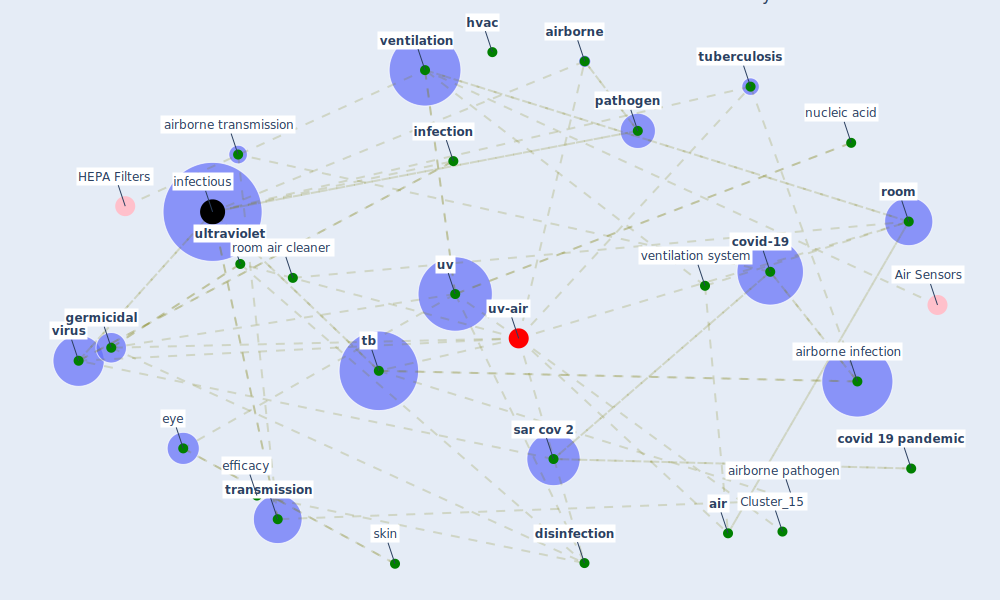

# Article: Air Disinfection for Airborne Infection Control with a Focus on COVID‐19: Why Germicidal UV is Essential             † (nardell_air_2021)

* Source: [10.1111/php.13421](https://doi.org/10.1111/php.13421)
* Year: 2021
* Cluster: [air-uv](cluster_10)

## Keywords

 * [air](keyword_air), air change, [air conditioning](keyword_air_conditioning), air disinfection, [airborne](keyword_airborne), airborne contaminant, [airborne infection](keyword_airborne_infection), airborne pathogen, airborne transmission, [australia](keyword_australia), [build](keyword_build), [cochrane france](keyword_cochrane_france), communicable infection, [covid 19 pandemic](keyword_covid_19_pandemic), [covid-19](keyword_covid-19), decontaminate, [disinfection](keyword_disinfection), duct, ductless, e2011834, e43, e68, efficacy, efficiency, efficient filter, epa, eqach, equivalent, equivalent ach, [exposure](keyword_exposure), eye, [germicidal](keyword_germicidal), gonioradiometry, health perspect, [healthcare](keyword_healthcare), [hospital](keyword_hospital), [hvac](keyword_hvac), [hvac system](keyword_hvac_system), [infection](keyword_infection), [infectious](keyword_infectious), infectious source, intervention, jail, jamaica, literature, m verdeș, mercury, mmwr, morb, mortal, mycobacterium tuberculosis, neglect, [new south wale](keyword_new_south_wale), nucleic acid, odor, [online library](keyword_online_library), pandemic influenza, [pathogen](keyword_pathogen), patient care, [peru](keyword_peru), photobiology, photochem, photochemistry, photoreactivation, plos medicine, recapture, recirculate air, romania, [room](keyword_room), room air, room air cleaner, room volume, [russia](keyword_russia), [safety](keyword_safety), [sar cov 2](keyword_sar_cov_2), sar cov 2 virus, skin, [south africa](keyword_south_africa), soyuz, space capsule, split system, surface contact, surface contact spread, surface decontaminant, surface decontamination, surface disinfection, [tb](keyword_tb), [transmission](keyword_transmission), transmit, triple infection, [tuberculosis](keyword_tuberculosis), [ultraviolet](keyword_ultraviolet), [uv](keyword_uv), uv fluency, [ventilation](keyword_ventilation), ventilation duct, ventilation system, [virus](keyword_virus), vladimir, filter

## Concepts

 

## Neighbours

### Closest articles

* Applications of ultraviolet germicidal irradiation disinfection in health care facilities: Effective adjunct, but not stand-alone technology - [LINK](article_memarzadeh_applications_2010)
* Upper-Room Ultraviolet Light and Negative Air Ionization to Prevent Tuberculosis Transmission - [LINK](article_escombe_upper-room_2009)
* Upper-room ultraviolet air disinfection might help to reduce COVID-19 transmission in buildings: a feasibility study - [LINK](article_beggs_upper-room_2020)
* Behind the Update: ASHRAE Handbook Chapters on UV-C to Include Updated Best Practices, Guidance - [LINK](article_ashrae_behind_2020)
* Methods for air cleaning and protection of building occupants from airborne pathogens - [LINK](article_bolashikov_methods_2009)
* Effect of Ultraviolet Germicidal Irradiation on Viral Aerosols - [LINK](article_walker_effect_2007)
* The efficacy of social distance and ventilation effectiveness in preventing COVID-19 transmission - [LINK](article_sun_efficacy_2020)
* Case Study: Using Germicidal UV-C to Mitigate COVID-19 - HVAC - [LINK](article_healthcare_facilities_today_case_2021)

### Closest BPs

* Blueprint: Installing UV in ductwork - [LINK](bp_10)
* Blueprint: Negative pressure rooms - [LINK](bp_13)
* Blueprint: Resilience in staffing and skills training - [LINK](bp_12)
