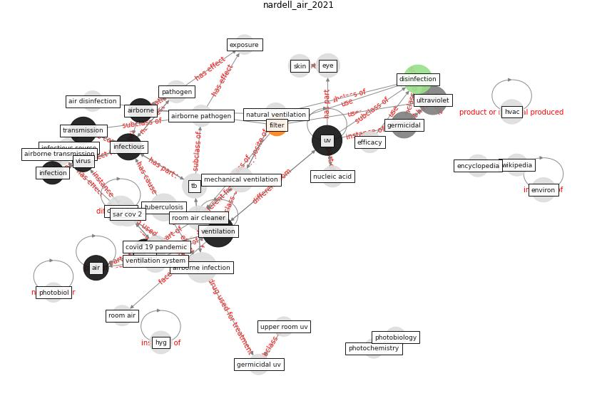

# Article: __Air Disinfection for Airborne Infection Control with a Focus on COVID‐19: Why Germicidal UV is Essential
            †__ (nardell_air_2021)

* [10.1111/php.13421](https://doi.org/10.1111/php.13421)
* Cluster: [uv-room](cluster_2)

## Keywords

* [ventilation](keyword_ventilation), [airborne infection](keyword_airborne_infection), [uv](keyword_uv), [ultraviolet](keyword_ultraviolet), [disinfection](keyword_disinfection), [covid-19](keyword_covid-19), [tuberculosis](keyword_tuberculosis), [transmission](keyword_transmission), [infectious](keyword_infectious), [germicidal](keyword_germicidal), mechanical ventilation, [airborne transmission](keyword_airborne_transmission), [tb](keyword_tb), room air cleaner, eye

## Keywords at large

* [ventilation](keyword_ventilation), [covid-19](keyword_covid-19), [airborne infection](keyword_airborne_infection), [uv](keyword_uv), [ultraviolet](keyword_ultraviolet), [disinfection](keyword_disinfection), [tuberculosis](keyword_tuberculosis), [transmission](keyword_transmission), [infectious](keyword_infectious), [germicidal](keyword_germicidal)

## Abstract

Aerosol transmission is now widely accepted as the
principal way that COVID-19 is spread, as has the
importance of ventilation-natural and mechanical. But in
other than healthcare facilities, mechanical ventilation is
designed for comfort, not airborne infection control, and
cannot achieve the 6 to 12 room air changes per hour
recommended for airborne infection control. More efficient
air filters have been recommended in ventilation ducts
despite a lack of convincing evidence that SARS-CoV-2 virus
spreads through ventilation systems. Most transmission
appears to occur in rooms where both an infectious source
COVID-19 case and other susceptible occupants share the
same air. Only two established room-based technologies are
available to supplement mechanical ventilation: portable
room air cleaners and upper room germicidal UV air
disinfection. Portable room air cleaners can be effective,
but performance is limited by their clean air delivery rate
relative to room volume. SARS-CoV-2 is highly susceptible
to GUV, an 80-year-old technology that has been shown to
safely, quietly, effectively and economically produce the
equivalent of 10 to 20 or more air changes per hour under
real life conditions. For these reasons, upper room GUV is
the essential engineering intervention for reducing
COVID-19 spread.

## Concepts

 

### Closest articles 

* [Applications of ultraviolet germicidal irradiation disinfection in health care facilities: Effective adjunct, but not stand-alone technology](article_memarzadeh_applications_2010)
* [Upper-Room Ultraviolet Light and Negative Air Ionization to Prevent Tuberculosis Transmission](article_escombe_upper-room_2009)
* [Methods for air cleaning and protection of building occupants from airborne pathogens](article_bolashikov_methods_2009)
* [Behind the Update: ASHRAE Handbook Chapters on
UV-C to Include Updated Best Practices,
Guidance](article_ashrae_behind_2020)
* [Upper-room ultraviolet air disinfection might help to reduce COVID-19 transmission in buildings: a feasibility study](article_beggs_upper-room_2020)
* [morawska_how_2020-1](article_morawska_how_2020-1)
* [Case Study: Using Germicidal UV-C to Mitigate
COVID-19 - HVAC](article_healthcare_facilities_today_case_2021)
* [ASHRAE Position Document on Infectious
Aerosols](article_ashrae_ashrae_2022)
* [How can airborne transmission of COVID-19 indoors be minimised?](article_morawska_how_2020)
* [Effect of Ultraviolet Germicidal Irradiation on Viral Aerosols](article_walker_effect_2007)

### References 

* [Upper-Room Ultraviolet Light and Negative Air
Ionization to Prevent Tuberculosis Transmission](article_escombe_upper-room_2009)
* [Far-UVC light (222 nm) efficiently and safely
inactivates airborne human coronaviruses](article_buonanno_far-uvc_2020)

### Cited by 

