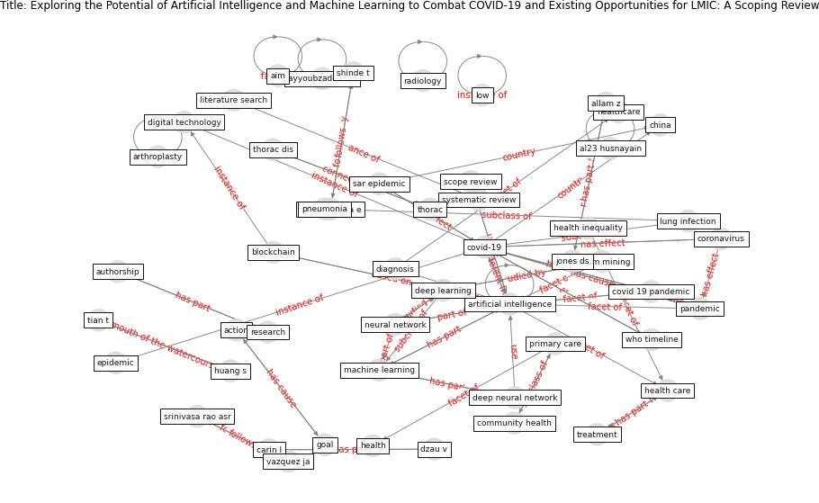

# Article: __Exploring the Potential of Artificial Intelligence and Machine Learning to Combat COVID-19 and Existing Opportunities for LMIC: A Scoping Review__ (naseem_exploring_2020)

* [10.1177/2150132720963634](https://doi.org/10.1177/2150132720963634)
* Cluster: [om-ai](cluster_1.md)

## Keywords

[ai](keyword_ai.md), [pandemic](keyword_pandemic.md), [blockchain](keyword_blockchain.md), [health](keyword_health.md)

## Abstract

Background: In the face of the current time-sensitive
COVID-19 pandemic, the limited capacity of healthcare
systems resulted in an emerging need to develop newer
methods to control the spread of the pandemic. Artificial
Intelligence (AI), and Machine Learning (ML) have a vast
potential to exponentially optimize health care research.
The use of AI-driven tools in LMIC can help in eradicating
health inequalities and decrease the burden on health
systems.

Methods: The literature search for this Scoping review was
conducted through the PubMed database using keywords:
COVID-19, Artificial Intelligence (AI), Machine Learning
(ML), and Low Middle-Income Countries (LMIC). Forty-three
articles were identified and screened for eligibility and
13 were included in the final review. All the items of this
Scoping review are reported using guidelines for PRISMA
extension for scoping reviews (PRISMA-ScR).

Results: Results were synthesized and reported under 4
themes. (a) The need of AI during this pandemic: AI can
assist to increase the speed and accuracy of identification
of cases and through data mining to deal with the health
crisis efficiently, (b) Utility of AI in COVID-19
screening, contact tracing, and diagnosis: Efficacy for
virus detection can a be increased by deploying the smart
city data network using terminal tracking system along-with
prediction of future outbreaks, (c) Use of AI in COVID-19
patient monitoring and drug development: A Deep learning
system provides valuable information regarding protein
structures associated with COVID-19 which could be utilized
for vaccine formulation, and (d) AI beyond COVID-19 and
opportunities for Low-Middle Income Countries (LMIC): There
is a lack of financial, material, and human resources in
LMIC, AI can minimize the workload on human labor and help
in analyzing vast medical data, potentiating predictive and
preventive healthcare.

Conclusion: AI-based tools can be a game-changer for
diagnosis, treatment, and management of COVID-19 patients
with the potential to reshape the future of healthcare in
LMIC.

## Concepts

 

### References 

* [Digital technology and COVID-19](article_ting_digital_2020.md)

### Cited by 

* [Contributions of Smart City Solutions and
Technologies to Resilience against the COVID-19
Pandemic: A Literature Review](article_sharifi_contributions_2021.md)
