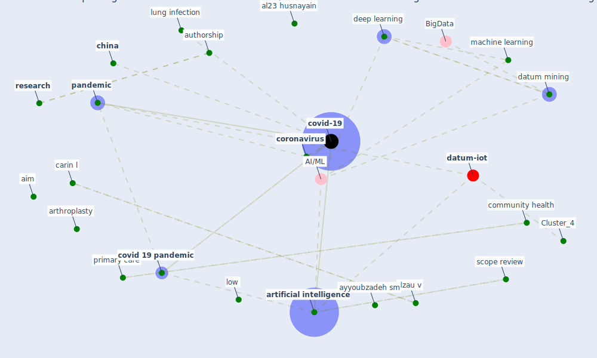

# Article: Exploring the Potential of Artificial Intelligence and Machine Learning to Combat COVID-19 and Existing Opportunities for LMIC: A Scoping Review (naseem_exploring_2020)

* Source: [10.1177/2150132720963634](https://doi.org/10.1177/2150132720963634)
* Year: 2020
* Cluster: [iot-blockchain](cluster_7)

## Keywords

 * action, active learning, aga khan university, ai base, aim, al23 husnayain, aladinskiy v, [algorithm](keyword_algorithm), allam z, [application](keyword_application), arthroplasty, [artificial intelligence](keyword_artificial_intelligence), authorship, ayyoubzadeh sm, baricitinib, basic science, [blockchain](keyword_blockchain), boulos mnk, carin l, checklist, chemrxiv, [china](keyword_china), communication, community health, [coronavirus](keyword_coronavirus), [covid 19 pandemic](keyword_covid_19_pandemic), covid 19 vaccine, [covid-19](keyword_covid-19), ct scan, database search, datum drive, datum extraction, datum mining, [deep learning](keyword_deep_learning), [diabete](keyword_diabete), [diagnosis](keyword_diagnosis), dzau v, [epidemic](keyword_epidemic), epidemiol, ge p, goal, goebel, hajra arshad, [health](keyword_health), [health care](keyword_health_care), health care manager, health care system, health inequality, [health system](keyword_health_system), [healthcare](keyword_healthcare), huang s, infect control, [infectious disease](keyword_infectious_disease), interpretation error, jiang c, jones ds, karachi, key word, lehoux p, lillie e, literature review, literature search, [low](keyword_low), lung infection, [machine learning](keyword_machine_learning), mackworth, manuscript, [pandemic](keyword_pandemic), phylogenetic, pneumonia, primary care, prisma extension, prisma extension for scope review, prisma scr, [protocol](keyword_protocol), [public health](keyword_public_health), radiology, rao ass, [research](keyword_research), respiratory infection, rheumatoid arthritis, sar epidemic, scope review, shinde t, sokolovskaya e, srinivasa rao asr, synthesis, synthesize, systematic review, [theme](keyword_theme), thorac, thorac dis, tian t, train test model, [treatment](keyword_treatment), [united kingdom](keyword_united_kingdom), university of oxford, vazquez ja, who timeline, zhebrak a

## Concepts

 

## Neighbours

### Closest articles

* Pandemic Analytics: How Countries are Leveraging Big Data Analytics and Artificial Intelligence to Fight COVID-19? - [LINK](article_mehta_pandemic_2021)
* Digital technology and COVID-19 - [LINK](article_ting_digital_2020)
* A Comprehensive Review of the COVID-19 Pandemic and the Role of IoT, Drones, AI, Blockchain, and 5G in Managing its Impact - [LINK](article_chamola_comprehensive_2020)
* Emerging Technologies to Combat the COVID-19 Pandemic - [LINK](article_vaishya_emerging_2020)
* Leveraging Digital Transformation Technologies to Tackle COVID-19: Proposing a Privacy-First Holistic Framework - [LINK](article_arpaci_leveraging_2021)
* Mobile Technology Solution for COVID-19: Surveillance and Prevention - [LINK](article_raza_mobile_2021)
* The role of 5G for digital healthcare against COVID-19 pandemic: Opportunities and challenges - [LINK](article_siriwardhana_role_2021)
* How the 5G Enabled the COVID-19 Pandemic Prevention and Control: Materiality, Affordance, and (De-)Spatialization - [LINK](article_li_how_2022)
* Design COVID-19 Ontology: A Healthcare and Safety Perspective - [LINK](article_aloulou_design_2022)
* SARS-CoV-2 in wastewater: potential health risk, but also data source - [LINK](article_lodder_sars-cov-2_2020)

### Closest BPs

* Blueprint: Resilience in staffing and skills training - [LINK](bp_12)
* Blueprint: Negative pressure rooms - [LINK](bp_13)
* Blueprint: Installing UV in ductwork - [LINK](bp_10)
