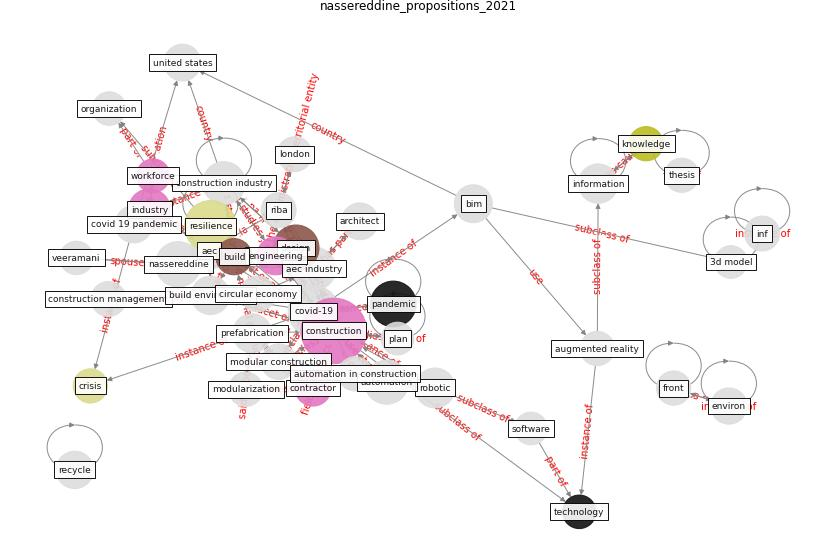

# Article: __Propositions for a Resilient, Post-COVID-19 Future for the AEC Industry__ (nassereddine_propositions_2021)

* URL: [https://www.frontiersin.org/articles/10.3389/fbuil.2021.687021](https://www.frontiersin.org/articles/10.3389/fbuil.2021.687021)
* Year: 2021
* Abstract: The coronavirus outbreak has challenged and continues to
challenge every aspect of the supply chain within the AEC
industry, forcing stakeholders to cope with increasing
uncertainties and continuous change. The notion of
resilience is especially salient now. While the need for
the AEC industry to focus on resilience has been
highlighted in recent articles, there is a need for a
comprehensive discussion on what resilience means for the
AEC industry and how companies can create built-in
resilience. This paper takes the form of a high-level
overview of where the industry is headed and aims to
establish eleven propositions for a resilient,
post-COVID-19 future, for practitioners working in the
design and construction industry. Moreover, this paper
proposes a ‘decentralization of workforce and integration
of data’ model in which the established propositions are
manifested to support a resilient AEC industry.

## Keywords

[construction](keyword_construction), [resilience](keyword_resilience), [design](keyword_design), [pandemic](keyword_pandemic), [industry](keyword_industry)

## Concepts

 

