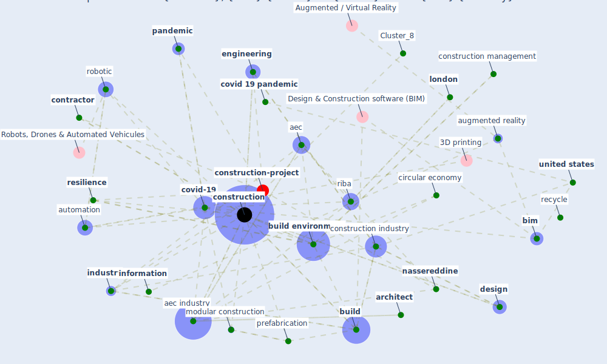

# Article: Propositions for a Resilient, Post-COVID-19 Future for the AEC Industry (nassereddine_propositions_2021)

* [https://www.frontiersin.org/articles/10.3389/fbuil.2021.687021](https://www.frontiersin.org/articles/10.3389/fbuil.2021.687021)
* Year: 2021
* Cluster: [construction-pandemic](cluster_1)

## Keywords

 * 3d model, [3d print](keyword_3d_print), adaptive, adaptive capacity, aec, aec industry, american institute of architect, amsterdam, [architect](keyword_architect), [architecture](keyword_architecture), augmented reality, automation, automation in construction, [beijing](keyword_beijing), [bim](keyword_bim), [build](keyword_build), [build environment](keyword_build_environment), building design, business continuity, business disruption, business model, cern, cheshmehzangi, [china](keyword_china), [circular economy](keyword_circular_economy), code of practice, [construction](keyword_construction), construction 4 0, construction company, [construction industry](keyword_construction_industry), construction management, construction site, [contractor](keyword_contractor), [covid 19 pandemic](keyword_covid_19_pandemic), [covid-19](keyword_covid-19), [crisis](keyword_crisis), decentralization, decision make, [design](keyword_design), [engineering](keyword_engineering), front, frontier in build environment, gunalan, head mount display, [industry](keyword_industry), [information](keyword_information), integrate design management, integrate project delivery, [japan](keyword_japan), juhasz, kitakyushu, klinc, [knowledge](keyword_knowledge), knowledge and resource, [london](keyword_london), lotfallah, main menu, [manhattan](keyword_manhattan), [manufacture](keyword_manufacture), mitigate, modular construction, modularization, nassereddine, [new york city](keyword_new_york_city), office, organism, organization, [pandemic](keyword_pandemic), piskernik, [plan](keyword_plan), pot, prefabrication, psp, recession, [recycle](keyword_recycle), remote expert, remote working, [resilience](keyword_resilience), [resilient](keyword_resilient), resilient organization, riba, [robotic](keyword_robotic), [russia](keyword_russia), silos, software, st petersburg, [stakeholder](keyword_stakeholder), [supply chain](keyword_supply_chain), [switzerland](keyword_switzerland), [system](keyword_system), [technology](keyword_technology), thesis, turk, [united kingdom](keyword_united_kingdom), [united states](keyword_united_states), veeramani, we re do it already, [worker](keyword_worker), workforce, flow

## Concepts

 

## Neighbours

### Closest articles

* COVID-19 pandemic: the effects and prospects in the construction industry. - [LINK](article_ogunnusi_covid-19_2020)
* Influence between COVID-19 Impacts and Project Stakeholders in Chilean Construction Projects - [LINK](article_araya_influence_2021)
* Guidelines for Responding to COVID-19 Pandemic: Best Practices, Impacts, and Future Research Directions - [LINK](article_assaad_guidelines_2021)
* Overcoming the Impact of COVID-19 Using Integrated Project Delivery Model - [LINK](article_g_overcoming_2020)
* Perception of COVID-19 impacts on the construction industry over time - [LINK](article_rokooei_perception_2022)
* Identifying Actions to Control and Mitigate the Effects of the COVID-19 Pandemic on Construction Organizations: Preliminary Findings - [LINK](article_raoufi_identifying_2021)
* Effects to Construction Project Management Impacted Circular Economic of Covid-19 Pandemic - [LINK](article_paikan_effects_2021)
* The Impact of Pandemic Crisis on the Survival of Construction Industry: A Case of COVID-19 - [LINK](article_gamil_impact_2020)
* Analysis of COVID-19 Concerns Raised by the Construction Workforce and Development of Mitigation Practices - [LINK](article_bou_hatoum_analysis_2021)
* Mechanisms for addressing the impact of COVID-19 on infrastructure projects - [LINK](article_king_mechanisms_2021)

### Closest BPs

* Blueprint: Monitoring of wastewater - [LINK](bp_21)
* Blueprint: Smart Locker System - [LINK](bp_1)
* Blueprint: Mental health – Belong: Do something with someone - [LINK](bp_19)
