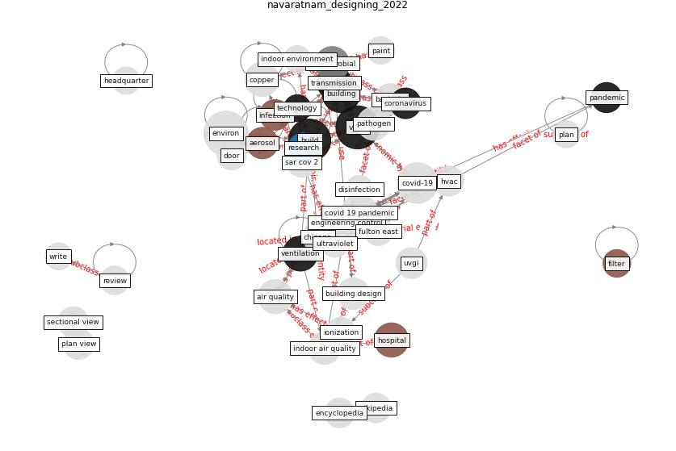

# Article: Designing Post COVID-19 Buildings: Approaches for Achieving Healthy Buildings (navaratnam_designing_2022)

* Source: [10.3390/buildings12010074](https://doi.org/10.3390/buildings12010074)
* Year: 2022
* Cluster: [air-ventilation](cluster_13)

## Keywords

 * 19 of 21, [aerosol](keyword_aerosol), air quality, [antimicrobial](keyword_antimicrobial), [architect](keyword_architect), [artificial intelligence](keyword_artificial_intelligence), [australia](keyword_australia), [bacteria](keyword_bacteria), bc, bee ah, bipolar ionization, bipolar ionization device, [build](keyword_build), [build environment](keyword_build_environment), build industry, build j, [building](keyword_building), building design, building material, building technology, [canada](keyword_canada), chicago, [clean](keyword_clean), [coating](keyword_coating), communicable disease, composite, [construction](keyword_construction), [copper](keyword_copper), [coronavirus](keyword_coronavirus), [covid 19 pandemic](keyword_covid_19_pandemic), covid 19 virus, [covid-19](keyword_covid-19), direct exposure, disinfect, [disinfectant](keyword_disinfectant), [disinfection](keyword_disinfection), door, door handle, dune, early identification, elevator, [engineering](keyword_engineering), engineering control, facial recognition, [filter](keyword_filter), floor, fulton east, headquarter, [healthcare](keyword_healthcare), [hospital](keyword_hospital), [hvac](keyword_hvac), [indoor](keyword_indoor), indoor air, [indoor air quality](keyword_indoor_air_quality), [indoor environment](keyword_indoor_environment), indoor plant, indoor temperature, [infection](keyword_infection), [infectious disease](keyword_infectious_disease), installation, ionization, java, larsen, [mental](keyword_mental), mold, natural ventilation, paint, [pandemic](keyword_pandemic), passageway, [pathogen](keyword_pathogen), [physical](keyword_physical), [plan](keyword_plan), plan view, [plant](keyword_plant), post covid 19, radiation, relative humidity, [research](keyword_research), retrofitting, rmit university, roof, [sar cov 2](keyword_sar_cov_2), sectional view, [spread](keyword_spread), sustain, [switzerland](keyword_switzerland), [technology](keyword_technology), [temperature](keyword_temperature), [transmission](keyword_transmission), transmit, [ultraviolet](keyword_ultraviolet), ultraviolet germicidal irradiation, [uv](keyword_uv), uv radiation, [uvgi](keyword_uvgi), vancouver, [ventilation](keyword_ventilation), [virus](keyword_virus), wall, web of science

## Concepts

 

## Neighbours

### Closest articles

* Smart buildings: how a virus might lead to healthier buildings - Arup - [LINK](article_lam_smart_2021)
* Indoor Air Quality: Rethinking rules of building design strategies in post-pandemic architecture - [LINK](article_megahed_indoor_2021)
* A Review on Building Design as a Biomedical System for Preventing COVID-19 Pandemic - [LINK](article_amran_review_2022)
* Architectural design strategies for infection prevention and control (IPC) in health-care facilities: towards curbing the spread of Covid-19 \textbar SpringerLink - [LINK](article_udomiaye_architectural_2020)
* Ten questions concerning occupant health in buildings during normal operations and extreme events including the COVID-19 pandemic - [LINK](article_awada_ten_2021)
* A review of facilities management interventions to mitigate respiratory infections in existing buildings - [LINK](article_zhang_review_2022)
* Occupant health in buildings: Impact of the COVID-19 pandemic on the opinions of building professionals and implications on research - [LINK](article_awada_occupant_2022)
* 2019 Novel Coronavirus (COVID-19) Pandemic: Built Environment Considerations To Reduce Transmission - [LINK](article_dietz_2019_2020)
* Health, Wellbeing \& Productivity in Offices - [LINK](article_world_green_building_council_health_2014)
* The efficacy of social distance and ventilation effectiveness in preventing COVID-19 transmission - [LINK](article_sun_efficacy_2020)

### Closest BPs

* Blueprint: Indoor Environmental Quality (IEQ) monitoring system - [LINK](bp_3)
* Blueprint: Building Adaptation during a pandemic - [LINK](bp_14)
* Blueprint: Air Cleaning Plants - [LINK](bp_15)
