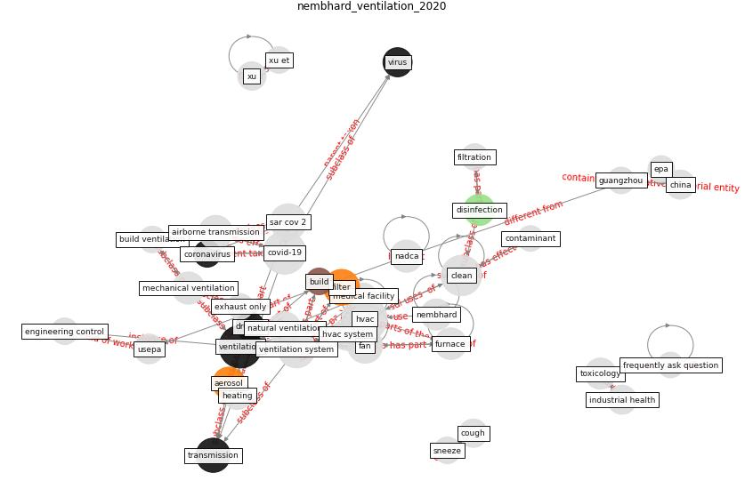

# Article: Ventilation use in nonmedical settings during COVID-19: Cleaning protocol, maintenance, and recommendations (nembhard_ventilation_2020)

* Source: [10.1177/0748233720967528](https://doi.org/10.1177/0748233720967528)
* Year: 2020
* Cluster: [air-ventilation](cluster_4)

## Keywords

 * [aerosol](keyword_aerosol), [air](keyword_air), air contaminant, air duct, [air filter](keyword_air_filter), air intake, airborne transmission, [ashrae](keyword_ashrae), authorship, bahnfleth w, [build](keyword_build), cardno chemrisk, chartier y, [china](keyword_china), [clean](keyword_clean), close contact, code, contagion, contaminant, [control](keyword_control), cool, [coronavirus](keyword_coronavirus), cough, [covid 19 pandemic](keyword_covid_19_pandemic), [covid-19](keyword_covid-19), diamond princess cruise ship, dilution, [disinfection](keyword_disinfection), [droplet](keyword_droplet), ductwork, [efficiency](keyword_efficiency), engineering control, epa, exhaust fan, exhaust only, [facility management](keyword_facility_management), fan, [filter](keyword_filter), [filtration](keyword_filtration), flamholz a, frequently ask question, furnace, garbage, growth, gu j, guangzhou, heating, [humidity](keyword_humidity), [hvac](keyword_hvac), [hvac system](keyword_hvac_system), [iaq](keyword_iaq), in room, indoor air, [indoor air quality](keyword_indoor_air_quality), infectious, infectious disease outbreak, insulation, john milton, li k, louver, lung, [mask](keyword_mask), microbiological, nadca, nadca laurel, nembhard, odor, [pandemic](keyword_pandemic), paradise lose, perera h, pessoa silva c, [product](keyword_product), [protocol](keyword_protocol), psa, pulmonary system, qian h, rating, register, [research](keyword_research), respiratory virus, [russia](keyword_russia), [sar cov 2](keyword_sar_cov_2), service, [simulation](keyword_simulation), sneeze, [space](keyword_space), st petersburg, [system](keyword_system), tang jw, taylor engineering, [temperature](keyword_temperature), [transmission](keyword_transmission), [united states](keyword_united_states), usepa, [ventilation](keyword_ventilation), ventilation system, [virus](keyword_virus), [world health organization](keyword_world_health_organization), worldwide pandemic, [wuhan](keyword_wuhan)

## Concepts

 

## Neighbours

### Closest articles

* Review and comparison of HVAC operation guidelines in different countries during the COVID-19 pandemic - [LINK](article_guo_review_2021)
* Heating, ventilation and air-conditioning systems in the context of COVID-19 - [LINK](article_ecdc_heating_2020)
* ASHRAE Position Document on Infectious Aerosols - [LINK](article_ashrae_ashrae_2022)
* A critical review of heating, ventilation, and air conditioning (HVAC) systems within the context of a global SARS-CoV-2 epidemic - [LINK](article_elsaid_critical_2021)
* How can airborne transmission of COVID-19 indoors be minimised? - [LINK](article_morawska_how_2020)
* Methods for air cleaning and protection of building occupants from airborne pathogens - [LINK](article_bolashikov_methods_2009)
* A review of facilities management interventions to mitigate respiratory infections in existing buildings - [LINK](article_zhang_review_2022)
* The ventilation of buildings and other mitigating measures for COVID-19: a focus on wintertime - [LINK](article_burridge_ventilation_2021)
* Indoor Air Quality: Rethinking rules of building design strategies in post-pandemic architecture - [LINK](article_megahed_indoor_2021)

### Closest BPs

* Blueprint: Installing UV in ductwork - [LINK](bp_10)
* Blueprint: Monitoring of wastewater - [LINK](bp_21)
* Blueprint: Resilience in staffing and skills training - [LINK](bp_12)
