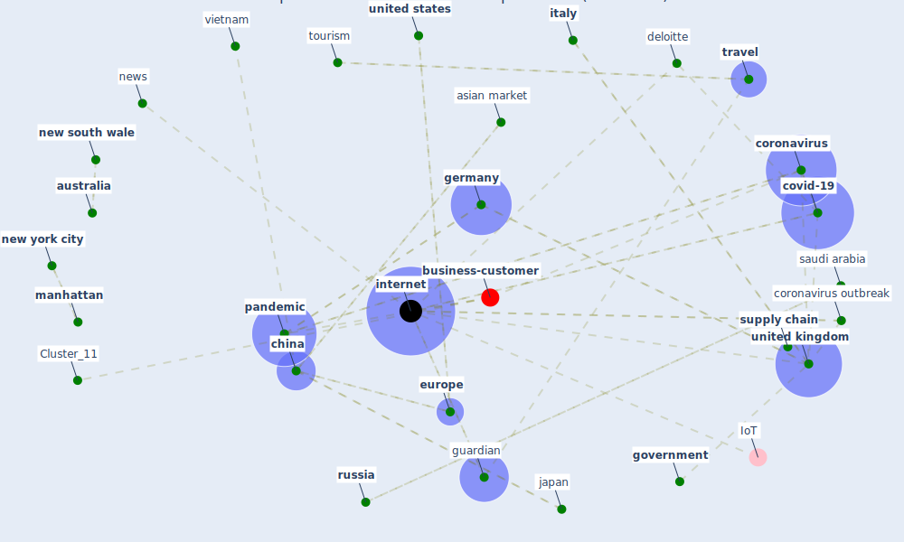

# Article: The socio-economic implications of the coronavirus pandemic (COVID-19): A review (nicola_socio-economic_2020)

* Source: [10.1016/j.ijsu.2020.04.018](https://doi.org/10.1016/j.ijsu.2020.04.018)
* Year: 2020
* Cluster: [construction-pandemic](cluster_1)

## Keywords

 * asian market, [australia](keyword_australia), bank of america, bank of england, bbc, buyer, chancellor, [china](keyword_china), commodity, [conflict of interest](keyword_conflict_of_interest), content, [coronavirus](keyword_coronavirus), [coronavirus outbreak](keyword_coronavirus_outbreak), correspond government, [covid 19 pandemic](keyword_covid_19_pandemic), [covid-19](keyword_covid-19), [datum](keyword_datum), deloitte, demand, dollar, domestic abuse, domestic abuse how to get help, domestic violence, [economic](keyword_economic), [economic crisis](keyword_economic_crisis), england, [europe](keyword_europe), european commission, [european union](keyword_european_union), eurozone, fast food, food parcel, food product, gates foundation, george orwell, german, [germany](keyword_germany), gold, [government](keyword_government), grant, guardian, [healthcare](keyword_healthcare), healthcare worker, hospitality, index, insurance, [internet](keyword_internet), iran, iraq, [italy](keyword_italy), [japan](keyword_japan), kurzarbeitergeld, las vegas, loan, [london](keyword_london), [manhattan](keyword_manhattan), marketwatch, mastercard, merrill lynch, mexico, [new south wale](keyword_new_south_wale), [new york city](keyword_new_york_city), [news](keyword_news), nicola, [nih](keyword_nih), nineteen eighty four, novavax, npr, npr org, oil, opec, [pandemic](keyword_pandemic), panic buying, panicbuye, recession, [russia](keyword_russia), [saudi arabia](keyword_saudi_arabia), [school](keyword_school), school closure, scientific research, seller, selling process, stock market, [supply chain](keyword_supply_chain), syria, tertiary sector, [tourism](keyword_tourism), tourism sector, [travel](keyword_travel), ukraine, [unesco](keyword_unesco), [united kingdom](keyword_united_kingdom), [united states](keyword_united_states), [usa](keyword_usa), [vaccine](keyword_vaccine), vietnam, wellcome, world bank group, [world heritage site](keyword_world_heritage_site), world news

## Concepts

 

## Neighbours

### Closest articles

* The COVID-19 pandemic: Lessons on building more equal and sustainable societies - [LINK](article_van_barneveld_covid-19_2020)
* Mapping research in logistics and supply chain management during COVID-19 pandemic - [LINK](article_montoya-torres_mapping_2021)
* Sustainable work throughout the life course: National policies and strategies, Publications Office of the European Union - [LINK](article_eurofund_sustainable_2016)
* Building sustainable finance for resilient protected and conserved areas: lessons from COVID-19 - [LINK](article_cumming_building_2021)
* Global value chains: Efficiency and risks in the context of COVID-19 - [LINK](article_oecd_global_2021)
* COVID-19 and the UN Sustainable Development Goals: Threat to Solidarity or an Opportunity? - [LINK](article_leal_filho_covid-19_2020)
* Covid-19 and asset management in EU: a preliminary assessment of performance and investment styles - [LINK](article_rizvi_covid-19_2020)
* World Bank Development Report - [LINK](article_world_bank_world_2022)
* How COVID-19 Redefines the Concept of Sustainability - [LINK](article_hakovirta_how_2020)
* Health, Economic and Social Development Challenges of the COVID-19 Pandemic: Strategies for Multiple and Interconnected Issues - [LINK](article_panneer_health_2022)

### Closest BPs

* Blueprint: Smart Locker System - [LINK](bp_1)
* Blueprint: Resilience in staffing and skills training - [LINK](bp_12)
* Blueprint: Tracking and enforcing use of Personal Protective Equipment - [LINK](bp_23)
