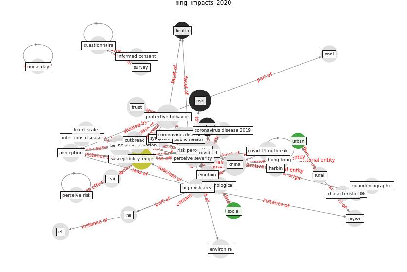

# Article: __The impacts of knowledge, risk perception, emotion and information on citizens’ protective behaviors during the outbreak of COVID-19: a cross-sectional study in China__ (ning_impacts_2020)

* [10.1186/s12889-020-09892-y](https://doi.org/10.1186/s12889-020-09892-y)
* Cluster: [health-city](cluster_0)

## Keywords

[china](keyword_china), [knowledge](keyword_knowledge), [risk](keyword_risk), [pandemic](keyword_pandemic)

## Abstract

Abstract

Background Individual protective behaviors play an
important role in the control of the spread of infectious
diseases. This study aimed to investigate the adoption of
protective behaviors by Chinese citizens amid the COVID-19
outbreak and its associated factors.

Methods An online cross-sectional survey was conducted from
22 January to 14 February 2020 through Wenjuanxing
platform, measuring their knowledge, risk perception,
negative emotion, response to official communication, and
protective behaviors in relation to COVID-19. A total of
3008 people completed the questionnaire, of which 2845 were
valid questionnaires.

Results

On average, 71\% of respondents embraced protective
behaviors. Those who made no error in the knowledge test
(AOR = 1.77, p  \textless 0.001) perceived the
high severity of the epidemic (AOR = 1.90, p
\textless 0.001), had high negative emotion
(AOR = 1.36, p  = 0.005), reported good health
(AOR = 1.94, p  \textless 0.001), paid high
attention to the governmental media (AOR = 4.16, p
\textless 0.001) and trusted the governmental media
(AOR = 1.97, p  \textless 0.001) were more likely
to embrace protective behaviors after adjustments for
variations in potential confounding factors. Women and
older people were also more likely to embrace protective
behaviors. No regional or educational differences were
found in the adoption of protective behaviors.

Conclusion The majority of Chinese citizens embraced
protective behaviors. Higher levels of protective behaviors
are associated with higher knowledge, perceived severity,
negative emotion, and attention to and trust in the
official governmental media. Official governmental
communication is the largest single predictor of protective
behaviors.

## Concepts

 

