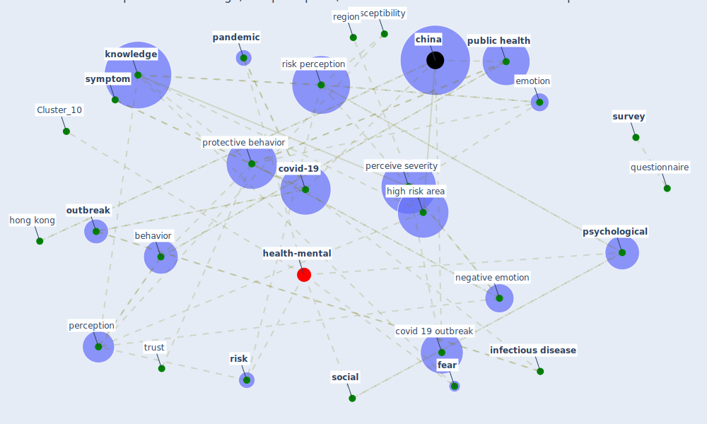

# Article: The impacts of knowledge, risk perception, emotion and information on citizens’ protective behaviors during the outbreak of COVID-19: a cross-sectional study in China (ning_impacts_2020)

* Source: [10.1186/s12889-020-09892-y](https://doi.org/10.1186/s12889-020-09892-y)
* Year: 2020
* Cluster: [health-mental](cluster_10)

## Keywords

 * answer, [anxiety](keyword_anxiety), attention, behavior, [beijing](keyword_beijing), bmc, characteristic, [china](keyword_china), [chinese](keyword_chinese), chinese government, cho s, choi js, citizen, communication, community health, controllability, controllable, coronavirus disease, covid 19 outbreak, [covid 19 pandemic](keyword_covid_19_pandemic), [covid-19](keyword_covid-19), cultural, datum analysis, datum collection, elderly, embracement, emotion, [epidemic](keyword_epidemic), epidemiol, [fear](keyword_fear), female, [fever](keyword_fever), [government](keyword_government), h1n1 flu, hand hygiene, harbin, [harm](keyword_harm), [health](keyword_health), high level group, high risk area, [hong kong](keyword_hong_kong), [hubei](keyword_hubei), [infectious disease](keyword_infectious_disease), [influenza](keyword_influenza), influenza a, informed consent, kim js, [knowledge](keyword_knowledge), knowledge acquisition, kwok, likert scale, linear regression, link, male, ne, negative emotion, nguyen dn, nurse day, old people, online survey, [outbreak](keyword_outbreak), pan r, [pandemic](keyword_pandemic), [perceive risk](keyword_perceive_risk), perceive severity, perception, pham qt, [protective behavior](keyword_protective_behavior), [psychological](keyword_psychological), [public](keyword_public), [public health](keyword_public_health), public health emergency, question, questionnaire, region, reye pwc, [risk](keyword_risk), risk communication, [risk perception](keyword_risk_perception), risk perception score, rural, scale, self report health, severe, [social](keyword_social), sociodemographic, source of information, [stress](keyword_stress), [survey](keyword_survey), susceptibility, [symptom](keyword_symptom), trust, university degree, university of pennsylvania, [urban](keyword_urban), validity, [vulnerability](keyword_vulnerability), wenjuanxe, woman, [wuhan](keyword_wuhan)

## Concepts

 

## Neighbours

### Closest articles

* Knowledge, attitudes, and practices of Indonesian residents regarding COVID-19: A national cross-sectional survey - [LINK](article_yodang_knowledge_2021)
* COVID-19 media fatigue: predictors of decreasing interest and avoidance of COVID-19–related news - [LINK](article_buneviciene_covid-19_2021)
* Overview of the mitigation strategies for COVID-19 pandemic - [LINK](article_ads_overview_2020)
* Infodemic and the spread of fake news in the COVID-19-era - [LINK](article_orso_infodemic_2020)
* Covid-19 and community mitigation strategies in a pandemic - [LINK](article_ebrahim_covid-19_2020)
* Contributions to the mitigation of the COVID-19 pandemic - [LINK](article_pilz_contributions_2022)
* Coronavirus disease 2019: The harms of exaggerated information and non‐evidence‐based measures - [LINK](article_ioannidis_coronavirus_2020)
* The changes in the effects of social media use of Cypriots due to COVID-19 pandemic - [LINK](article_kaya_changes_2020)
* COVID-19 misinformation: Accuracy of articles about coronavirus prevention mostly shared on social media - [LINK](article_obiala_covid-19_2021)
* What drives unverified information sharing and cyberchondria during the COVID-19 pandemic? - [LINK](article_laato_what_2020)

### Closest BPs

* Blueprint: Resilience in staffing and skills training - [LINK](bp_12)
* Blueprint: Negative pressure rooms - [LINK](bp_13)
* Blueprint: Air Cleaning Plants - [LINK](bp_15)
