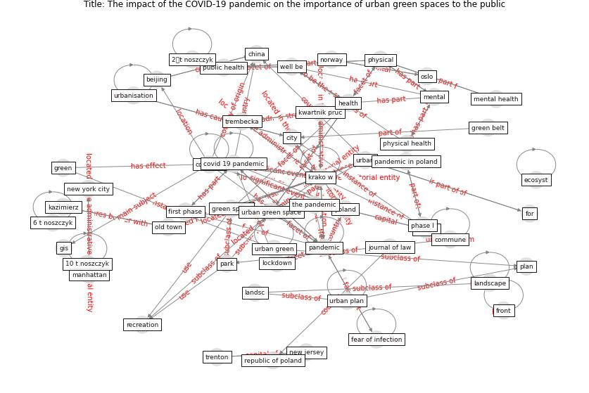

# Article: The impact of the COVID-19 pandemic on the importance of urban green spaces to the public (noszczyk_impact_2022)

* Source: [10.1016/j.landusepol.2021.105925](https://doi.org/10.1016/j.landusepol.2021.105925)
* Year: 2022
* Cluster: [city-urban](cluster_7)

## Keywords

 * 10 t noszczyk, 2𒀠t noszczyk, 6 t noszczyk, [beijing](keyword_beijing), belgium, brussels, central statistical office, [china](keyword_china), [city](keyword_city), commune, compact city, consum, correspond author, [covid 19 pandemic](keyword_covid_19_pandemic), [covid-19](keyword_covid-19), [crisis](keyword_crisis), [design](keyword_design), different phase, ecol, ecosyst, ecosystem, fear of infection, first phase, for, front, geod, gis, global pandemic, [green](keyword_green), green belt, green space, [gym](keyword_gym), [health](keyword_health), [infection](keyword_infection), [infrastructure](keyword_infrastructure), journal of law, kazimierz, kim y k, [krako w](keyword_krako_w), krako w s, krakow, kwartnik pruc, landsc, landscape, [lockdown](keyword_lockdown), [manhattan](keyword_manhattan), [mental](keyword_mental), [mental health](keyword_mental_health), mobility restriction, natl, natural science, [new jersey](keyword_new_jersey), [new york city](keyword_new_york_city), norway, old town, oslo, [pandemic](keyword_pandemic), pandemic in poland, park, phase I, phase ii, [physical](keyword_physical), physical activity, [physical health](keyword_physical_health), [plan](keyword_plan), [poland](keyword_poland), [psychological](keyword_psychological), [public health](keyword_public_health), quant, recreation, republic of poland, restriction, result visualisation, serv, [shanghai](keyword_shanghai), shaw r, [social](keyword_social), [social medium](keyword_social_medium), social sciences, socioeconomic, [survey](keyword_survey), sustain, [sustainability](keyword_sustainability), telega, telega I, the pandemic, third question, trembecka, [trenton](keyword_trenton), [urban](keyword_urban), [urban area](keyword_urban_area), urban green, [urban green space](keyword_urban_green_space), urban plan, [urban planning](keyword_urban_planning), urbanisation, vistula, vistula promenade, [well be](keyword_well_be), wzgo rza krzesławickie

## Concepts

 

## Neighbours

### Closest articles

* Urban Green Infrastructure and Green Open Spaces: An Issue of Social Fairness in Times of COVID-19 Crisis - [LINK](article_reinwald_urban_2021)
* The role of green roofs in post COVID-19 confinement: An analysis of willingness to pay - [LINK](article_manso_role_2021)
* Association between indoor-outdoor green features and psychological health during the COVID-19 lockdown in Italy: A cross-sectional nationwide study - [LINK](article_spano_association_2021)
* Green in times of COVID-19: urban green space relevance during the COVID-19 pandemic in Buenos Aires City - [LINK](article_marconi_green_2022)
* Effects of the COVID-19 pandemic on the use and perceptions of urban green space: An international exploratory study - [LINK](article_ugolini_effects_2020)
* Green spaces, especially forest, linked to lower SARS-CoV-2 infection rates: A one-year nationwide study - [LINK](article_jiang_green_2021)
* The Impact of COVID-19 on Public Space: A Review of the Emerging Questions - [LINK](article_honey-roses_impact_2020)
* Impact of Covid-19 on the built environment - [LINK](article_mahima_impact_2022)
* The COVID-19 Impact on Flexible Office Space - [LINK](article_clifton_covid-19_2020)
* Antivirus-built environment: Lessons learned from Covid-19 pandemic - [LINK](article_megahed_antivirus-built_2020)

### Closest BPs

* Blueprint: Architecture design - [LINK](bp_2)
* Blueprint: Building Adaptation during a pandemic - [LINK](bp_14)
* Blueprint: Tender support at building stage - [LINK](bp_9)
