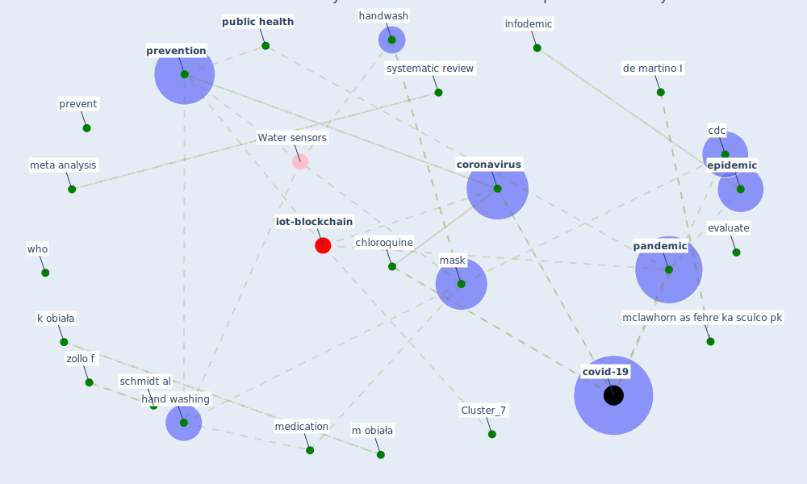

# Article: COVID-19 misinformation: Accuracy of articles about coronavirus prevention mostly shared on social media (obiala_covid-19_2021)

* Source: [10.1016/j.hlpt.2020.10.007](https://doi.org/10.1016/j.hlpt.2020.10.007)
* Year: 2021
* Cluster: [iot-blockchain](cluster_7)

## Keywords

 * 185 j obiała, 2014 ebola outbreak, accuracy, accurate article, accurate content, advice, airborne transmission, alternative medicine, aronoff dm, asymptomatic, benefits, bias, [cdc](keyword_cdc), center for disease prevention and control, chi square test, [china](keyword_china), chloroquine, chu dk, [coronavirus](keyword_coronavirus), coronavirus comment le, coronavirus cure rumor, coronavirus disease covid 19, coronavirus pandemic, coronavirus prevention, [country](keyword_country), [covid-19](keyword_covid-19), [datum](keyword_datum), de martino I, desai an, descriptive statistic, discussion, drawback, drink, [epidemic](keyword_epidemic), epidemiologist, [epidemiology](keyword_epidemiology), evaluate, [facebook](keyword_facebook), fellowship, [france](keyword_france), genitounitary malignancy, guideline, haddad, hand washing, handwash, health authority, health policy and technology, identification, inaccurate content, infodemic, [information](keyword_information), iran, k obiała, khan, klompas, language, lifestyle, liu q, m obiała, magazine, [mask](keyword_mask), mclawhorn as fehre ka sculco pk, medication, medicine, [meta analysis](keyword_meta_analysis), mian, mislead, misleading article, morris can, myth, newspaper, [number](keyword_number), [pandemic](keyword_pandemic), percentage, postgraduate medicine, presymptomatic, prevent, [prevention](keyword_prevention), [public health](keyword_public_health), [real](keyword_real), [research](keyword_research), [researcher](keyword_researcher), schmidt al, scientific, selection, sommariva s, subjective judgment, systematic review, the sense of wear it, [vaccine](keyword_vaccine), vamos c, virus transmission, web of science, who, [world health organization](keyword_world_health_organization), [wuhan](keyword_wuhan), zarocosta, zheng z, zollo f, finding

## Concepts

 

## Neighbours

### Closest articles

* What drives unverified information sharing and cyberchondria during the COVID-19 pandemic? - [LINK](article_laato_what_2020)
* Infodemic and the spread of fake news in the COVID-19-era - [LINK](article_orso_infodemic_2020)
* Coronavirus: Can artificial intelligence be smart enough to detect fake news? - [LINK](article_tong_coronavirus_2020)
* The changes in the effects of social media use of Cypriots due to COVID-19 pandemic - [LINK](article_kaya_changes_2020)
* COVID-19 media fatigue: predictors of decreasing interest and avoidance of COVID-19–related news - [LINK](article_buneviciene_covid-19_2021)
* The impacts of knowledge, risk perception, emotion and information on citizens’ protective behaviors during the outbreak of COVID-19: a cross-sectional study in China - [LINK](article_ning_impacts_2020)
* Knowledge, attitudes, and practices of Indonesian residents regarding COVID-19: A national cross-sectional survey - [LINK](article_yodang_knowledge_2021)
* Coronavirus disease 2019: The harms of exaggerated information and non‐evidence‐based measures - [LINK](article_ioannidis_coronavirus_2020)
* Covid-19 and community mitigation strategies in a pandemic - [LINK](article_ebrahim_covid-19_2020)
* Overview of the mitigation strategies for COVID-19 pandemic - [LINK](article_ads_overview_2020)

### Closest BPs

* Blueprint: Resilience in staffing and skills training - [LINK](bp_12)
* Blueprint: Installing UV in ductwork - [LINK](bp_10)
* Blueprint: Negative pressure rooms - [LINK](bp_13)
