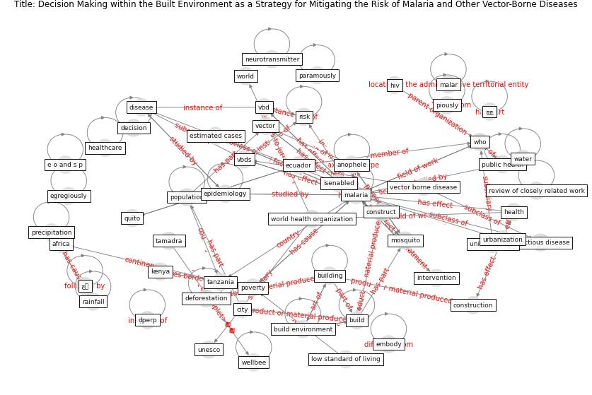

# Article: Decision Making within the Built Environment as a Strategy for Mitigating the Risk of Malaria and Other Vector-Borne Diseases (obonyo_decision_2018)

* Source: [10.3390/buildings9010002](https://doi.org/10.3390/buildings9010002)
* Year: 2018
* Cluster: [malaria-vector](cluster_12)

## Keywords

 * [africa](keyword_africa), agriculture, aid, anophele, anthropocene, autoimmune, [build](keyword_build), [build environment](keyword_build_environment), [building](keyword_building), categorized source factors, [city](keyword_city), construct, [construction](keyword_construction), decision, decision make, deforestation, demolition, [dengue](keyword_dengue), [design](keyword_design), [disease](keyword_disease), e o and s p, east africa, ecuador, [education](keyword_education), egregiously, embody, epidemiologist, [epidemiology](keyword_epidemiology), estimated cases, ethiopia, excavation, exterior, gpu, [health](keyword_health), health perspect, [healthcare](keyword_healthcare), [hiv](keyword_hiv), hygiene, [infectious disease](keyword_infectious_disease), interdependency, interior, intervention, intervention method, intervention strategy, isenabled, jawara m, [kenya](keyword_kenya), land use, linkage, low standard of living, [malar](keyword_malar), [malaria](keyword_malaria), [manhattan](keyword_manhattan), [mosquito](keyword_mosquito), neurotransmitter, [new jersey](keyword_new_jersey), [new york city](keyword_new_york_city), paine k, panama canal, paramously, physic, piously, [pollutant](keyword_pollutant), [population](keyword_population), populous, poverty, precipitation, [professional](keyword_professional), [public health](keyword_public_health), quito, rainfall, review of closely related work, [risk](keyword_risk), severe dengue, slum, socioeconomic status, source factor, source factors, sub saharan, [sustainable development goal](keyword_sustainable_development_goal), tamadra, [tanzania](keyword_tanzania), [trenton](keyword_trenton), [unesco](keyword_unesco), [united nations](keyword_united_nations), [urban](keyword_urban), urbanization, [vbd](keyword_vbd), vbds, [vector](keyword_vector), [vector borne disease](keyword_vector_borne_disease), [ventilation](keyword_ventilation), [water](keyword_water), [wellbee](keyword_wellbee), who, world, [world health organization](keyword_world_health_organization), چچ, [چہ](keyword_چہ), ḍperp

## Concepts

 

## Neighbours

### Closest articles

* Integrating rapid risk mapping and mobile phone call record data for strategic malaria elimination planning - [LINK](article_tatem_integrating_2014)
* Addressing vulnerability, building resilience: community-based adaptation to vector-borne diseases in the context of global change - [LINK](article_bardosh_addressing_2017)
* Prototype Early Warning Systems for Vector-Borne Diseases in Europe - [LINK](article_semenza_prototype_2015)
* The impact of climate change on the epidemiology and control of Rift Valley fever - PubMed - [LINK](article_martin_impact_2008)
* Challenges to Mitigating the Urban Health Burden of Mosquito-Borne Diseases in the Face of Climate Change - [LINK](article_ligsay_challenges_2021)
* Vector-borne disease, climate change and urban design - [LINK](article_ogden_vector-borne_2016)
* Design COVID-19 Ontology: A Healthcare and Safety Perspective - [LINK](article_aloulou_design_2022)
* How the 5G Enabled the COVID-19 Pandemic Prevention and Control: Materiality, Affordance, and (De-)Spatialization - [LINK](article_li_how_2022)
* CIDO, a community-based ontology for coronavirus disease knowledge and data integration, sharing, and analysis - [LINK](article_he_cido_2020)
* An Overview of Biomedical Ontologies for Pandemics and Infectious Diseases Representation - [LINK](article_bayoudhi_overview_2021)

### Closest BPs

* Blueprint: Installing high-efficiency air filters - [LINK](bp_11)
* Blueprint: Resilience in staffing and skills training - [LINK](bp_12)
* Blueprint: Monitoring of wastewater [CID] - [LINK](bp_21)
