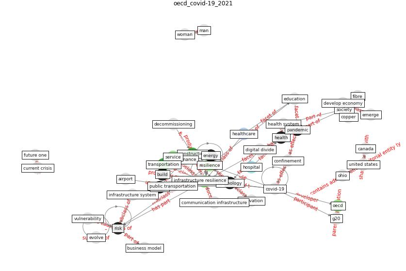

# Article: COVID-19 and a new resilient infrastructure landscape (oecd_covid-19_2021)

* [https://www.oecd.org/coronavirus/policy-responses/covid-19-and-a-new-resilient-infrastructure-landscape-d40a19e3/](https://www.oecd.org/coronavirus/policy-responses/covid-19-and-a-new-resilient-infrastructure-landscape-d40a19e3/)
* Year: 2021
* Cluster: [construction-resilience](cluster_5)

## Keywords

 * [5 g](keyword_5_g), [airport](keyword_airport), broadband, [build](keyword_build), business model, [canada](keyword_canada), capital, communication infrastructure, [confinement](keyword_confinement), [construction](keyword_construction), consumer preference, [copper](keyword_copper), [covid 19 crisis](keyword_covid_19_crisis), [covid-19](keyword_covid-19), [crisis](keyword_crisis), current crisis, cyber attack, decommissioning, demand for air travel, develop economy, [development](keyword_development), digital divide, e mobility, earthquake, ease, [economic](keyword_economic), [education](keyword_education), electric charge infrastructure, electric vehicle, emerge, [energy](keyword_energy), [energy efficiency](keyword_energy_efficiency), essential good, evolve, fibre, financing, fix cost, flexibility, future one, g20, g20 action plan, governance, [government](keyword_government), [health](keyword_health), [health system](keyword_health_system), [healthcare](keyword_healthcare), healthcare system, [hospital](keyword_hospital), [infrastructure](keyword_infrastructure), infrastructure resilience, infrastructure system, [innovation](keyword_innovation), interconnect, investment, life cycle, [lockdown](keyword_lockdown), municipality, natural hazard, network operator, [oecd](keyword_oecd), ohio, [operation](keyword_operation), opinion express, [pandemic](keyword_pandemic), peri urban, preparedness, prevent congestion, private sector, [project](keyword_project), [public](keyword_public), public transportation, re insurance, region, regulator, renewable energy, [resilience](keyword_resilience), rideshare app, [risk](keyword_risk), risk management, service, smart infrastructure, [society](keyword_society), [supply chain](keyword_supply_chain), [system](keyword_system), take off, [technology](keyword_technology), telecommunication, [telehealth](keyword_telehealth), teleworke, threat, topdown, transportation, tsunami, [united states](keyword_united_states), urban mobility, variable cost, [vulnerability](keyword_vulnerability), waste, [water](keyword_water), [work](keyword_work)

## Concepts

 

## Neighbours

### Closest articles

* Preparing critical infrastructure for the future: Lessons learnt from the Covid-19 pandemic - [LINK](article_tomalska_preparing_2022)
* COVID-19 as a Harbinger of Transforming Infrastructure Resilience - [LINK](article_carvalhaes_covid-19_2020)
* DfMA for rapid adaptive resilience and flexible infrastructure - [LINK](article_mott_macdonald_dfma_2020)
* Guidelines for resilience systems analysis - [LINK](article_oecd_guidelines_2014)
* A review of definitions and measures of system resilience - [LINK](article_hosseini_review_2016)
* Strengthening resilience: a priority shared by Health 2020 and - [LINK](article_who_strengthening_2017)
* A Continuously Active Antimicrobial Coating effective against Human Coronavirus 229E - [LINK](article_ikner_continuously_2020)
* Sars-CoV-2 (COVID-19) inactivation capability of copper-coated touch surface fabricated by cold-spray technology - [LINK](article_hutasoit_sars-cov-2_2020)
* A Surface Coating that Rapidly Inactivates SARS-CoV-2 - [LINK](article_behzadinasab_surface_2020)
* Graphene-based nanomaterials as antimicrobial surface coatings: A parallel approach to restrain the expansion of COVID-19 - [LINK](article_ayub_graphene-based_2021)

### Closest BPs

* Blueprint: Mental health – Commit: Do something meaningfull - [LINK](bp_20)
* Blueprint: Mental health – Belong: Do something with someone - [LINK](bp_19)
* Blueprint: Mental health – Act: Do something - [LINK](bp_18)
