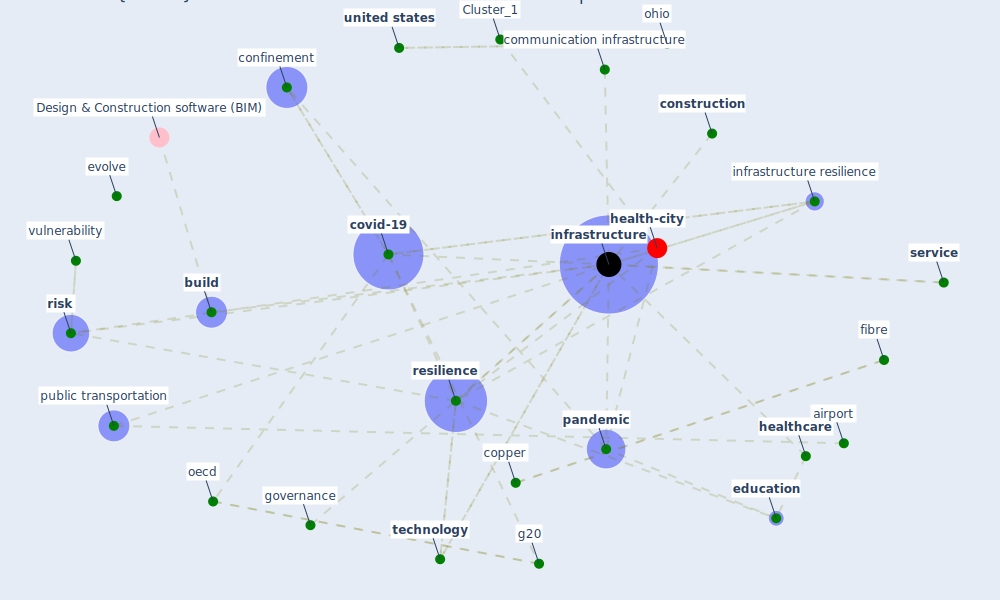

# Article: COVID-19 and a new resilient infrastructure landscape (oecd_covid-19_2021)

* [https://www.oecd.org/coronavirus/policy-responses/covid-19-and-a-new-resilient-infrastructure-landscape-d40a19e3/](https://www.oecd.org/coronavirus/policy-responses/covid-19-and-a-new-resilient-infrastructure-landscape-d40a19e3/)
* Year: 2021
* Cluster: [health-city](cluster_1)

## Keywords

 * [5 g](keyword_5_g), [airport](keyword_airport), [build](keyword_build), business model, [canada](keyword_canada), capital, communication infrastructure, [confinement](keyword_confinement), [construction](keyword_construction), consumer preference, [copper](keyword_copper), [covid 19 crisis](keyword_covid_19_crisis), [covid-19](keyword_covid-19), [crisis](keyword_crisis), current crisis, decommissioning, demand for air travel, develop economy, development, e mobility, earthquake, ease, [education](keyword_education), electric charge infrastructure, electric vehicle, [emerge](keyword_emerge), [energy](keyword_energy), evolve, fibre, financing, fix cost, flexibility, future one, g20, g20 action plan, governance, [government](keyword_government), [health](keyword_health), [health system](keyword_health_system), [healthcare](keyword_healthcare), [healthcare system](keyword_healthcare_system), [hospital](keyword_hospital), [impact](keyword_impact), [infrastructure](keyword_infrastructure), infrastructure resilience, infrastructure system, [innovation](keyword_innovation), insurance, interconnect, [interdependency](keyword_interdependency), [internet](keyword_internet), investment, ireland, land, life cycle, [lockdown](keyword_lockdown), municipality, network operator, [oecd](keyword_oecd), ohio, operation, [pandemic](keyword_pandemic), preparedness, private sector, [project](keyword_project), [public](keyword_public), public transportation, re insurance, [region](keyword_region), regulator, renewable energy, [resilience](keyword_resilience), resilience in infrastructure, resource, rideshare app, [risk](keyword_risk), risk management, security checkpoint, [service](keyword_service), [shock](keyword_shock), smart infrastructure, [society](keyword_society), spend more, spending habit, [supply chain](keyword_supply_chain), [system](keyword_system), system resilience, take off, [technology](keyword_technology), telecommunication, [telehealth](keyword_telehealth), threat, topdown, [transportation](keyword_transportation), tsunami, [united states](keyword_united_states), variable cost, [vulnerability](keyword_vulnerability), waste, [water](keyword_water)

## Concepts

 

## Neighbours

### Closest articles

* Preparing critical infrastructure for the future: Lessons learnt from the Covid-19 pandemic - [LINK](article_tomalska_preparing_2022)
* COVID-19 as a Harbinger of Transforming Infrastructure Resilience - [LINK](article_carvalhaes_covid-19_2020)
* Guidelines for resilience systems analysis - [LINK](article_oecd_guidelines_2014)
* A review of definitions and measures of system resilience - [LINK](article_hosseini_review_2016)
* Strengthening resilience: a priority shared by Health 2020 and - [LINK](article_who_strengthening_2017)
* China adapts survey drones to enforce world’s largest quarantine - [LINK](article_liu_china_2020)
* The impact of climate change on the epidemiology and control of Rift Valley fever - PubMed - [LINK](article_martin_impact_2008)
* Assessment method for new sustainability indicators providing pandemic resilience for residential buildings - [LINK](article_tokazhanov_assessment_2021)
* Vector-borne disease, climate change and urban design - [LINK](article_ogden_vector-borne_2016)

### Closest BPs

* Blueprint: Monitoring of wastewater - [LINK](bp_21)
* Blueprint: Indoor Environmental Quality (IEQ) monitoring system - [LINK](bp_3)
* Blueprint: Air Cleaning Plants - [LINK](bp_15)
