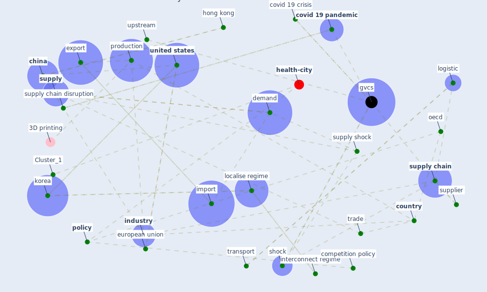

# Article: Global value chains: Efficiency and risks in the context of COVID-19 (oecd_global_2021)

* Source: [10.1787/67c75fdc-en](https://doi.org/10.1787/67c75fdc-en)
* Year: 2021
* Cluster: [health-city](cluster_1)

## Keywords

 * 105 105 sea row, [argentina](keyword_argentina), arriola, asia, [austria](keyword_austria), backward metric, benefit, [brazil](keyword_brazil), buyer, [china](keyword_china), competition, competition policy, [computer](keyword_computer), [concentration](keyword_concentration), consumption, [cost](keyword_cost), [country](keyword_country), [covid 19 crisis](keyword_covid_19_crisis), [covid 19 pandemic](keyword_covid_19_pandemic), [covid-19](keyword_covid-19), current crisis, cyclicality, database, demand, demand shock, diversification, dnk ltu prt nld swe kor deu lva fin pol fra, downstream, [economic](keyword_economic), economic activity, economic slowdown, [economy](keyword_economy), economy of scale, emerge market economy, [europe](keyword_europe), [european union](keyword_european_union), export, export concentration, export demand, [exposure](keyword_exposure), financial, food industry, forward centrality, fra cze bel lux aut mex che pol nzl zaf swe fin isr, fragmentation of production, gdp, [germany](keyword_germany), graz, gvc, [gvcs](keyword_gvcs), [hong kong](keyword_hong_kong), hubs, idn, import, import tariff, [industry](keyword_industry), information system, input, instability, insurance, interconnect, interconnect regime, intermediate, [korea](keyword_korea), large economy, latin america, latin american country, localise regime, [logistic](keyword_logistic), [manufacture](keyword_manufacture), [oecd](keyword_oecd), [pandemic](keyword_pandemic), paris, [policy](keyword_policy), product group, production, prt nld swe kor deu lva fin pol fra, quantitatively, [region](keyword_region), [resilience](keyword_resilience), [risk](keyword_risk), risk management, [service](keyword_service), service sector, [shock](keyword_shock), [simulation](keyword_simulation), small economy, southeast asia, substitution, supplier, [supply](keyword_supply), [supply chain](keyword_supply_chain), supply chain disruption, supply shock, trade, trade cost shock, [transport](keyword_transport), [united states](keyword_united_states), upstream, [world bank](keyword_world_bank)

## Concepts

 

## Neighbours

### Closest articles

* Mapping research in logistics and supply chain management during COVID-19 pandemic - [LINK](article_montoya-torres_mapping_2021)
* Covid-19 and asset management in EU: a preliminary assessment of performance and investment styles - [LINK](article_rizvi_covid-19_2020)
* Building sustainable finance for resilient protected and conserved areas: lessons from COVID-19 - [LINK](article_cumming_building_2021)
* COVID-19 and regional solutions for mitigating the risk of SME finance in selected ASEAN member states - [LINK](article_taghizadeh-hesary_covid-19_2022)
* World Bank Development Report - [LINK](article_world_bank_world_2022)
* Startups in times of crisis – A rapid response to the COVID-19 pandemic - [LINK](article_kuckertz_startups_2020)
* <scp>COVID</scp>             ‐19: Small and medium enterprises challenges and responses with creativity, innovation, and entrepreneurship - [LINK](article_thukral_covid19_2021)
* 2020 Data Protection Report - [LINK](article_council_of_europe_2020_2020)
* Challenges of data sharing in European Covid-19 projects: A learning opportunity for advancing pandemic preparedness and response - [LINK](article_tacconelli_challenges_2022)

### Closest BPs

* Blueprint: Resilience in staffing and skills training - [LINK](bp_12)
* Blueprint: Installing high-efficiency air filters - [LINK](bp_11)
* Blueprint: Smart Locker System - [LINK](bp_1)
