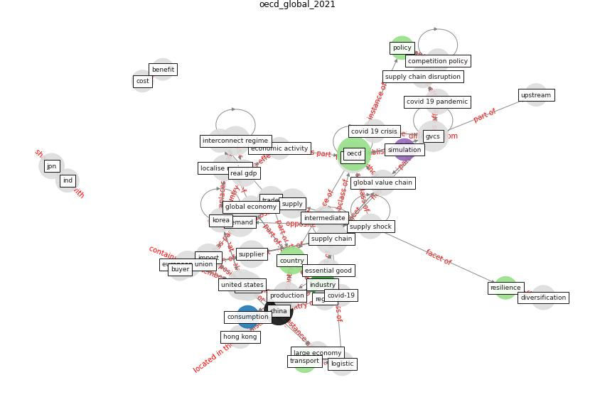

# Article: __Global value chains: Efficiency and risks in the context of COVID-19__ (oecd_global_2021)

* [10.1787/67c75fdc-en](https://doi.org/10.1787/67c75fdc-en)
* Cluster: [resilience-health](cluster_4)

## Keywords

[oecd](keyword_oecd), [china](keyword_china), [country](keyword_country)

## Concepts

 

