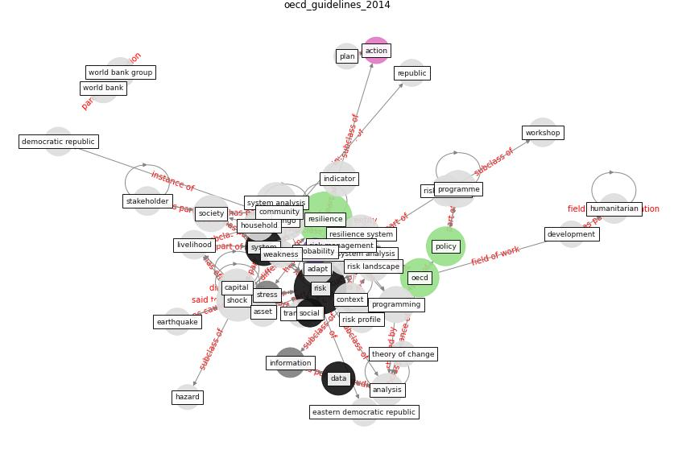

# Article: __Guidelines for resilience systems analysis__ (oecd_guidelines_2014)

* URL: [https://www.oecd.org/dac/Resilience%20Systems%20Analysis%20FINAL.pdf](https://www.oecd.org/dac/Resilience%20Systems%20Analysis%20FINAL.pdf)
* Year: 2014

## Keywords

* [resilience](keyword_resilience), [risk](keyword_risk), [resilience system analysis](keyword_resilience_system_analysis), [shock](keyword_shock), [system analysis](keyword_system_analysis), [congo](keyword_congo), [policy](keyword_policy), [oecd](keyword_oecd), [resilience system](keyword_resilience_system), [capital](keyword_capital), [system](keyword_system), programme, [society](keyword_society), [programming](keyword_programming), [indicator](keyword_indicator)

## Keywords at large

* [resilience](keyword_resilience), [risk](keyword_risk), [resilience system analysis](keyword_resilience_system_analysis), [shock](keyword_shock), [system analysis](keyword_system_analysis), [congo](keyword_congo), [policy](keyword_policy), [oecd](keyword_oecd), [resilience system](keyword_resilience_system), [capital](keyword_capital)

## Concepts

 

### Closest articles 

* [A review of definitions and measures of system resilience](article_hosseini_review_2016)
* [Strengthening resilience: a priority shared by Health
2020 and](article_who_strengthening_2017)
* [COVID-19 and a new resilient infrastructure landscape](article_oecd_covid-19_2021)
* [Preparing critical infrastructure for the future: Lessons learnt from the Covid-19 pandemic](article_tomalska_preparing_2022)
* [DfMA for rapid adaptive resilience and flexible
infrastructure](article_mott_macdonald_dfma_2020)
* [COVID-19 as a Harbinger of Transforming
Infrastructure Resilience](article_carvalhaes_covid-19_2020)
* [Mobility Behaviour in View of the Impact of the COVID-19 Pandemic—Public Transport Users in Gdansk Case Study](article_przybylowski_mobility_2021)
* [Responsible Transport: A post-COVID agenda for transport policy and practice](article_budd_responsible_2020)
* [Understanding the role of urban design in disease spreading](article_brizuela_understanding_2019)
* [RUDDS_bioRxiv_update](article_RUDDS_bioRxiv_update)

