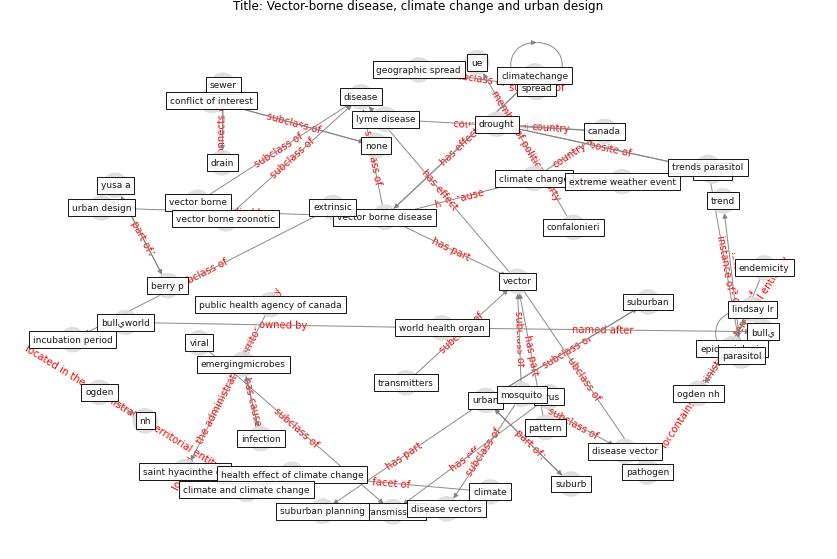

# Article: Vector-borne disease, climate change and urban design (ogden_vector-borne_2016)

* Source: [10.14745/ccdr.v42i10a04](https://doi.org/10.14745/ccdr.v42i10a04)
* Year: 2016
* Cluster: [urban-city](cluster_13)

## Keywords

 * ak, berrang ford l, berry p, buck pa, bullي, bullيworld, [canada](keyword_canada), chikungunya, [climate](keyword_climate), climate and climate change, [climate change](keyword_climate_change), climatechange, confalonieri, [conflict of interest](keyword_conflict_of_interest), [disease](keyword_disease), disease vector, disease vectors, drain, drought, emergence, emerging vector borne zoonotic diseases of public health importance in canada, emergingmicrobes, endemicity, environ res public health, [epidemic](keyword_epidemic), epidemiologic, epidemiologic pattern, extreme weather event, extrinsic, extrinsic incubation period, geographic spread, githeko, health effect of climate change, host, incubation, incubation period, [infection](keyword_infection), ja, lindsay lr, lyme disease, [mosquito](keyword_mosquito), mosquito borne disease, nh, none, ogden, ogden nh, parasitol, [pathogen](keyword_pathogen), pattern, patz, [public health](keyword_public_health), public health agency of canada, rainfall, saint hyacinthe, saint hyacinthe qc, sewer, [spread](keyword_spread), suburb, suburban, suburban planning, [temperature](keyword_temperature), [transmission](keyword_transmission), transmitters, trend, trends parasitol, ue, [urban](keyword_urban), urban design, [vector](keyword_vector), vector borne, [vector borne disease](keyword_vector_borne_disease), vector borne zoonotic, [viral](keyword_viral), [virus](keyword_virus), world health organ, yusa a

## Concepts

 

## Neighbours

### Closest articles

* The impact of climate change on the epidemiology and control of Rift Valley fever - PubMed - [LINK](article_martin_impact_2008)
* Challenges to Mitigating the Urban Health Burden of Mosquito-Borne Diseases in the Face of Climate Change - [LINK](article_ligsay_challenges_2021)
* Prototype Early Warning Systems for Vector-Borne Diseases in Europe - [LINK](article_semenza_prototype_2015)
* Making green infrastructure healthier infrastructure - [LINK](article_lohmus_making_2015)
* Global policy challenges for urban vector-borne disease risks - [LINK](article_alabaster_global_2016)
* Addressing vulnerability, building resilience: community-based adaptation to vector-borne diseases in the context of global change - [LINK](article_bardosh_addressing_2017)
* Decision Making within the Built Environment as a Strategy for Mitigating the Risk of Malaria and Other Vector-Borne Diseases - [LINK](article_obonyo_decision_2018)
* Integrating rapid risk mapping and mobile phone call record data for strategic malaria elimination planning - [LINK](article_tatem_integrating_2014)
* China adapts survey drones to enforce world’s largest quarantine - [LINK](article_liu_china_2020)

### Closest BPs

* Blueprint: Antimicrobial Surfaces - [LINK](bp_5)
* Blueprint: Smart Locker System - [LINK](bp_1)
* Blueprint: Good hand hygiene practice - [LINK](bp_16)
