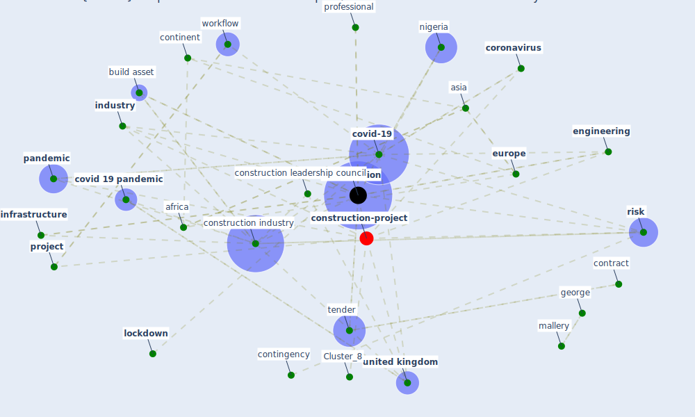

# Article: COVID-19 pandemic: the effects and prospects in the construction industry. (ogunnusi_covid-19_2020)

* [https://rgu-repository.worktribe.com/output/1000407/covid-19-pandemic-the-effects-and-prospects-in-the-construction-industry](https://rgu-repository.worktribe.com/output/1000407/covid-19-pandemic-the-effects-and-prospects-in-the-construction-industry)
* Year: 2020
* Cluster: [construction-pandemic](cluster_1)

## Keywords

 * abd el khalek, abuja, [africa](keyword_africa), [architect](keyword_architect), aryal, asia, [australia](keyword_australia), aziz, build asset, builder, [business](keyword_business), business decision, cern, ciob, civil engineer, [climate change](keyword_climate_change), [construction](keyword_construction), construction business, construction company, construction firm, [construction industry](keyword_construction_industry), construction leadership council, construction manager, continent, contingency, contingency plan, [contract](keyword_contract), contract wording, [contractor](keyword_contractor), contractual, [coronavirus](keyword_coronavirus), court, [covid 19 pandemic](keyword_covid_19_pandemic), [covid-19](keyword_covid-19), cronbach s alpha, decision, eastern, [engineering](keyword_engineering), [europe](keyword_europe), fidic, force majeure, george, government decision, hse rule, [industry](keyword_industry), [infrastructure](keyword_infrastructure), institute of build, khalek, [lockdown](keyword_lockdown), magazine, mallery, mishra, nation, [nigeria](keyword_nigeria), o callaghan, obligation, odesola, office base, ogunnusi, opportunity, otali, outside, [pandemic](keyword_pandemic), partial, [participant](keyword_participant), [plan](keyword_plan), positive, [productivity](keyword_productivity), [professional](keyword_professional), [project](keyword_project), reset, resource, restart, resume work, [risk](keyword_risk), [sample](keyword_sample), [saudi arabia](keyword_saudi_arabia), significance, significant, site, site operating procedure, skype, standard form of contract, stern, [supply chain](keyword_supply_chain), [survey](keyword_survey), suspension of work, tax, tender, threat, tribunal, turnaround strategy, [unesco](keyword_unesco), united arab emirate, [united kingdom](keyword_united_kingdom), unknown, work from home, work process, workflow, workforce

## Concepts

 

## Neighbours

### Closest articles

* Influence between COVID-19 Impacts and Project Stakeholders in Chilean Construction Projects - [LINK](article_araya_influence_2021)
* Perception of COVID-19 impacts on the construction industry over time - [LINK](article_rokooei_perception_2022)
* The Impact of Pandemic Crisis on the Survival of Construction Industry: A Case of COVID-19 - [LINK](article_gamil_impact_2020)
* Propositions for a Resilient, Post-COVID-19 Future for the AEC Industry - [LINK](article_nassereddine_propositions_2021)
* Identifying Actions to Control and Mitigate the Effects of the COVID-19 Pandemic on Construction Organizations: Preliminary Findings - [LINK](article_raoufi_identifying_2021)
* Overcoming the Impact of COVID-19 Using Integrated Project Delivery Model - [LINK](article_g_overcoming_2020)
* Effects to Construction Project Management Impacted Circular Economic of Covid-19 Pandemic - [LINK](article_paikan_effects_2021)
* Guidelines for Responding to COVID-19 Pandemic: Best Practices, Impacts, and Future Research Directions - [LINK](article_assaad_guidelines_2021)
* Mechanisms for addressing the impact of COVID-19 on infrastructure projects - [LINK](article_king_mechanisms_2021)
* Analysis of COVID-19 Concerns Raised by the Construction Workforce and Development of Mitigation Practices - [LINK](article_bou_hatoum_analysis_2021)

### Closest BPs

* Blueprint: Monitoring of wastewater - [LINK](bp_21)
* Blueprint: Smart Locker System - [LINK](bp_1)
* Blueprint: Mental health – Belong: Do something with someone - [LINK](bp_19)
