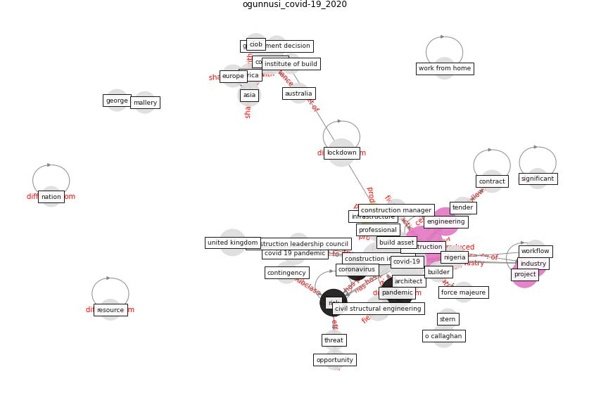

# Article: __COVID-19 pandemic: the effects and prospects in the construction industry.__ (ogunnusi_covid-19_2020)

* URL: [https://rgu-repository.worktribe.com/output/1000407/covid-19-pandemic-the-effects-and-prospects-in-the-construction-industry](https://rgu-repository.worktribe.com/output/1000407/covid-19-pandemic-the-effects-and-prospects-in-the-construction-industry)
* Year: 2020
* Abstract: COVID-19, social distancing, self-isolation, quarantine,
furlough, palliatives, and many more emerged as the new
vocabularies of the entire world, construction industry not
excluded. It is precisely a decade from the last pandemic
experienced by the human race. However, the current disease
outbreak called Coronavirus Disease 2019 (COVID-19) was
announced, which hit all the nations of the world within
four months and was declared a pandemic in March 2020. This
outbreak disrupted businesses around the globe, including
built asset procurement and facility management. The United
Kingdom, through the Construction Leadership Council, for
instance, in responding to this unprecedented situation,
published a new Site Operating Procedure (SOP). The effect
of this pandemic in these extraordinary times posed both
positive and negative impacts in the Architecture,
Engineering and Construction, Owner and Operator (AECOO)
industry. Its effect has brought about innovative and
diverse use of technology in an exemplary manner which may
change the course of construction even after the extinction
of coronavirus. This study explores the effects of COVID-19
on the built asset procurement and potential opportunities
for the construction industry through a quantitative means.
A survey was carried out on the built asset procurement
professionals for the data collection. 71 questionnaires
were received from Architects, Building Engineers,
Civil/Structural Engineers, Electrical Engineers,
Mechanical Engineers, Construction / Project Managers and
Quantity Surveyors. SPSS 25 software (a social science
statistical package) was used for the analysis of the data.
The result reveals some challenges in the area of workflow
and supply chain disruption, new policy issues, workers’
anxiety and review of COVID-19 vs Force Majeure in standard
forms of the construction contract. However, opportunities
evolved in the field of modern procurement planning, the
necessity for virtual working and unique design
considerations. This study is essential to paving the way
for the development of additional contingency plans and a
new working strategy in a minimised human contact situation
caused by the pandemic.

## Keywords

[construction](keyword_construction), [pandemic](keyword_pandemic), [engineering](keyword_engineering), [industry](keyword_industry), [risk](keyword_risk), [infrastructure](keyword_infrastructure), [project](keyword_project)

## Concepts

 

