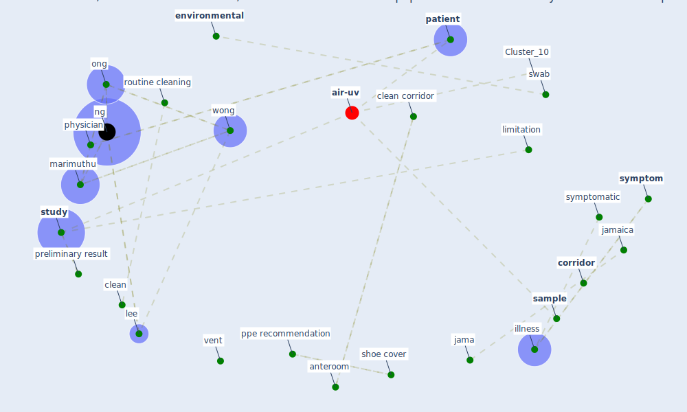

# Article: Air, Surface Environmental, and Personal Protective Equipment Contamination by Severe Acute Respiratory Syndrome Coronavirus 2 (SARS-CoV-2) From a Symptomatic Patient (ong_air_2020)

* Source: [10.1001/jama.2020.3227](https://doi.org/10.1001/jama.2020.3227)
* Year: 2020
* Cluster: [air-uv](cluster_10)

## Keywords

 * [air](keyword_air), air exchange, air sample, [analysis](keyword_analysis), [anteroom](keyword_anteroom), asymptomatic, bbmc, [china](keyword_china), [clean](keyword_clean), clean corridor, [clinical](keyword_clinical), clinician, clinician scientist, clinician scientist award, clinician scientist award moh000276, conflict of interest disclosure, [coronavirus](keyword_coronavirus), [corridor](keyword_corridor), [datum](keyword_datum), datum analysis, [decontamination](keyword_decontamination), dedicate sar cov 2 outbreak center, dichloroisocyanurate, dr marimuthu, [environmental](keyword_environmental), front, funder, hand hygiene, illness, [infect](keyword_infect), infect dis clin infect dis, [infectious](keyword_infectious), interpretation, jama, jamaica, jody w zylke, lee, lee s, limitation, manuscript, [marimuthu](keyword_marimuthu), md, [medical](keyword_medical), mer cov outbreak, methodology, moh000276, multicenter, multicenter study, negative, [ng](keyword_ng), nmrc, [ong](keyword_ong), [outbreak](keyword_outbreak), [patient](keyword_patient), [personal protective equipment](keyword_personal_protective_equipment), physician, pneumonia, polymerase, postcleane, ppe recommendation, ppe swab, preliminary result, premoistene, [report](keyword_report), reverse transcriptase polymerase chain reaction, rnadependent, rnadependent rna polymerase, routine cleaning, rt pcr, [sample](keyword_sample), [sar cov 2](keyword_sar_cov_2), sar cov 2 outbreak center, scientist, section editor, severe acute respiratory syndrome coronavirus 2, shoe, shoe cover, singapore, sodium, sodium dichloroisocyanurate, [south korea](keyword_south_korea), sponsor, sponsorship, [study](keyword_study), swab, [symptom](keyword_symptom), symptomatic, tan, [toilet](keyword_toilet), toilet bowl, [transmission](keyword_transmission), [united kingdom](keyword_united_kingdom), university of oxford, upper respiratory tract, vent, [viral](keyword_viral), volume, volume of air, [wong](keyword_wong), [wuhan](keyword_wuhan)

## Concepts

 

## Neighbours

### Closest articles

* Aerosol and Surface Distribution of Severe Acute Respiratory Syndrome Coronavirus 2 in Hospital Wards, Wuhan, China, 2020 - [LINK](article_guo_aerosol_2020)
* SARS-CoV-2 RNA detection of hospital isolation wards hygiene monitoring during the Coronavirus Disease 2019 outbreak in a Chinese hospital - [LINK](article_wang_sars-cov-2_2020)
* Toilets dominate environmental detection of SARS-CoV-2 virus in a hospital - [LINK](article_ding_toilets_2020)
* Rapid expansion of temporary, reliable airborne-infection isolation rooms with negative air machines for critical COVID-19 patients - [LINK](article_lee_rapid_2020)
* COVID-19 Forced Hospitals to Build Negative Pressure Rooms Fast - [LINK](article_dyer_covid-19_2020)
* COVID-19 and its Modes of Transmission - [LINK](article_karia_covid-19_2020)
* Persistence of coronaviruses on inanimate surfaces and their inactivation with biocidal agents - [LINK](article_kampf_persistence_2020)
* Current knowledge of COVID-19: Advances, challenges and future perspectives - [LINK](article_wu_current_2021)
* COVID-19 Pandemic: Prevention and Protection Measures to Be Adopted at the Workplace - [LINK](article_cirrincione_covid-19_2020)

### Closest BPs

* Blueprint: Negative pressure rooms - [LINK](bp_13)
* Blueprint: Resilience in staffing and skills training - [LINK](bp_12)
* Blueprint: Smart Locker System - [LINK](bp_1)
